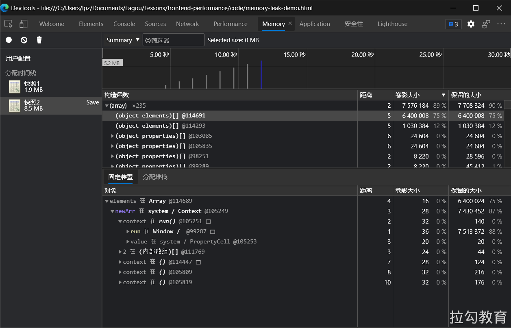

# 使用 Chrome DevTools 测试性能

## 浏览器任务管理器 

通过 Chrome 任务管理器我们可以查看当前 Chrome 浏览器中，所有进程关于 GPU、网络和内存空间的使用情况，这些进程包括当前打开的各个页签，安装的各种扩展插件，以及 GPU、网络、渲染等浏览器的默认进程，通过监控这些数据，我们可以在有异于其他进程的大幅开销出现时，去定位到可能存在内存泄漏或网络资源加载异常的问题进程。

## Network 网络分析

Network 面板是 Chrome 开发者工具中一个经常会被用到的工具面板，通过它可以查看到网站所有资源的请求情况，包括加载时间、尺寸大小、优先级设置及 HTTP 缓存触发情况等信息，从而帮助我们发现可能由于未进行有效压缩而导致资源尺寸过大的问题，或者未合理配置缓存策略导致二次请求加载时间过长的问题等。

参考：https://developer.chrome.com/docs/devtools/network/。

### 面板设置

### **查看网络请求信息**

### **缓存测试**

### **网络吞吐测试**

### **网络请求阻止**

- 打开方式：Ctrl+ Shift + P -> Show Network Request Blocking
- 启用网络请求阻止
- 添加阻止规则

## Coverage 面板

**我们可以通过 Coverage 面板监控并统计出网站应用运行过程中代码执行的覆盖率情况**。该面板统计的对象是 JavaScript 脚本文件与 CSS 样式表文件，统计结果主要包括：每个文件的字节大小、执行过程中已覆盖的代码字节数，以及可视化的覆盖率条形图。

根据执行结果我们能够发现，在启动录制的过程中到底有哪些尺寸较大的代码文件执行覆盖率较低，这就意味着有些代码文件中可能存在较多的无用代码，更准确地说是暂时没用到的代码。这些信息对性能优化来说是非常有用的，开发者可以据此将执行覆盖率较低的代码文件进行拆分，将首屏渲染阶段暂时不会执行到的代码部分单独打包，仅在需要的时候再去加载。

同时对规模较大且迭代周期较长的项目来说，工程代码中会包含一些永远都不会执行到的代码，而使用 webpack 的 Tree Shaking 仅能根据 export 进行无关联引用，那么此时 Coverage 面板就为优化提供了一条可以尝试的途径。

## **Memory 面板**

前端主要使用 JavaScript 代码来处理业务逻辑，所以保证代码在执行过程中内存的良性开销对用户的性能体验来说尤为重要，如果出现内存泄漏，那么就可能会带来网站应用卡顿或崩溃的后果。

为了更细致和准确地监控网站应用当前的内存使用情况，Chrome 浏览器开发者工具提供了 Memory 面板，通过它可以快速生成当前的堆内存快照，或者查看内存随时间的变化情况。据此我们可以查看并发现可能出现内存泄漏的环节，下图是使用 Memory 面板查看堆内存使用快照的情况。

## Performance 面板 

使用 Performance 面板主要对网站应用的运行时性能表现进行检测与分析，其可检测的内容不仅包括页面的每秒帧数（FPS）、CPU 的消耗情况和各种请求的时间花费，还能查看页面在前 1ms 与后 1ms 之间网络任务的执行情况等内容。

### 使用方式 

使用方式非常简单，只需要在进行性能检测的网站页面中打开 Chrome 开发者工具的 Performance 面板即可，这里建议在Chrome 浏览器的匿名模式下使用该工具，因为在匿名模式下不会受到既有缓存或其他插件程序等因素的影响，能够给性能检测提供一个相对干净的运行环境。

Performance 面板中常用的是图中标出的三个按钮。通常当我们需要检测一段时间内的性能状况时，可单击两次“启动/停止检测”按钮来设置起止时间点，当单击第二次按钮停止检测后，相应的检测信息便出现在控制面板下方的区域。

图中的“启动检测并刷新页面”按钮用来检测页面刷新过程中的性能表现，单击它会首先清空目前已有的检测记录，然后启动检测刷新页面，当页面全部加载完成后自动停止检测。

打开测试示例：https://googlechrome.github.io/devtools-samples/jank/。

### 面板信息

Performance 的评估结果页，其中的面板信息大致可分为四大类：控制面板、概览面板、线程面板及统计面板，下面进行逐一介绍。

#### 控制面板 

（1）Screenshots：表示是否截取每一帧的屏幕截图，默认会勾选，并且在概览面板中展示随时间变化的每帧截屏画面，如果取消勾选，则不会在概览面板中展示这部分内容。

（2）Memory：表示是否记录内存消耗，默认不会勾选，如果勾选则会在线程面板与统计面板之间展示出各种类型资源的内存消耗曲线。

（3）网页指标：表示是否展示性能指标信息，默认不会勾选，如果勾选则会在网络和Frames之间展示出核心指标的节点状态。

（4）Disable javaScript samples：如果勾选则表示关闭 JavaScript 示例，减少在手机端运行时的开销，若要模拟手机端的运行环境时则需要勾选。

（5）Enable advanced paint instrumentation（slow）：如果选中则表示开启加速渲染工具，用来记录渲染事件的相关细节。因为该功能比较消耗性能，所以开启后重新生成检测报告的速度会变慢。

（6）Network：在性能检测时，用以切换模拟网络环境。

（7）CPU：限制 CPU 处理速度，主要用于模拟低速 CPU 运行时的性能。

#### 概览面板 

在概览面板的时间轴上，可以通过选择一个起始时间点，然后按住鼠标左键滑动选择面板中的局部范围，来进行更小范围内的性能观察。

这部分可观察的性能信息包括：FPS、CPU 开销和网络请求时间。对每秒帧数而言，尽量保持在60FPS才能让动画有比较流畅的视觉体验。

对CPU开销而言，不仅可以在整个检测时间轴上以曲线的形式观察CPU处理任务所花费时间的变化情况，同时还可以在统计面板中查看当前选中时间区域里各个任务花费时间的占比，其中占比较大的部分就有可能存在性能问题，可以进一步检测与分析。

对网络请求时间而言，概览面板提供的信息可能不够清晰，这里建议在线程面板的Network部分中具体查看，比如时间轴上每个请求的耗时及起止时间点都会更加清楚，从而方便开发者发现响应过长的网络请求并进行优化。

#### 线程面板

这部分最主要的信息即为主线程执行过程的火焰图，主线程在解析 HTML 和 CSS、页面绘制及执行 JavaScript 的过程中，每个事件调用堆栈和耗时的情况都会反映在这张图上，其中每一个长条都代表了一个事件，将鼠标悬浮其上的时候可以查看到相应事件的执行耗时与事件名。

这个火焰图的横轴表示执行时间，纵轴表示调用栈的情况，上面的事件会调用下面的事件，越往下事件数量越少，所以火焰图是倒立的形式。

火焰图中的事件会以不同颜色进行标注，常见的事件类型有以下几种：HTML 解析、JavaScript 事件（例如鼠标单击、滚动等）、页面布局更改、元素样式重新计算及页面图层的绘制。了解并熟知这些事件的执行情况，有助于发现潜在的性能问题。

#### 统计面板 

统计面板会根据在概览面板中选择时间区域的不同，绘制出不同类型任务执行耗时的可视化图标。统计面板中包含四个页签。

其中 Summary 页签中会展示各类任务事件耗时的环形图；

Bottom-Up 页签中可以查看各个事件耗费时间的排序列表，列表会包含两个维度：去除子事件后该事件本身的耗时和包含子事件从开始到结束的总耗时。

Call Tree页签中可以查看全部或指定火焰图中某个事件的调用栈，如下图所示。

Event Log 页签中可查看关于每个事件的详细日志信息，如图下图所示。

### **保存测试记录**

## **FPS 计数器**

另一个非常方便的工具是 FPS 计数，可在页面运行时提供对 FPS 的实时估计。

1、选择 Control+Shift+P (Windows、Linux) 或 Command+Shift+P (macOS) 打开命令菜单。
2、在命令菜单中开始键入Rendering，然后选择显示渲染.
3、在呈现工具 中，打开 FPS 指示器。 新的叠加层将显示在视线的右上角。

4、关闭 FPS 计数并选择 Escape 来关闭呈现工具。 

## Performance monitor 

虽然使用 Performance 面板来进行检测能够得到较为全面的性能数据，但依然存在两个使用上的问题，即面板信息不够直观和数据的实时性不够强。

为了弥补这两方面的不足，Chrome 从 64 版本开始便在开发者工具中引入了 Performance monitor 面板，通过它让我们可以实时监控网站应用运行过程中，诸如 CPU 占用率、JavaScript 内存使用大小、内存中挂的 DOM 节点数、JavaScript 事件监听次数及页面发生重绘与重排的处理时间等信息。

据此如果我们发现，当与页面的交互过程中出现某项指标有较为陡峭的增长，就意味着可能有影响性能体验的风险存在。

如图所示为 Performance monitor 面板，图中出现的明显波动是执行刷新页面操作所产生的，可观察到 JavaScript 堆内存大小与 DOM 节点数的指标都有一个明显的断崖式下跌，这正是刷新操作清除了原有 DOM 节点后，还未重新渲染出新节点的时间点。

## 参考链接 

- https://developer.chrome.com/docs/devtools/
- https://developer.chrome.com/docs/devtools/evaluate-performance/
- https://docs.microsoft.com/zh-cn/microsoft-edge/devtools-guide-chromium/evaluate-performance/