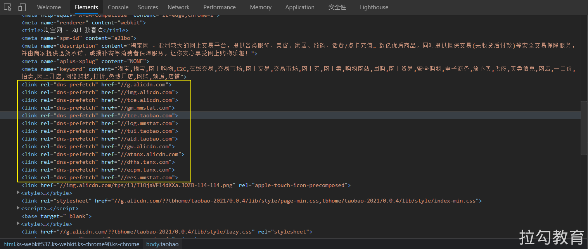

# DNS 解析

当浏览器从（第三方）服务器请求资源时，必须先将该跨域域名解析为 IP 地址，然后浏览器才能发出请求。此过程称为  DNS 解析。DNS 作为互联网的基础协议，其解析的速度似乎很容易被网站优化人员忽视。现在大多数新浏览器已经针对 DNS 解析进行了优化，比如 DNS 缓存。典型的一次 DNS 解析需要耗费 20-120 毫秒，所花费的时间几乎可以忽略不计，但是当网站中使用的资源依赖于多个不同的域的时候，时间就会成倍的增加，从而增加了网站的加载时间。比如在某些图片较多的页面中，在发起图片加载请求之前预先把域名解析好将会有至少 5% 的图片加载速度提升。

一般来说，在前端优化中与 DNS 有关的有两点：

- 减少 DNS 的请求次数

- 进行 DNS 预获取：DNS Prefetch

## 减少 DNS 查找 

域名系统（DNS）将主机名映射到IP地址，就像电话簿将人们的姓名映射到他们的电话号码一样。在浏览器中输入 www.taobao.com 时，浏览器联系的 DNS 解析器将返回该服务器的 IP 地址。DNS 有成本。DNS 通常需要 20-120 毫秒来查找给定主机名的IP地址。在 DNS 查找完成之前，浏览器无法从该主机名下载任何内容。

缓存 DNS 查找以提高性能。这种缓存可以在由用户的 ISP 或局域网维护的特殊缓存服务器上进行，但是在个别用户的计算机上也会发生缓存。DNS 信息保留在操作系统的 DNS 缓存中（Microsoft Windows上的“ DNS客户端服务”）。大多数浏览器都有自己的缓存，与操作系统的缓存分开。只要浏览器将 DNS 记录保留在其自己的缓存中，它就不会对操作系统发出记录请求进行打扰。

默认情况下，Internet Explorer 会缓存 30 分钟的 DNS 查找，这是由 DnsCacheTimeout 注册表设置指定的 。Firefox 在network.dnsCacheExpiration 配置设置的控制下缓存 DNS 查找1分钟。Chrome 也是1分钟。

当客户端的 DNS 缓存为空（对于浏览器和操作系统）时，DNS 查找的次数等于网页中唯一主机名的数目。这包括在页面的 URL，图像，脚本文件，样式表，Flash 对象等中使用的主机名。减少唯一主机名的数量将减少 DNS 查找的数量。

减少域名的数量有可能减少页面中并行下载的数量。避免 DNS 查找会减少响应时间，但是减少并行下载可能会增加响应时间。**我的指导原则是将这些资源划分为至少两个但不超过四个域名**。这将在减少 DNS 查找和允许高度并行下载之间取得良好的折衷。

## dns-prefetch 

DNS-prefetch (DNS 预获取) 是尝试在请求资源之前解析域名。这可能是后面要加载的文件，也可能是用户尝试打开的链接目标。域名解析和内容载入是串行的网络操作，所以这个方式能减少用户的等待时间，提升用户体验 。

dns-prefetch 可帮助开发人员掩盖 DNS 解析延迟。 HTML \<link> 元素通过 dns-prefetch 的 rel 属性值提供此功能。然后在 href 属性中指要跨域的域名：

```html
<link rel="dns-prefetch" href="https://fonts.googleapis.com/"> 
```

比如这是淘宝网对 `dns-prefetch` 的使用：



还可以通过使用 HTTP [Link](https://developer.mozilla.org/zh-CN/docs/Web/HTTP/Headers/Link) 字段将 `dns-prefetch`（以及其他资源提示）指定为 HTTP 标头：

```
Link: <https://fonts.gstatic.com/>; rel=dns-prefetch
```

每当站点引用跨域域上的资源时，都应在 \<head> 元素中放置 `dns-prefetch` 提示，但是要记住一些注意事项。

（1）`dns-prefetch` 仅对[跨域](https://wiki.developer.mozilla.org/zh-CN/docs/Web/HTTP/CORS)域上的 DNS 查找有效，因此请避免使用它来指向您的站点或域。这是因为，到浏览器看到提示时，您站点域背后的IP已经被解析。

（2）`dns-prefetch` 需慎用，多页面重复 DNS 预解析会增加重复 DNS 查询次数。

（3）默认情况下浏览器会对页面中和当前域名（正在浏览网页的域名）不在同一个域的域名进行预获取，并且缓存结果，这就是隐式的 DNS Prefetch。如果想对页面中没有出现的域进行预获取，那么就要使用显示 DNS Prefetch 了。

（4）虽然使用 DNS Prefetch 能够加快页面的解析速度，但是也不能滥用，因为有开发者指出禁用 DNS 预读取能节省每月100亿的 DNS 查询。

```html
<meta http-equiv="x-dns-prefetch-control" content="off">
```

## 更多 DNS 解析优化 

1. 延长 DNS 缓存时间
2. 尽可能使用 A 或 AAAA 记录代替 CNAME
3. 使用 CDN 加速域名
4. 自己搭建 DNS 服务

## 附：清除 DNS 缓存 

1、清除浏览器 DNS 缓存

- 清除 DNS 缓存：`chrome://net-internals/#dns`

- 有时候也需要同时清除套接字缓存池：`chrome://net-internals/#sockets`

2、清除系统 DNS 缓存

```shell
# 在 Windows 中查看 DNS 缓存记录
ipconfig /displaydns

# 在 Windows 中清除 DNS 缓存记录
ipconfig /flushdns

# 在 macOS 中清除 DNS 缓存记录
sudo killall -HUP mDNSResponder
```

## 参考链接

- https://developer.mozilla.org/zh-CN/docs/Web/Performance/dns-prefetch
- https://developer.mozilla.org/zh-CN/docs/Web/HTTP/Headers/X-DNS-Prefetch-Control
- https://ashu.online/blogs/optimize-dns-resolution-for-fast-website

