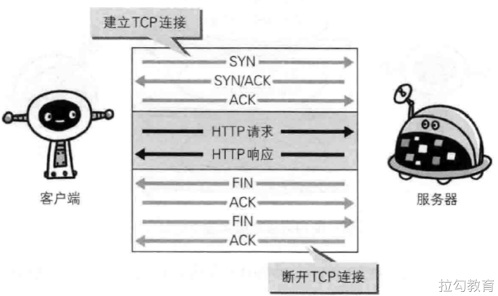
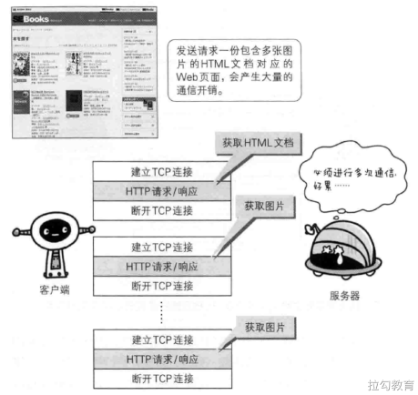
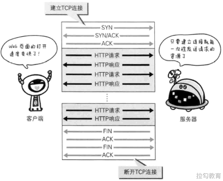
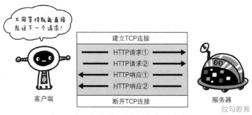

# HTTP 长连接

## 短连接 

HTTP 协议的初始版本中，每进行一次 HTTP 通信就要断开一次 TCP 连接。



以早期的通信情况来说，因为都是些容量很小的文本传输，所以即使这样也没有多大问题。但是随着 HTTP  的大量普及，文档中包含大量富文本（图片、视频等资源）的情况多了起来。

比如，使用浏览器浏览一个包含多张图片的 HTMl 页面时，在发送请求访问 HTMl 页面资源的同时，也会请求该 HTML 页面包含的其它资源。因此，每次的请求都会造成无谓的 TCP 连接建立和断开，增加通信录的开销。



为了解决这个问题，有些浏览器在请求时，用了一个非标准的 Connection 字段。

```
Connection: keep-alive
```

这个字段要求服务器不要关闭 TCP 连接，以便其他请求复用。服务器同样回应这个字段。

```
Connection: keep-alive
```

一个可以复用的 TCP 连接就建立了，直到客户端或服务器主动关闭连接。但是，这不是标准字段，不同实现的行为可能不一致，因此不是根本的解决办法。

## 长连接

1997 年 1 月，HTTP/1.1 版本发布，只比 1.0 版本晚了半年。它进一步完善了 HTTP 协议，直到现在还是最流行的版本。

HTTP 1.1 版的最大变化，就是引入了持久连接（HTTP Persistent Connections），即 TCP 连接默认不关闭，可以被多个请求复用，不用声明 `Connection: keep-alive`。



持久连接的好处在于减少了 TCP 连接的重复建立和断开所造成的额外开销，减轻了服务器端的负载。另外，减少开销的那部分时间，使 HTTP 请求和响应能够更早的结束，这样 Web 页面的显示速度也就相应提高了。

客户端和服务器发现对方一段时间没有活动，就可以主动关闭连接。不过，规范的做法是，客户端在最后一个请求时，发送 `Connection: close`，明确要求服务器关闭 TCP 连接。

```
Connection: close
```

目前，对于同一个域名，大多数浏览器允许同时建立6个持久连接。

## 管道机制 

HTTP 1.1 版还引入了管道机制（pipelining），即在同一个 TCP 连接里面，客户端可以同时发送多个请求。这样就进一步改进了 HTTP 协议的效率。

从前发送请求后需等待并接收响应，才能发送下一个请求。管线化技术出现后，不用等待响应即可直接发送下一个请求。这样就能够做到同时并行发送多个请求，而不需要一个接一个的等待响应了，与挨个连接相比，用持久连接可以让请求更快结束。而管线化技术则比持久连接还要快。请求数越多，时间差就越明显。



举例来说，客户端需要请求两个资源。以前的做法是，在同一个 TCP 连接里面，先发送 A 请求，然后等待服务器做出回应，收到后再发出 B 请求。管道机制则是允许浏览器同时发出 A 请求和 B 请求，但是服务器还是按照顺序，先回应A请求，完成后再回应 B 请求。

## Content-Length 字段 

一个 TCP 连接现在可以传送多个回应，势必就要有一种机制，区分数据包是属于哪一个回应的。这就是 Content-length 字段的作用，声明本次回应的数据长度。

```
Content-Length: 3495
```

上面代码告诉浏览器，本次回应的长度是3495个字节，后面的字节就属于下一个回应了。

在1.0版中，`Content-Length` 字段不是必需的，因为浏览器发现服务器关闭了 TCP 连接，就表明收到的数据包已经全了。

## 分块传输编码

使用 Content-Length 字段的前提条件是，服务器发送回应之前，必须知道回应的数据长度。

对于一些很耗时的动态操作来说，这意味着，服务器要等到所有操作完成，才能发送数据，显然这样的效率不高。更好的处理方法是，产生一块数据，就发送一块，采用“流模式”（stream）取代“缓存模式”（buffer）。

因此，1.1版规定可以不使用 Content-Length 字段，而使用"分块传输编码"（chunked transfer encoding）。只要请求或回应的头信息有 Transfer-Encoding 字段，就表明回应将由数量未定的数据块组成。

```
Transfer-Encoding: chunked
```

每个非空的数据块之前，会有一个16进制的数值，表示这个块的长度。最后是一个大小为0的块，就表示本次回应的数据发送完了。下面是一个例子。

```
HTTP/1.1 200 OK
Content-Type: text/plain
Transfer-Encoding: chunked

25
This is the data in the first chunk

1C
and this is the second one

3
con

8
sequence

0
```

## 长连接的缺点

虽然 HTTP 1.1 版允许复用 TCP 连接，但是同一个 TCP 连接里面，所有的数据通信是按次序进行的。服务器只有处理完一个回应，才会进行下一个回应。要是前面的回应特别慢，后面就会有许多请求排队等着。这称为"队头堵塞"（Head-of-line blocking）。

为了避免这个问题，只有两种方法：

- 一是减少请求数
- 二是同时多开持久连接

这导致了很多的网页优化技巧，比如合并脚本和样式表、将图片嵌入 CSS 代码、域名分片（domain sharding）等等。如果 HTTP 协议设计得更好一些，这些额外的工作是可以避免的。