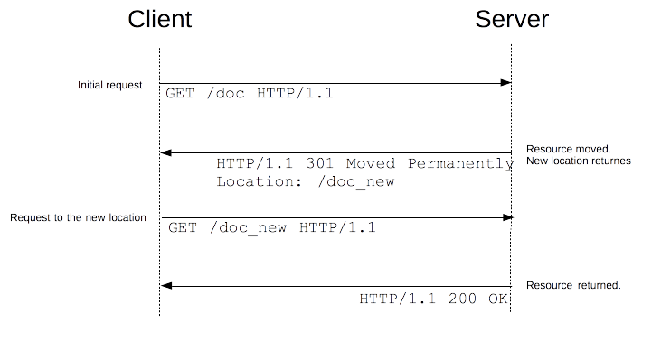

# **避免重定向**

URL 重定向，也称为 URL 转发，是一种当实际资源，如单个页面、表单或者整个 Web 应用被迁移到新的 URL 下的时候，保持（原有）链接可用的技术。HTTP 协议提供了一种特殊形式的响应—— HTTP 重定向（HTTP redirects）来执行此类操作。

重定向可实现许多目标：

- 站点维护或停机期间的临时重定向。
- 永久重定向将在更改站点的URL，上传文件时的进度页等之后保留现有的链接/书签。
- 上传文件时的表示进度的页面。

## 原理 

在 HTTP 协议中，重定向操作由服务器通过发送特殊的响应（即 redirects）而触发。HTTP 协议的重定向响应的状态码为 3xx 。

浏览器在接收到重定向响应的时候，会采用该响应提供的新的 URL ，并立即进行加载；大多数情况下，除了会有一小部分性能损失之外，重定向操作对于用户来说是不可见的。

不同类型的重定向映射可以划分为三个类别：

- 永久重定向
- 临时重定向
- 特殊重定向

## 永久重定向 

这种重定向操作是永久性的。它表示原 URL 不应再被使用，而应该优先选用新的 URL。搜索引擎机器人会在遇到该状态码时触发更新操作，在其索引库中修改与该资源相关的 URL 。

| 编码 | 含义               | 处理方法                                                     | 典型应用场景                                             |
| ---- | ------------------ | ------------------------------------------------------------ | -------------------------------------------------------- |
| 301  | Moved Permanently  | [GET](https://developer.mozilla.org/zh-CN/docs/Web/HTTP/Methods/GET)  方法不会发生变更，其他方法有可能会变更为 [GET](https://developer.mozilla.org/zh-CN/docs/Web/HTTP/Methods/GET)  方法。[[1\]](https://developer.mozilla.org/zh-CN/docs/Web/HTTP/Redirections#attr1) | 网站重构。                                               |
| 308  | Permanent Redirect | 方法和消息主体都不发生变化。                                 | 网站重构，用于非GET方法。(with non-GET links/operations) |

## 临时重定向 

有时候请求的资源无法从其标准地址访问，但是却可以从另外的地方访问。在这种情况下可以使用临时重定向。

搜索引擎不会记录该新的、临时的链接。在创建、更新或者删除资源的时候，临时重定向也可以用于显示临时性的进度页面。

| 编码 | 含义               | 处理方法                                                     | 典型应用场景                                                 |
| ---- | ------------------ | ------------------------------------------------------------ | ------------------------------------------------------------ |
| 302  | Found              | [GET](https://developer.mozilla.org/zh-CN/docs/Web/HTTP/Methods/GET)  方法不会发生变更，其他方法有可能会变更为 [GET](https://developer.mozilla.org/zh-CN/docs/Web/HTTP/Methods/GET)  方法。[[2\]](https://developer.mozilla.org/zh-CN/docs/Web/HTTP/Redirections#attr2) | 由于不可预见的原因该页面暂不可用。在这种情况下，搜索引擎不会更新它们的链接。 |
| 303  | See Other          | [GET](https://developer.mozilla.org/zh-CN/docs/Web/HTTP/Methods/GET)  方法不会发生变更，其他方法会变更为 GET 方法（消息主体会丢失）。 | 用于[PUT](https://developer.mozilla.org/zh-CN/docs/Web/HTTP/Methods/PUT)  或 [POST](https://developer.mozilla.org/zh-CN/docs/Web/HTTP/Methods/POST)  请求完成之后进行页面跳转来防止由于页面刷新导致的操作的重复触发。 |
| 307  | Temporary Redirect | 方法和消息主体都不发生变化。                                 | 由于不可预见的原因该页面暂不可用。在这种情况下，搜索引擎不会更新它们的链接。当站点支持非 GET 方法的链接或操作的时候，该状态码优于 302 状态码。 |

## 特殊重定向 

除了上述两种常见的重定向之外，还有两种特殊的重定向。304 （Not Modified，资源未被修改）会使页面跳转到本地陈旧的缓存版本当中（该缓存已过期(?)），而 300 （Multiple Choice，多项选择） 则是一种手工重定向：以 Web 页面形式呈现在浏览器中的消息主体包含了一个可能的重定向链接的列表，用户可以从中进行选择。

| 编码 | 含义            | 典型应用场景                                                 |
| ---- | --------------- | ------------------------------------------------------------ |
| 300  | Multiple Choice | 不常用：所有的选项在消息主体的 HTML 页面中列出。鼓励在 [Link](https://developer.mozilla.org/zh-CN/docs/Web/HTTP/Headers/Link)  头部加入机器可读的 rel=alternate |
| 304  | Not Modified    | 发送用于重新验证的条件请求。表示缓存的响应仍然是新鲜的并且可以使用。 |

## 参考链接

- https://developer.mozilla.org/zh-CN/docs/Web/HTTP/Redirections