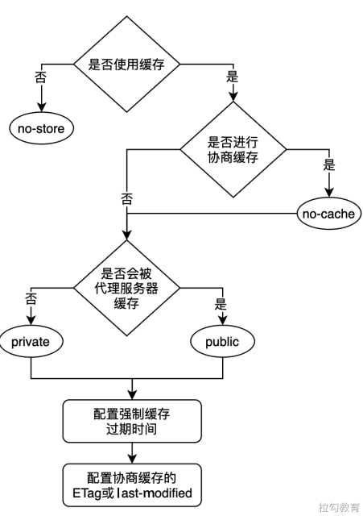

# HTTP 缓存

在任何一个前端项目中，访问服务器获取数据都是很常见的事情，但是如果相同的数据被重复请求了不止一次，那么多余的请求次数必然会浪费网络带宽，以及延迟浏览器渲染所要处理的内容，从而影响用户的使用体验。如果用户使用的是按量计费的方式访问网络，那么多余的请求还会隐性地增加用户的网络流量资费。因此考虑使用缓存技术对已获取的资源进行重用，是一种提升网站性能与用户体验的有效策略。

缓存的原理是在首次请求后保存一份请求资源的响应副本，当用户再次发起相同请求后，如果判断缓存命中则拦截请求，将之前存储的响应副本返回给用户，从而避免重新向服务器发起资源请求。

缓存的技术种类有很多，比如代理缓存、浏览器缓存、网关缓存、负载均衡器及内容分发网络等，它们大致可以分为两类：共享缓存和私有缓存。共享缓存指的是缓存内容可被多个用户使用，如公司内部架设的Web代理；私有缓存指的是只能单独被用户使用的缓存，如浏览器缓存。

HTTP 缓存应该算是前端开发中最常接触的缓存机制之一，它又可细分为**强制缓存**与**协商缓存**，二者最大的区别在于判断缓存命中时，浏览器是否需要向服务器端进行询问以协商缓存的相关信息，进而判断是否需要就响应内容进行重新请求。下面就来具体看HTTP缓存的具体机制及缓存的决策策略。

## 强制缓存 

对于强制缓存而言，如果浏览器判断所请求的目标资源有效命中，则可直接从强制缓存中返回请求响应，无须与服务器进行任何通信。

在介绍强制缓存命中判断之前，我们首先来看一段响应头的部分信息：

```
access-control-allow-origin: *
age: 734978
content-length: 40830
content-type: image/jpeg
cache-control: max-age=31536000
expires: Web, 14 Fed 2021 12:23:42 GMT
```

其中与强制缓存相关的两个字段是 `expires` 和 `cache-control`，`expires` 是在 HTTP 1.0 协议中声明的用来控制缓存失效日期时间戳的字段，它由服务器端指定后通过响应头告知浏览器，浏览器在接收到带有该字段的响应体后进行缓存。

若之后浏览器再次发起相同的资源请求，便会对比 `expires` 与本地当前的时间戳，如果当前请求的本地时间戳小于 `expires` 的值，则说明浏览器缓存的响应还未过期，可以直接使用而无须向服务器端再次发起请求。只有当本地时间戳大于 `expires` 值发生缓存过期时，才允许重新向服务器发起请求。

从上述强制缓存是否过期的判断机制中不难看出，这个方式存在一个很大的漏洞，即对本地时间戳过分依赖，如果客户端本地的时间与服务器端的时间不同步，或者对客户端时间进行主动修改，那么对于缓存过期的判断可能就无法和预期相符。

为了解决 `expires` 判断的局限性，从 HTTP 1.1 协议开始新增了 `cache-control` 字段来对 `expires` 的功能进行扩展和完善。从上述代码中可见 `cache-control` 设置了 `maxage=31536000` 的属性值来控制响应资源的有效期，它是一个以秒为单位的时间长度，表示该资源在被请求到后的 31536000 秒内有效，如此便可避免服务器端和客户端时间戳不同步而造成的问题。除此之外，`cache-control` 还可配置一些其他属性值来更准确地控制缓存，下面来具体介绍。

### no-cache 和 no-store 

设置 `no-cache` 并非像字面上的意思不使用缓存，其表示为强制进行协商缓存（后面会说），即对于每次发起的请求都不会再去判断强制缓存是否过期，而是直接与服务器协商来验证缓存的有效性，若缓存未过期，则会使用本地缓存。设置 `no-store` 则表示禁止使用任何缓存策略，客户端的每次请求都需要服务器端给予全新的响应。`no-cache` 和 `no-store` 是两个互斥的属性值，不能同时设置。

发送如下响应头可以关闭缓存。

```
Cache-Control: no-store
```

指定 `no-cache` 或 `max-age=0` 表示客户端可以缓存资源，每次使用缓存资源前都必须重新验证其有效性。这意味着每次都会发起 HTTP 请求，但当缓存内容仍有效时可以跳过 HTTP 响应体的下载。

```
Cache-Control: max-age=0

Cache-Control: no-store
```

### private 和 public

`private` 和 `public` 也是 `cache-control` 的一组互斥属性值，它们用以明确响应资源是否可被代理服务器进行缓存。

- 若资源响应头中的 `cache-control` 字段设置了 `public` 属性值，则表示响应资源既可以被浏览器缓存，又可以被代理服务器缓存。
- `private` 则限制了响应资源只能被浏览器缓存，若未显式指定则默认值为 `private`。

对于应用程序中不会改变的文件，你通常可以在发送响应头前添加积极缓存。这包括例如由应用程序提供的静态文件，例如图像，CSS 文件和 JavaScript 文件。

```
Cache-Control:public, max-age=31536000
```

### max-age 和 s-maxage

max-age 属性值会比 s-maxage 更常用，它表示服务器端告知客户端浏览器响应资源的过期时长。在一般项目的使用场景中基本够用，对于大型架构的项目通常会涉及使用各种代理服务器的情况，这就需要考虑缓存在代理服务器上的有效性问题。这便是 s-maxage 存在的意义，它表示缓存在代理服务器中的过期时长，且仅当设置了 public 属性值时才有效。

由此可见 `cache-control` 能作为 `expires` 的完全替代方案，并且拥有其所不具备的一些缓存控制特性，在项目实践中使用它就足够了，目前 expires 还存在的唯一理由是考虑可用性方面的向下兼容。

## 协商缓存

顾名思义，**协商缓存就是在使用本地缓存之前，需要向服务器端发起一次 GET 请求，与之协商当前浏览器保存的本地缓存是否已经过期**。

通常是采用所请求资源最近一次的修改时间戳来判断的，为了便于理解，下面来看一个例子：假设客户端浏览器需要向服务器请求一个 manifest.js 的 JavaScript 文件资源，为了让该资源被再次请求时能通过协商缓存的机制使用本地缓存，那么首次返回该图片资源的响应头中应包含一个名为 last-modified 的字段，该字段的属性值为该 JavaScript 文件最近一次修改的时间戳，简略截取请求头与响应头的关键信息如下：

```
Request URL: http://localhost:3000/image.jpg
Request Method: GET

last-modified: Thu, 29 Apr 2021 03:09:28 GMT
cache-control: no-cache
```

当我们刷新网页时，由于该 JavaScript 文件使用的是协商缓存，客户端浏览器无法确定本地缓存是否过期，所以需要向服务器发送一次 GET 请求，进行缓存有效性的协商，此次 GET 请求的请求头中需要包含一个 ifmodified-since 字段，其值正是上次响应头中 last-modified 的字段值。

当服务器收到该请求后便会对比请求资源当前的修改时间戳与 if-modified-since 字段的值，如果二者相同则说明缓存未过期，可继续使用本地缓存，否则服务器重新返回全新的文件资源，简略截取请求头与响应头的关键信息如下：

```
// 再次请求的请求头
Request URL: http://localhost:3000/image.jpg
Request Method: GET
If-Modified-Since: Thu, 29 Apr 2021 03:09:28 GMT


// 协商缓存有效的响应头
Status Code: 304 Not Modified
```

这里需要注意的是，协商缓存判断缓存有效的响应状态码是 `304`，即缓存有效响应重定向到本地缓存上。这和强制缓存有所不同，强制缓存若有效，则再次请求的响应状态码是 `200`。

### last-modifed 的不足

通过 last-modified 所实现的协商缓存能够满足大部分的使用场景，但也存在两个比较明显的缺陷：

- 首先它只是根据资源最后的修改时间戳进行判断的，虽然请求的文件资源进行了编辑，但内容并没有发生任何变化，时间戳也会更新，从而导致协商缓存时关于有效性的判断验证为失效，需要重新进行完整的资源请求。这无疑会造成网络带宽资源的浪费，以及延长用户获取到目标资源的时间。
- 其次标识文件资源修改的时间戳单位是秒，如果文件修改的速度非常快，假设在几百毫秒内完成，那么上述通过时间戳的方式来验证缓存的有效性，是无法识别出该次文件资源的更新的。

其实造成上述两种缺陷的原因相同，就是服务器无法仅依据资源修改的时间戳来识别出真正的更新，进而导致重新发起了请求，该重新请求却使用了缓存的 Bug 场景。

### 基于 ETag 的协商缓存

为了弥补通过时间戳判断的不足，从 HTTP 1.1 规范开始新增了一个 ETag 的头信息，即实体标签（Entity Tag）。

其内容主要是服务器为不同资源进行哈希运算所生成的一个字符串，该字符串类似于文件指纹，只要文件内容编码存在差异，对应的 ETag 标签值就会不同，因此可以使用 ETag 对文件资源进行更精准的变化感知。下面我们来看一个使用 ETag 进行协商缓存图片资源的示例，首次请求后的部分响应头关键信息如下。

```
Content-Type: image/jpeg
ETag: "xxx"
Last-Modified: Fri, 12 Jul 2021 18:30:00 GMT
Content-Length: 9887
```

上述响应头中同时包含了 last-modified 文件修改时间戳和 ETag 实体标签两种协商缓存的有效性校验字段，因为 ETag 比 last-modified 具有更准确的文件资源变化感知，所以它的优先级也更高，二者同时存在时以 ETag 为准。再次对该图片资源发起请求时，会将之前响应头中 ETag 的字段值作为此次请求头中 If-None-Match 字段，提供给服务器进行缓存有效性验证。请求头与响应头的关键字段信息如下。

再次请求头：

```
If-Modified-Since: Fri, 12 Jul 2021 18:30:00 GMT
If-None-Match: "xxx"
```

再次响应头：

```
Content-Type: image/jpeg
ETag: "xxx"
Last-Modified: Fri, 12 Jul 2021 18:30:00 GMT
Content-Length: 9887
```

若验证缓存有效，则返回 304 状态码响应重定向到本地缓存，所以上面响应头中的内容长度 Content-Length 字段值也就为 0 了。

### ETag 的不足 

不像强制缓存中 cache-control 可以完全替代 expires 的功能，在协商缓存中，ETag 并非 last-modified 的替代方案而是一种补充方案，因为它依旧存在一些弊端。

- 一方面服务器对于生成文件资源的 ETag 需要付出额外的计算开销，如果资源的尺寸较大，数量较多且修改比较频繁，那么生成 ETag 的过程就会影响服务器的性能。

- 另一方面 ETag 字段值的生成分为强验证和弱验证，强验证根据资源内容进行生成，能够保证每个字节都相同；弱验证则根据资源的部分属性值来生成，生成速度快但无法确保每个字节都相同，并且在服务器集群场景下，也会因为不够准确而降低协商缓存有效性验证的成功率，所以恰当的方式是根据具体的资源使用场景选择恰当的缓存校验方式。

## 缓存决策 

前面我们较为详细地介绍了浏览器 HTTP 缓存的配置与验证细节，下面思考一下如何应用 HTTP 缓存技术来提升网站的性能。假设在不考虑客户端缓存容量与服务器算力的理想情况下，我们当然希望客户端浏览器上的缓存触发率尽可能高，留存时间尽可能长，同时还要 ETag 实现当资源更新时进行高效的重新验证。

但实际情况往往是容量与算力都有限，因此就需要制定合适的缓存策略，来利用有限的资源达到最优的性能效果。明确能力的边界，力求在边界内做到最好。

### 缓存决策树 

在面对一个具体的缓存需求时，到底该如何制定缓存策略呢？我们可以参照图所示的决策树来逐步确定对一个资源具体的缓存策略。



首先根据资源内容的属性判断是否需要使用缓存，如果不希望对该资源开启缓存（比如涉及用户的一些敏感信息），则可直接设置 cache-control 的属性值为 no-store 来禁止任何缓存策略，这样请求和响应的信息就都不会被存储在对方及中间代理的磁盘系统上。

如果希望使用缓存，那么接下来就需要确定对缓存有效性的判断是否要与服务器进行协商，若需要与服务器协商则可为 cache-control 字段增加 no-cache 属性值，来强制启用协商缓存。

否则接下来考虑是否允许中间代理服务器缓存该资源，参考之前在强制缓存中介绍的内容，可通过为 cache-control 字段添加 private 或 public 来进行控制。如果之前未设置 no-cache 启用协商缓存，那么接下来可设置强制缓存的过期时间，即为 cache-control 字段配置 max-age=… 的属性值，最后如果启用了协商缓存，则可进一步设置请求资源的 last-modified 和 ETag 实体标签等参数。

这里建议你能够根据该决策树的流程去设置缓存策略，这样不但会让指定的策略有很高的可行性，而且对于理解缓存过程中的各个知识点也非常有帮助。

### 缓存决策示例 

在使用缓存技术优化性能体验的过程中，有一个问题是不可逾越的：我们既希望缓存能在客户端尽可能久的保存，又希望它能在资源发生修改时进行及时更新。

这是两个互斥的优化诉求，使用强制缓存并定义足够长的过期时间就能让缓存在客户端长期驻留，但由于强制缓存的优先级高于协商缓存，所以很难进行及时更新；若使用协商缓存，虽然能够保证及时更新，但频繁与服务器进行协商验证的响应速度肯定不及使用强制缓存快。那么如何兼顾二者的优势呢？

我们可以将一个网站所需要的资源按照不同类型去拆解，为不同类型的资源制定相应的缓存策略，以下面的HTML文件资源为例：

```html
<!DOCTYPE html>
<html lang="en">
<head>
  <meta charset="UTF-8">
  <meta http-equiv="X-UA-Compatible" content="IE=edge">
  <meta name="viewport" content="width=device-width, initial-scale=1.0">
  <title>HTTP 缓存策略</title>
  <link rel="stylesheet" href="style.css">
</head>
<body>
  
  <script src="script.js"></script>
</body>
</html>
```

该 HTML 文件中包含了一个 JavaScript 文件 script.js、一个样式表文件 style.css 和一个图片文件 photo.jpg，若要展示出该 HTML 中的内容就需要加载出其包含的所有外链文件。据此我们可针对它们进行如下设置。

首先 HTML 在这里属于包含其他文件的主文件，为保证当其内容发生修改时能及时更新，应当将其设置为协商缓存，即为 cache-control 字段添加 no-cache 属性值；其次是图片文件，因为网站对图片的修改基本都是更换修改，同时考虑到图片文件的数量及大小可能对客户端缓存空间造成不小的开销，所以可采用强制缓存且过期时间不宜过长，故可设置 cache-control 字段值为 max-age=86400。

接下来需要考虑的是样式表文件 style.css，由于其属于文本文件，可能存在内容的不定期修改，又想使用强制缓存来提高重用效率，故可以考虑在样式表文件的命名中增加文件指纹或版本号（比如添加文件指纹后的样式表文件名变为了 style.51ad84f7.css），这样当发生文件修改后，不同的文件便会有不同的文件指纹，即需要请求的文件 URL 不同了，因此必然会发生对资源的重新请求。同时考虑到网络中浏览器与 CDN 等中间代理的缓存，其过期时间可适当延长到一年，即 cache-control：max-age=31536000。

最后是 JavaScript 脚本文件，其可类似于样式表文件的设置，采取文件指纹和较长的过期时间，如果 JavaScript 中包含了用户的私人信息而不想让中间代理缓存，则可为 cache-control 添加 private 属性值。

从这个缓存策略的示例中我们可以看出，对不同资源进行组合使用强制缓存、协商缓存及文件指纹或版本号，可以做到一举多得：及时修改更新、较长缓存过期时间及控制所能进行缓存的位置。

### 缓存设置注意事项 

在前面的内容中虽然给出了一种制定缓存决策的思路与示例，但需要明白的一点是：不存在适用于所有场景下的最佳缓存策略。凡是恰当的缓存策略都需要根据具体场景下的请求资源类型、数据更新要求及网络通信模式等多方面因素考量后制定出来，所以下面列举一些缓存决策时的注意事项，来作为决策思路的补充。

**1、拆分源码，分包加载**

对大型的前端应用迭代开发来说，其代码量通常很大，如果发生修改的部分集中在几个重要模块中，那么进行全量的代码更新显然会比较冗余，因此我们可以考虑在代码构建过程中，按照模块拆分将其打包成多个单独的文件。这样在每次修改后的更新提取时，仅需拉取发生修改的模块代码包，从而大大降低了需要下载的内容大小。

**2、预估资源的缓存时效**

根据不同资源的不同需求特点，规划相应的缓存更新时效，为强制缓存指定合适的 max-age 取值，为协商缓存提供验证更新的 ETag 实体标签。

**3、控制中间代理的缓存**

凡是会涉及用户隐私信息的尽量避免中间代理的缓存，如果对所有用户响应相同的资源，则可以考虑让中间代理也进行缓存。

**4、避免网址的冗余**

缓存是根据请求资源的 URL 进行的，不同的资源会有不同的 URL，所以尽量不要将相同的资源设置为不同的 URL。

**5、规划缓存的层次结构**

参考缓存决策中介绍的示例，不仅是请求的资源类型，文件资源的层次结构也会对制定缓存策略有一定影响，我们应当综合考虑。

## 注意事项 

### 缓存是限定域名的 

- 根域下的缓存是共享的。比如 a.com、foo.a.com、bar.a.com 的根域都是 a.com，他们是共享缓存；

- 同理，域名不同的缓存不共享。比如 a.com、b.com、c.com，他们之间即使加载相同资源也仅在该域名下有效，不共享。

## 参考链接 

- https://developer.mozilla.org/zh-CN/docs/Web/HTTP/Caching

- https://developer.mozilla.org/zh-CN/docs/Web/HTTP/Headers/Cache-Control

- https://developer.mozilla.org/zh-CN/docs/Web/HTTP/Headers/Expires

## 代码示例

```js
const http = require('http')
const fs = require('fs')
const url = require('url')
const etag = require('etag')

http.createServer((req, res) => {
  console.log(req.method, req.url)

  const { pathname } = url.parse(req.url)
  if (pathname === '/') {
    const data = fs.readFileSync('./index.html')
    res.end(data)
  } else if (pathname === '/img/01.jpg') {
    const data = fs.readFileSync('./img/01.jpg')
    res.writeHead(200, {
      // 缺点：客户端时间和服务器时间可能不同步
      Expires: new Date('2021-5-27 21:40').toUTCString()
    })
    res.end(data)
  } else if (pathname === '/img/02.jpg') {
    const data = fs.readFileSync('./img/02.jpg')
    res.writeHead(200, {
      'Cache-Control': 'max-age=5' // 滑动时间，单位是秒
    })
    res.end(data)
  } else if (pathname === '/img/03.jpg') {
    const { mtime } = fs.statSync('./img/03.jpg')

    const ifModifiedSince = req.headers['if-modified-since']

    if (ifModifiedSince === mtime.toUTCString()) {
      // 缓存生效
      res.statusCode = 304
      res.end()
      return
    }

    const data = fs.readFileSync('./img/03.jpg')

    // 告诉客户端该资源要使用协商缓存
    //   客户端使用缓存数据之前问一下服务器缓存有效吗
    //   服务端：
    //     有效：返回 304 ，客户端使用本地缓存资源
    //     无效：直接返回新的资源数据，客户端直接使用
    res.setHeader('Cache-Control', 'no-cache')
    // 服务端要下发一个字段告诉客户端这个资源的更新时间
    res.setHeader('last-modified', mtime.toUTCString())
    res.end(data)
  } else if (pathname === '/img/04.jpg') {
    const data = fs.readFileSync('./img/04.jpg')
    // 基于文件内容生成一个唯一的密码戳
    const etagContent = etag(data)

    const ifNoneMatch = req.headers['if-none-match']

    if (ifNoneMatch === etagContent) {
      res.statusCode = 304
      res.end()
      return
    }

    // 告诉客户端要进行协商缓存
    res.setHeader('Cache-Control', 'no-cache')
    // 把该资源的内容密码戳发给客户端
    res.setHeader('etag', etagContent)
    res.end(data)
  } else {
    res.statusCode = 404
    res.end()
  }
}).listen(3000, () => {
  console.log('http://localhost:3000')
})
```

