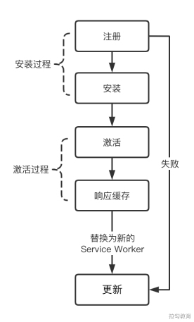
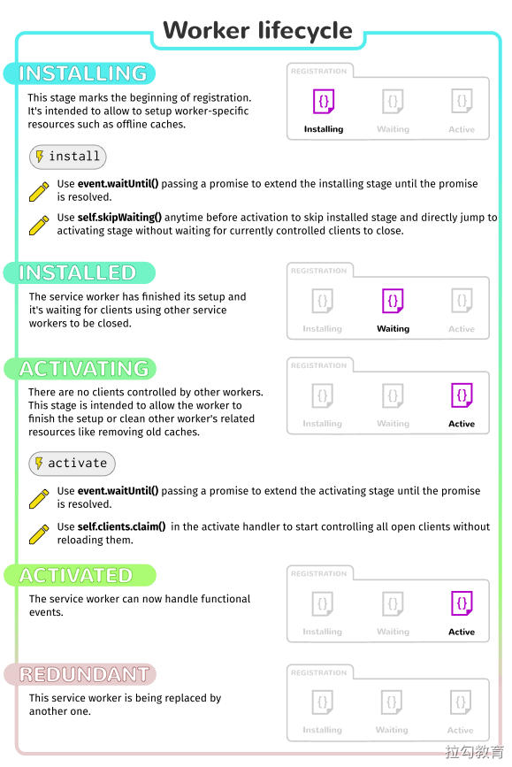
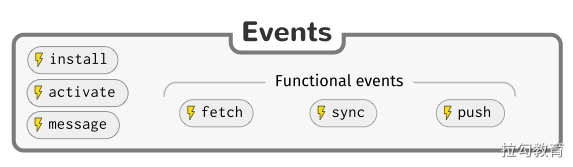
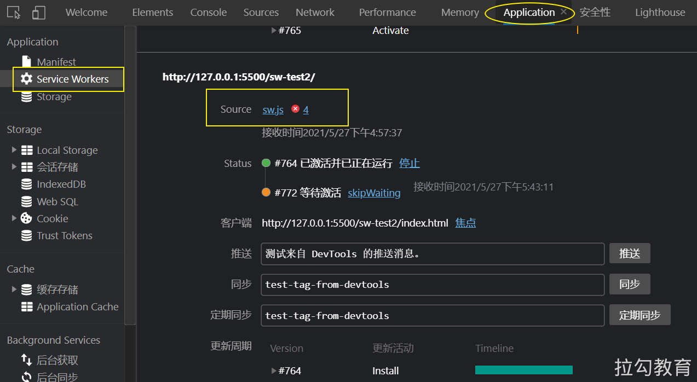
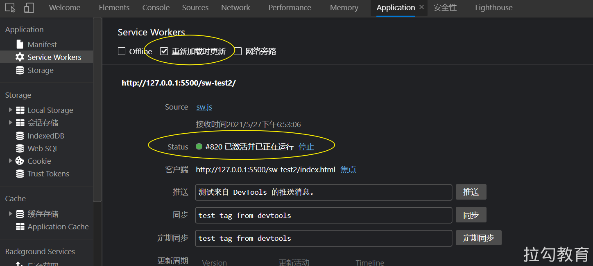
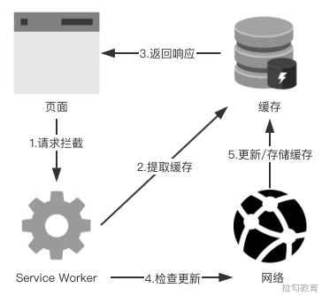

# Service Worker 缓存

Service Worker 是浏览器后台独立于主线程之外的工作线程，正因如此它的处理能力能够脱离浏览器窗体而不影响页面的渲染性能。同时它还能实现诸如推送通知、后台同步、请求拦截及缓存管理等功能，本节将主要讲解其生命周期和对缓存的管理。

## Service Worker 概览 

Service Worker 是伴随着 Google 推出的 PWA（即 Progressive Web App 渐进式 Web 应用）一同出现的技术，它能够实现诸如消息推送、后台加载、离线应用及移动端添加到主屏等堪比原生应用的功能，同时还具备小程序“无须安装、用完即走”的体验特点。虽然 Service Worker 已被列入 W3C 标准，但在各端上的兼容性并不理想，目前来讲应用比较多的还是在基于 Chrome 的 PC 端浏览器上。

### 技术由来 

我们都知道 JavaScript 的执行是单线程的，如果一个任务的执行占用并消耗了许多计算资源，则势必会导致阻塞执行其他任务，这正是单线程的弊端。为此浏览器引入了 Web Worker，它是一个独立于浏览器主线程之外的工作线程，可以将较复杂的运算交给它来处理，而无须担心这是否会对页面渲染产生负面影响。Service Worker 正是在此基础上增加了对离线缓存的管理能力，它的表现弥补了之前 HTML 5 上采用 AppCache 实现离线缓存的诸多缺陷。

Service Worker 定义了由事件驱动的生命周期，这使得页面上任何网络请求事件都可以被其拦截并加以处理，同时还能访问缓存和 IndexedDB，这就可以让开发者制定自定义度更高的缓存管理策略，从而提高离线弱网环境下的 Web 运行体验。

### 基本特征 

在介绍的技术由来中，其实已经提到了有关 Service Worker 的一些特点，下面来对其进行简要的归纳。

- 独立于浏览器主线程，无法直接操作 DOM。

- 在开发过程中可以通过 localhost 使用，但要部署到线上环境则需要 HTTPS 的支持。

- 能够监听并拦截全站的网络请求，从而进行自定义请求响应控制。

- 在不使用的时候会被中止，在需要的时候进行重启。所以我们不能依赖在其 onmessage 与 onfetch 的事件监听处理程序中的全局状态，如果有此需要可以通过访问 IndexedDB API 将全局状态进行存储。

- 广泛使用 Promise 来处理异步。

- 消息推送。

- 后台同步。

## 生命周期 

若想更好地将 Service Worker 的特性应用到实际项目中，来为用户提供零感知的性能优化体验，那么其生命周期就是必须要熟知的，本节就来详细地探讨有关 Service Worker 生命周期的各个环节，如图所示。



首先来看一下使用 Service Worker 的大致过程：通常每一个 Service Worker 都会依赖于各自独立的执行脚本，在页面需要使用时通过请求相应的执行脚本进行 Service Worker 的注册；当注册流程启动后，便可在执行脚本中监听 install 事件来判断安装是否成功，若安装成功则可进行有关离线缓存的处理操作。

但此时的安装成功并不意味着 Service Worker 已经能够取得页面的控制权，只有进行激活后，Service Worker 才能监听页面发出的 fetch 和 push 等事件；如果 Service Worker 的执行脚本发生修改需要进行更新，则更新的流程也会涉及完整的生命周期。

Service Worker 生命周期所涉及的五个关键状态，下面就来依次讨论每个状态中所包含的关键处理操作。





### 注册

目前对于 Service Worker 的兼容性来看，依然存在一些浏览器尚未支持的场景，因此在注册之前，需要判断全局环境中是否存在注册 Service Worker 所需的 API，再进行相应的注册操作，具体代码示例如下：

```js
// 仅当浏览器支持 Service Worker 的场景下进行相应的注册
if ('serviceWorker' in navigator) {
  navigator.serviceWorker.register('/service-worker.js')
}
```

虽然上述代码能够完成对 Service Worker 的注册，但是该代码段位于 JavaScript 脚本的主流程中，它的执行需要请求加载 service-worker.js 文件，这就意味着在用户访问网站时的首屏渲染可能会被阻塞，进而降低用户体验。

对此进行优化十分简单的方法便是当页面完成加载后再启动 Service Worker 的注册操作，可以通过监听 load 事件来获取页面完成加载的时间点，优化后的代码如下：

```js
// 仅当浏览器支持 Service Worker 的场景下进行相应的注册
if ('serviceWorker' in navigator) {
  window.addEventListener('load', () => {
  	navigator.serviceWorker.register('/service-worker.js')
  })
}
```

在进行性能优化的过程中，经常会遇到类似的情况：引入一项技术带来了某方面性能提升的同时，也可能造成另一方面性能体验的降低。比如这里 Service Worker 可以丰富离线体验，提高开发者对缓存处理的自定义度，但如果不细致考虑资源加载的最佳时机，就很容易造成上述首屏渲染变慢的糟糕体验。
因此在引入任何优化方案时，都需要对优化前后的性能表现进行充分的测试，以避免出现优化方案使得性能指标 A 提升，但却导致性能指标 B 下降。

### 安装 

在注册步骤调用 navigator.serviceWorker.register 函数的处理过程中，会自动下载参数所指定的 Service Worker 执行脚本，然后进行解析与执行。此时处于 Service Worker 生命周期中的安装状态，如果在这个过程中由于某些原因引发了错误，则异步处理的 Promise 会拒绝继续执行，生命周期走到 redundant 终态，并且可在 Chrome 开发者工具的 Application 选项卡中，查看出相应的报错信息，具体如图所示。



如果一切顺利，则对 Service Worker 所请求的执行脚本下载、解析并执行成功，就会触发 install 事件进行 Service Worker 的后续处理。这个事件对每个 Service Worker 来说只会在安装时触发一次，即便执行脚本仅发生了几字节的修改更新，浏览器也会认为这是一个全新的 Service Worker，并在其重新安装后触发独立的 install 事件。

需要注意的是，在该事件中 Service Worker 其实还并未获得页面的控制权，即还不能监听页面上所发出的请求事件，但此时却可以执行一些与页面没有直接操作关系的其他任务，比如缓存一些页面稍后会用到的资源内容，代码示例如下：

```js
const cacheName = 'v1'

// 监听 SW 安装的 install 事件并进行缓存操作
this.addEventListener('install', event => {
  // 设置安装步骤的处理内容
  
  // waitUntil 确保 Service Worker 不会在 waitUntil() 里面的代码执行完毕之前安装完成。
  event.waitUntil(
    caches.open(cacheName).then(cache => {
      // 参数是一个由一组相对于 origin 的 URL 组成的数组，这些 URL 就是你想缓存的资源的列表。
      return cache.addAll([
        '/dist/index.js',
        '/dist/css/index.css'
      ])
    })
  )
})
```

上述代码中通过 event.waitUntil() 方法设置了 Service Worker 安装步骤的处理内容，即将两个文件添加缓存，如果指定的文件都下载并添加缓存成功，则表明 Service Worker 安装完成；否则只要有一个文件未完成下载或添加缓存失败，则整个安装步骤失败。因此在指定缓存所依赖的文件列表时，应确保其中所包含的文件都能获取成功，或在获取失败后提供相应的错误处理，来避免因个别文件的缓存失败而导致 Service Worker 的安装失败。

另外，在 Service Worker 的 install 事件中其实并未取得页面的控制权，这个限制的主要原因是为了确保整个过程中页面仅由同一个 Service Worker 控制，且每次仅运行唯一的一个版本。

### 激活 

若想要 Service Worker 获得页面的控制权，跳过安装完成后的等待期，十分简单的方式就是直接刷新浏览器，此时新的 Service Worker 便会被激活。当然也可以通过调用 self.skipWaiting() 方法来逐出当前旧的 Service Worker，并让新的 Service Worker 进入 activated 激活态以获得对页面的控制权。代码示例如下：

```js
self.addEventListener('install', event => {
  // 让 SW 进入激活态
  self.skipWaiting()
})
```

### 响应缓存

当 Service Worker 安装成功并进入激活态后，便可以接收页面所发出的 fetch 事件来进行缓存响应的相关操作。下面以一个代码示例进行说明：

```js
// 每次任何被 service worker 控制的资源被请求到时，都会触发 fetch 事件
this.addEventListener('fetch', event => {
  event.respondWith((async () => {
    try {
      // 获取缓存内容
      let response = await caches.match(event.request)

      // 缓存无效，发起网络请求获取资源
      if (!response) {
        response = await fetch(event.request.clone())

        // 将新获取的资源纳入缓存中
        const cache = await caches.open(cacheName)
        cache.put(event.request, response.clone())
      }
      return response
    } catch (err) {
      return caches.match('/sw-test2/gallery/myLittleVader.jpg')
    }
  })())
})
```

上述代码的基本流程是这样的：

- 当捕获到一个页面请求后，首先使用 caches.match() 方法在本地缓存中进行检索匹配；

- 如果检索到则返回缓存中储存的资源内容，否则将调用 fetch() 方法发起新的网络请求；

- 当接收到请求的响应后，依次判断响应是否有效、状态码是否为 200 及是否为自身发起的请求，经过判断，如果响应符合预期则将其放入对应请求的缓存中，以方便二次拦截到相同请求时能够快速响应。

### 更新 

当发生 Service Worker 执行代码的修改时，便需要对浏览器当前的 Service Worker 进行更新，更新的步骤与初始一个全新 Service Worker 的生命周期相同。

需要注意的是，应当将缓存管理放在 activate 事件的回调中进行处理，其原因是当新的 Service Worker 完成安装并处于等待状态时，此时页面的控制权依然属于旧的 Service Worker，如果不等到激活完成就对缓存内容进行清除或修改，则可能导致旧的 Service Worker 无法从缓存中提取到资源，这会是一个很不好的使用体验。

## 本地开发注意事项 

考虑到 Service Worker 生命周期的相关内容，它能够有效地拦截页面请求并判断缓存是否命中，这对用户体验来说是非常不错的，但同时也引起了开发过程中的一些不便，因为开发调试的需要，即使 Service Worker 的执行代码在前后两次完全相同，也希望能够进行重新提取，以及手动跳过安装后的等待期。幸运的是，Chrome 开发者工具已为这些开发诉求提供了现成的工具，如图所示。



选择图中1号框中的复选框，可使得每次刷新浏览器都进行 Service Worker 的更新，无论现有的 Service Worker 执行代码是否发生更新，单击图中2号框的按钮，则可让一个处在等待状态的 Service Worker 立即进入激活状态。

除此之外，Service Worker 的设计开发包含了可扩展网站架构思想，它应当给开发者提供对浏览器核心内容的访问方法，而不仅仅是一些简单的高级 API 调用。以下代码示例及注释说明，开发者可以观察 Service Worker 的整个更新周期：

```js
navigator.serviceWorker.register('/sw.js').then(reg => {
  // 如果 reg.installing 不为 undefined，则说明当前 SW 处理正在安装的状态
  reg.installing

  // 如果 reg.wating 不为 undefined，则说明当前 SW 处于安装后的等待状态
  reg.waiting

  // 如果 reg.active 不为 undefined，则说明当前 SW 处于激活状态
  reg.active

  reg.addEventListener('updatefound', () => {
    const newWorker = reg.installing

    // 该值为当前 SW 的状态字符串，可取的值包括：installing、installed、activating、activated、redundant，即 SW 的生命周期
    newWorker.state

    newWorker.addEventListener('statechange', () => {
      // 生命周期状态改变所触发的事件
    })
  })
})

navigator.serviceWorker.addEventListener('controllerchange', () => {
  // SW 对页面的控制权发生变更时触发的事件，比如一个新的 SW 从等待状态进入激活状态，获得了对当前页面的控制权
})
```

## 高性能加载

为网站应用添加 Service Worker 的能力，就相当于在浏览器后台为该应用增加了一条对资源的处理线程，它独立于主线程，虽然不能直接操作页面 DOM，但可以进行许多离线计算与缓存管理的工作，这将会带来显著的性能提升。下面介绍一点优化资源加载时间的合理做法及注意事项，为确保 Service Worker 能发挥最佳性能提供参考。

当浏览器发起对一组静态 HTML 文档资源的请求时，高性能的加载做法应当是：通过 Service Worker 拦截对资源的请求，使用缓存中已有的 HTML 资源进行响应，同时保证缓存中资源及时更新。静态资源高效加载策略如图所示。



上图处理策略的对应的代码示例如下：

```js
self.addEventListener('fetch', event => {
	if (event.request.mode === 'navigate') {
  	event.respondWith(async () => {
    	// 拦截页面请求
      const normalizedUrl = new URL(event.request.url)
      normalizedUrl.search = ''
      
      // 定义对资源重新请求的方法
      const fetchResponse = fetch(normalizedUrl)
      const fetchResponseClone = fetchResponse.then(r => r.clone())
      
      // 等到请求的响应到达后，更新缓存中的资源
      event.waitUntil((async () => {
      	const cache = await cached.open('cacheName')
        await cache.put(normalizedUrl, await fetchResponseClone)
      })())
      
      // 如果请求命中缓存，则使用相应缓存，否则重新发起资源请求
      return (await cached.match(normalizedUrl)) || fetchResponse
    }())
  }
})
```

这里需要注意的是，尽量避免和降低 Service Worker 对请求的无操作拦截，即 Service Worker 对所拦截的请求不进行任何处理，就直接向网络发起请求，然后在得到响应后再返回给页面。代码示例如下：

```js
self.addEventListener('fetch', event => {
	event.respondWith(fetch(event.request))
})
```

这是很糟糕的处理方式，因为在不考虑网络实际延迟的情况下，经过了 Service Worker 的拦截转发，会在请求与响应阶段造成不必要的开销。

## 参考链接 

- https://developer.mozilla.org/zh-CN/docs/Web/API/Service_Worker_API/Using_Service_Workers

- https://developer.mozilla.org/en-US/docs/Web/API/Service_Worker_API

- https://github.com/mdn/sw-test

