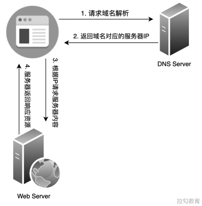
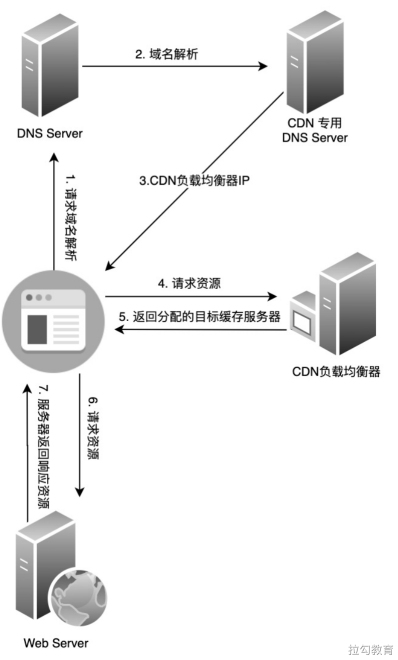
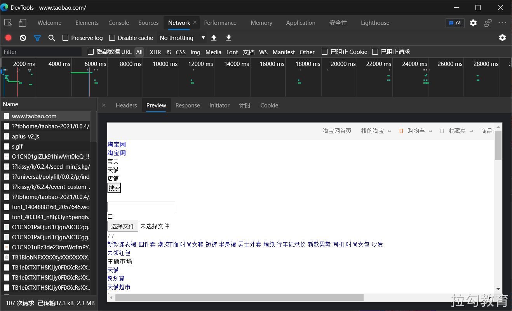

# CDN 缓存

CDN 全称 Content Delivery Network，即内容分发网络，它是构建在现有网络基础上的虚拟智能网络，依靠部署在各地的边缘服务器，通过中心平台的负载均衡、调度及内容分发等功能模块，使用户在请求所需访问的内容时能够就近获取，以此来降低网络拥塞，提高资源对用户的响应速度。本节就来对 CDN 缓存所涉及的性能优化内容进行简要介绍。

## CDN 概述 

前面章节讲到的浏览器缓存方案，它们带来的性能提升主要针对的是浏览器端已经缓存了所需的资源，当发生二次请求相同资源时便能够进行快速响应，避免重新发起请求或重新下载全部响应资源。

显而易见，这些方法对于首次资源请求的性能提升是无能为力的，若想提升首次请求资源的响应速度，除了对资源进行压缩、图片优化等方式，还可借助本节所要介绍的 CDN 技术。

### 工作原理 

回想在初学计算机网络的时候，常见的 B/S 模型都是浏览器直接向服务器请求所需的资源，但实际组网情况并非如此简单。因为通常对热门站点来说，同时发起资源请求的用户规模量往往非常巨大，而如果这些请求都发往同一服务器则极有可能造成访问拥塞。所以更合理的做法是将部分数据缓存在距离用户较近的边缘服务器上，这样不但可以提升对资源的请求获取速度，而且也能有效减少网站根节点的出口带宽压力，这便是 CDN 技术的基本思路。


如果未使用 CDN 网络进行缓存加速，那么通过浏览器访问网站获取资源的大致过程如图所示。



请求的步骤大致可分为四步。

（1）当用户在浏览器中输入所要访问的域名时，若本机无法完成域名解析工作，则会转向 DNS 服务器请求对该域名的解析。
（2）DNS 服务器解析完成返回给浏览器该域名所对应的 IP 地址。
（3）浏览器向该 IP 地址指向的服务器发起资源请求。
（4）最后服务器响应用户请求将资源返回给浏览器。如果使用了 CDN 网络，则资源获取的大致过程是这样的。



（1）由于 DNS 服务器将对 CDN 的域名解析权交给了 CNAME 指向的专用 DNS 服务器，所以对用户输入域名的解析最终是在 CDN 专用的 DNS 服务器上完成的。

（2）解析出的结果 IP 地址并非确定的 CDN 缓存服务器地址，而是 CDN 的负载均衡器的地址。

（3）浏览器会重新向该负载均衡器发起请求，经过对用户 IP 地址的距离、所请求资源内容的位置及各个服务器复杂状况的综合计算，返回给用户确定的缓存服务器 IP 地址。

（4）对目标缓存服务器请求所需资源的过程。

当然这个过程也可能会发生所需资源未找到的情况，那么此时便会依次向其上一级缓存服务器继续请求查询，直至追溯到网站的根服务器并将资源拉取到本地，如图所示。

虽然这个过程看起来稍微复杂了一些，但对用户体验来说是无感知的，并且能带来比较明显的资源加载速度的提升，因此对目前所有一线互联网产品来说，使用 CDN 已经不是一条建议，而是一个规定。

### 针对静态资源 

CDN 网络能够缓存网站资源来提升首次请求的响应速度，但并非能适用于网站所有资源类型，它往往仅被用来存放网站的静态资源文件。所谓静态资源，就是指不需要网站业务服务器参与计算即可得到的资源，包括第三方库的 JavaScript 脚本文件、样式表文件及图片等，这些文件的特点是访问频率高、承载流量大，但更新修改频次低，且不与业务有太多耦合。

如果是动态资源文件，比如依赖服务器端渲染得到的 HTML 页面，它需要借助服务器端的数据进行计算才能得到，所以它就不适合放在 CDN 缓存服务器上。

### 核心功能 

CDN 网络的核心功能包括两点：缓存与回源，缓存指的是将所需的静态资源文件复制一份到 CDN 缓存服务器上；回源指的是如果未在 CDN 缓存服务器上查找到目标资源，或 CDN 缓存服务器上的缓存资源已经过期，则重新追溯到网站根服务器获取相关资源的过程。

由于这两个过程与前端性能优化的关系并非特别紧密，所以此处仅介绍概念，暂不进行深入分析。

## 应用场景 

下面我们以淘宝官网为例，来看看关于 CDN 的具体使用情况，打开淘宝网址可查看页面最终的渲染效果，如图所示。


此时打开 Chrome 开发者工具的 Network 选项卡，来查看网站为渲染出该效果此时打开 Chrome 开发者工具的 Network 选项卡，来查看网站为渲染出该效果都请求了哪些资源，我们很容易发现除了从业务服务器返回的一个未完全加载资源的 HTML 文件，还包括了许多图片、JavaScript 文件及样式表文件，具体内容如图所示。



接着我们进一步去查看静态资源所请求的URL，并列举几种不同类型的资源文件如下：

```
// JavaScript 资源
https://g.alicdn.com/alilog/mlog/aplus_v2.js

// CSS 资源
https://g.alicdn.com/tb-mod/tbh-conve-common/0.0.1/index-min.css

// 图片资源
https://img.alicdn.com/tfs/TB1eiXTXlTH8KJjy0FiXXcRsXXa-24-595.png
```

从上述资源文件的请求域名中我们可以发现，这些文件都是从 CDN 网络上获取的，JavaScript 和样式表这样的文本文件与图片文件使用的是不同的 CDN 域名，而且 CDN 域名与主站域名也完全不同，这样的设计也是出于对性能的考虑，下面来分析具体的优化原理。

## 优化实践 

关于 CDN 的性能优化，如何能将其效果发挥到最大程度？其中包括了许多可实践的方面，比如 CDN 服务器本身的性能优化、动态资源静态边缘化、域名合并优化和多级缓存的架构优化等，这些可能需要前端工程师与后端工程师一起配合，根据具体场景进行思考和解决，这里仅介绍一个与前端关系密切的 CDN 优化点：域名设置。

我们以上节的示例来进行说明，主站请求的域名为 www.taobao.com，而静态资源请求 CDN 服务器的域名有 g.alicdn.com 和 img.alicdn.com 两种，它们是有意设计成与主站域名不同的，这样做的原因主要有两点：第一点是**避免对静态资源的请求携带不必要的 Cookie 信息**，第二点是**考虑浏览器对同一域名下并发请求的限制**。

（1）首先对第一点来说，Cookie 的访问遵循同源策略，并且同一域名下的所有请求都会携带全部 Cookie 信息。

虽然 Cookie 的存储空间就算存满也并不是很大，但如果将所有资源请求都放在主站域名下，那么所产生的效果对于任何一个图片、JavaScript 脚本及样式表等静态资源文件的请求，都会携带完整的 Cookie 信息，若这些完全没有必要的开销积少成多，那么它们所产生的流量浪费就会很大，所以将 CDN 服务器的域名和主站域名进行区分是非常有价值的实践。

（2）其次是第二点，因为浏览器对于同域名下的并发请求存在限制，通常 Chrome 的并发限制数是 6，其他浏览器可能多少会有所差异。这种限制也同时为我们提供了一种解决方案：通过增加类似域名的方式来提高并发请求数，比如对多个图片文件进行并发请求的场景，可以通过扩展如下类似域名的方式来规避限制：

```
https://img1.alicdn.com/examp1.jpg
https://img2.alicdn.com/examp1.jpg
```

虽然这种方式对于多并发限制是有效的，但是缓存命中是要根据整个 URL 进行匹配的，如果并发请求了相同的资源却又使用了不同的域名，那么图片之前的缓存就无法重用，也降低了缓存的命中，对于这种情况我们应该考虑进行恰当的域名合并优化。