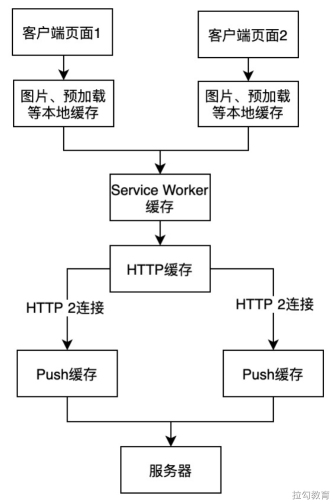
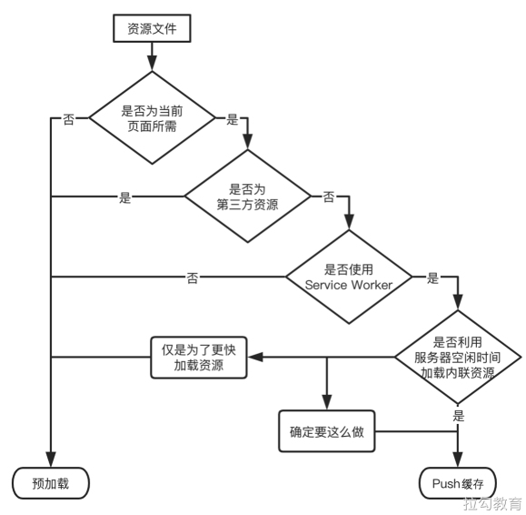

# Push 缓存

HTTP 2 新增了一个强大的功能：服务器端推送，它的出现打破了传统意义上的请求与响应一对一的模式，服务器可以对客户端浏览器的一个请求发送多个响应。

这样会带来性能优化的一个新思路：在传统的网络应用中，客户端若想将应用中所包含的多种资源渲染展示在浏览器中，就需要逐个资源进行请求，但其实一个 HTML 文件中所包含的 JavaScript、样式表及图片等文件资源，是服务器可以在收到该 HTML 请求后预判出稍后会到来的请求，那么就可以利用服务器端推送节省这些多余的资源请求，来提升页面加载的速度。

显然 Push 缓存能显著提升页面加载速度，但在具体使用过程中依然有许多需要注意的地方，本节就来对其相关内容进行详细讨论。

## 最后一道缓存 

### 内存中的缓存 

内存中的缓存是浏览器中响应速度最快且命中优先级最高的一种缓存，但它的驻留周期非常短，通常依赖于渲染进程，一旦页面页签关闭进程结束，内存中的缓存数据就会被回收。

具体到什么资源会放入内存中的缓存，其实具有一定的随机性，因为内存空间有限，首先需要考虑到当前的内存余量，然后再视具体的情况去分配内存与磁盘空间上的存储占比。通常体积不大的 JavaScript 文件和样式表文件有一定概率会被纳入内存中进行缓存，而对于体积较大的文件或图片则较大概率会被直接放在磁盘上存储。

### 缓存命中优先级 

上述四类浏览器缓存的命中优先级从高到低分别是：内存中的缓存、Service Worker 缓存、HTTP 缓存及 HTTP 2 的 Push 缓存。Push 缓存会作为缓存命中的最后一道防线，只有在前面三种缓存均未命中的情况下才会进行询问。这里需要注意的是，只要有高优先级的缓存命中成功，即便设置了低优先级的缓存，也不会对其进行询问。缓存命中优先级如图所示。

### 基于连接的缓存 

在了解了缓存命中优先级后，我们还需要明白 Push 缓存是依赖于 HTTP 2 连接的，如果连接断开，即便推送的资源具有较高的可缓存性，它们也会丢失，这就意味着需要建立新的连接并重新下载资源。考虑到网络可能存在不稳定性，建议不要长时间依赖 Push 缓存中的资源内容，它更擅长的是资源推送到页面提取间隔时长较短的使用场景。

另外，每个 HTTP 2 连接都有自己独立的 Push 缓存，对使用了同一个连接的多个页面来说，它们可以共享该 Push 缓存。但反过来看也需要明白，在将如 JSON 数据等内容与页面响应信息一同推送给客户端时，这些数据资源并非仅被同一页面提取，它们还可以被一个正在安装的 Service Worker 提取使用，这或许会成为 Push 缓存的一个优势。

## Push 缓存与预加载 

通过讲述有关 HTTP 2 推送的内容，可以察觉到它与 HTTP 的预加载存在许多相似之处，它们的优化原理都是利用客户端的空闲带宽来进行资源文件获取的，这种方式能够很好地将资源的执行与获取进行分离，当浏览器实际需要某个资源文件时，该资源文件其实已经存在于缓存中了，这样便省去了发起请求后的等待时间。

### 不同之处 

Push 缓存和预加载还存在一些不同之处，其中主要的不同点是，Push 缓存是由服务器端决定何时向客户端预先推送资源的，而预加载则是当客户端浏览器收到 HTML 文件后，经过解析其中带有 preload 的标签，才会开启预加载的。其他一些不同之处还包括以下几个方面。

- Push 缓存只能向同源或具有推送权的源进行资源的推送，而预加载则可以从任何源加载资源。
- 预加载使用的是内存中的缓存，而推送使用的 Push 缓存。
- 预加载的资源仅能被发起请求的页面使用，而服务器端 Push 缓存的资源却能在浏览器的不同标签页面中共用。
- 预加载使用的link标签上可以设置 onload 和 onerror 进行相应事件的监听，而 Push 缓存则在服务器端进行监听相对更加透明。
- 预加载可以根据不同的头信息，使用内容协商来确定发送的资源是否正确，Push 缓存却不可以。

### 使用场景 

在分析了 Push 缓存和预加载的异同点之后，会发现两者有其各自擅长的使用场景，首先来看适合使用 Push 缓存的两个场景。

（1）有效利用服务器的空闲时间进行资源的预先推送。例如对于服务器端渲染 HTML 页面的场景，在服务器端生成 HTML 页面的过程中，网络是出于空闲状态的，并且此时客户端浏览器也不会知道将要展示的页面中会包含哪些资源，那么便可以利用这段时间向浏览器推送相关资源。

（2）推送 HTML 中的内联资源。比如 JavaScript 脚本、样式表文件和一些小图标，将这些资源文件进行单独推送，同时也可以很好地利用浏览器缓存，避免每次将 HTML 文件及所包含的资源一并推送。

在这里介绍两种适合使用预加载的场景：CSS 样式表文件中所引用的字体文件；外部CSS样式表文件中使用 background-url 属性加载的图片文件。

### 使用决策 

为了方便决定使用 Push 缓存还是预加载，下面给出一个决策树以供参考，如图所示。

在上图的决策树中，如果资源并不能够利用服务器端空闲时间进行推送，可能就需要根据具体场景进行选取了，如果是内联的关键样式表或 JavaScript 脚本，仅希望更快进行加载则可以使用预加载；对于某些在服务器端就能预判出稍后便会请求的资源，则可使用 Push 推送进行提前缓存。