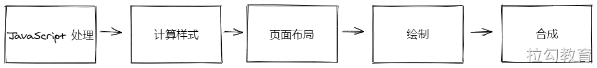

# 渲染优化

如果把浏览器呈现页面的整个过程一分为二，前面所讲的主要是浏览器为呈现页面请求所需资源的部分；本章将主要关注浏览器获取到资源后，进行渲染部分的相关优化内容。

在前面的前端页面的生命周期课程中，介绍过关键渲染路径的概念，浏览器通过这个过程对 HTML、CSS、JavaScript 等资源文件进行解析，然后组织渲染出最终的页面。本章将以此为基础，对渲染过程进行更深入的讨论，不仅包括打开一个网站的首次渲染，还有用户与页面进行交互后导致页面更改的渲染，即所谓的重绘与重排。其中除了对渲染过程的充分介绍，更重要的是对提升渲染过程性能的优化手段的探讨。

浏览器从获取 HTML 到最终在屏幕上显示内容需要完成以下步骤：

1. 处理 HTML 标记并构建 DOM 树。
2. 处理 CSS 标记并构建 CSSOM 树。
3. 将 DOM 与 CSSOM 合并成一个 render tree。
4. 根据渲染树来布局，以计算每个节点的几何信息。
5. 将各个节点绘制到屏幕上。

经过以上整个流程我们才能看见屏幕上出现渲染的内容，**优化关键渲染路径就是指最大限度缩短执行上述第 1 步至第 5 步耗费的总时间**，让用户最快的看到首次渲染的内容。

不但网站页面要快速加载出来，而且运行过程也应更顺畅，在响应用户操作时也要更加及时，比如我们通常使用手机浏览网上商城时，指尖滑动屏幕与页面滚动应很流畅，拒绝卡顿。那么要达到怎样的性能指标，才能满足用户流畅的使用体验呢？

目前大部分设备的屏幕分辨率都在60fps左右，也就是每秒屏幕会刷新60次，所以要满足用户的体验期望，就需要浏览器在渲染页面动画或响应用户操作时，每一帧的生成速率尽量接近屏幕的刷新率。若按照60fps来算，则留给每一帧画面的时间不到17ms，再除去浏览器对资源的一些整理工作，一帧画面的渲染应尽量在10ms内完成，如果达不到要求而导致帧率下降，则屏幕上的内容会发生抖动或卡顿。

为了使每一帧页面渲染的开销都能在期望的时间范围内完成，就需要开发者了解渲染过程的每个阶段，以及各阶段中有哪些优化空间是我们力所能及的。经过分析根据开发者对优化渲染过程的控制力度，可以大体将其划分为五个部分：JavaScript处理、计算样式、页面布局、绘制与合成，下面先简要介绍各部分的功能与作用。

- JavaScript 处理：前端项目中经常会需要响应用户操作，通过 JavaScript 对数据集进行计算、操作 DOM 元素，并展示动画等视觉效果。当然对于动画的实现，除了 JavaScript，也可以考虑使用如 CSS Animations、Transitions 等技术。
- 计算样式：在解析 CSS 文件后，浏览器需要根据各种选择器去匹配所要应用 CSS 规则的元素节点，然后计算出每个元素的最终样式。
- 页面布局：指的是浏览器在计算完成样式后，会对每个元素尺寸大小和屏幕位置进行计算。由于每个元素都可能会受到其他元素的影响，并且位于 DOM 树形结构中的子节点元素，总会受到父级元素修改的影响，所以页面布局的计算会经常发生。
- 绘制：在页面布局确定后，接下来便可以绘制元素的可视内容，包括颜色、边框、阴影及文本和图像。
- 合成：通常由于页面中的不同部分可能被绘制在多个图层上，所以在绘制完成后需要将多个图层按照正确的顺序在屏幕上合成，以便最终正确地渲染出来。

这个过程中的每一阶段都有可能产生卡顿，本章后续内容将会对各阶段所涉及的性能优化进行详细介绍。这里值得说明的是，并非对于每一帧画面都会经历这五个部分。比如仅修改与绘制相关的属性（文字颜色、背景图片或边缘阴影等），而未对页面布局产生任何修改，那么在计算样式阶段完成后，便会跳过页面布局直接执行绘制。