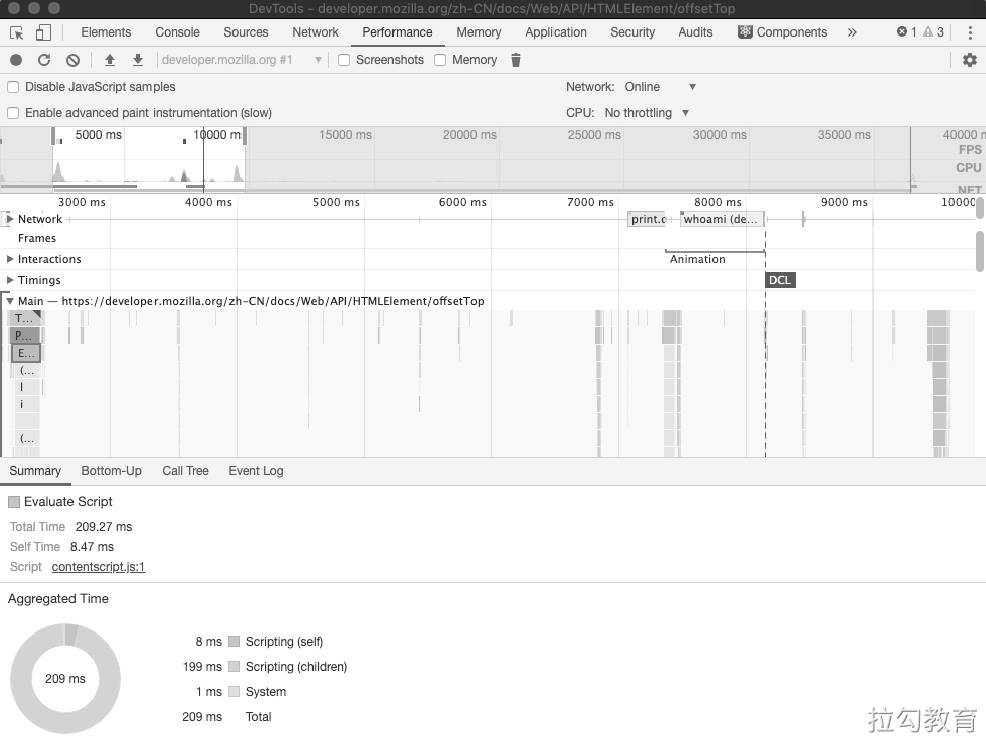
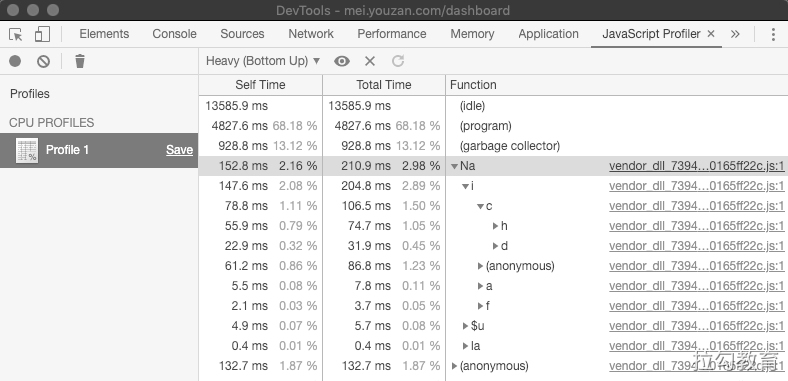

# JavaScript 执行优化

本节我们将讨论如何优化 JavaScript 的执行来改善用户在渲染方面的性能体验。

## 实现动画效果 

前端实现动画效果的方法有很多，比如在 CSS 中可以通过 transition 和 animation 来实现，在 HTML 中可以通过 canvas 来实现，而利用 JavaScript 通常最容易想到的方式是利用定时器 setTimeout 或 setInterval 来实现，即通过设置一个间隔时间来不断地改变目标图像的位置来达到视觉变化的效果。

```js
setInterval(function() {
  // animiate something
}, 1000 / 60)
```

实践经验告诉我们，使用定时器实现的动画会在一些低端机器上出现抖动或者卡顿的现象，这主要是因为浏览器无法确定定时器的回调函数的执行时机。以 setInterval 为例，其创建后回调任务会被放入异步队列，只有当主线程上的任务执行完成后，浏览器才会去检查队列中是否有等待需要执行的任务，如果有就从任务队列中取出执行，这样会使任务的实际执行时机比所设定的延迟时间要晚一些。

其次屏幕分辨率和尺寸也会影响刷新频率，不同设备的屏幕绘制频率可能会有所不同，而 setInterval 只能设置某个固定的时间间隔，这个间隔时间不一定与所有屏幕的刷新时间同步，那么导致动画出现随机丢帧也在所难免，如图所示。


为了避免这种动画实现方案中因丢帧而造成的卡顿现象，我们推荐使用 window.requestAnimationFrame 方法。与 setInterval 方法相比，其最大的优势是将回调函数的执行时机交由系统来决定，即如果屏幕刷新频率是 60Hz，则它的回调函数大约会每 16.7ms 执行一次，如果屏幕的刷新频率是 75Hz，则它回调函数大约会每 13.3ms 执行一次，就是说 requestAnimationFrame 方法的执行时机会与系统的刷新频率同步。

这样就能保证回调函数在屏幕的每次刷新间隔中只被执行一次，从而避免因随机丢帧而造成的卡顿现象。

其使用方法也十分简单，仅接受一个回调函数作为入参，即下次重绘之前更新动画帧所调用的函数。返回值为一个 long 型整数，作为回调任务队列中的唯一标识，可将该值传给 window.cancelAnimationFrame 来取消回调，以某个目标元素的平移动画为例：

```html
<!DOCTYPE html>
<html lang="en">

<head>
  <meta charset="UTF-8">
  <meta http-equiv="X-UA-Compatible" content="IE=edge">
  <meta name="viewport" content="width=device-width, initial-scale=1.0">
  <title>Document</title>
  <style>
    .box {
      width: 100px;
      height: 100px;
      position: absolute;
      background-color: skyblue;
    }
  </style>
</head>

<body>
  <div class="box"></div>
  <script>
    const element = document.querySelector('.box')
    let start

    function step(timestamp) {
      if (!start) {
        start = timestamp
      }

      const progress = timestamp - start

      // 在这里使用 Math.min() 确保元素刚好停在 200px 的位置
      element.style.left = `${Math.min(progress / 10, 200)}px`

      // 在两秒后停止动画
      if (progress < 2000) {
        window.requestAnimationFrame(step)
      }
    }

    window.requestAnimationFrame(step)
  </script>
</body>

</html>
```

使用这个 API 还需要浏览器兼容性的问题。


## 恰当使用 Web Worker

众所周知 JavaScript 是单线程执行的，所有任务放在一个线程上执行，只有当前一个任务执行完才能处理后一个任务，不然后面的任务只能等待，这就限制了多核计算机充分发挥它的计算能力。同时在浏览器上，JavaScript 的执行通常位于主线程，这恰好与样式计算、页面布局及绘制一起，如果 JavaScript 运行时间过长，必然就会导致其他工作任务的阻塞而造成丢帧。

为此可将一些纯计算的工作迁移到 Web Worker 上处理，它为 JavaScript 的执行提供了多线程环境，主线程通过创建出 Worker 子线程，可以分担一部分自己的任务执行压力。在 Worker 子线程上执行的任务不会干扰主线程，待其上的任务执行完成后，会把结果返回给主线程，这样的好处是让主线程可以更专注地处理 UI 交互，保证页面的使用体验流程。需要注意的是，Worker 子线程一旦创建成功就会始终执行，不会被主线程上的事件所打断，这就意味着 Worker 会比较耗费资源，所以不应当过度使用，一旦任务执行完毕就应及时关闭。除此之外，在使用中还有以下几点应当注意。

- DOM限制：Worker 无法读取主线程所处理网页的 DOM 对象，也就无法使用 document、window 和 parent 等对象，只能访问 navigator 和 location 对象。
- 文件读取限制：Worker 子线程无法访问本地文件系统，这就要求所加载的脚本来自网络。
- 通信限制：主线程和 Worker 子线程不在同一个上下文内，所以它们无法直接进行通信，只能通过消息来完成。
- 脚本执行限制：虽然 Worker 可以通过 XMLHTTPRequest 对象发起 ajax 请求，但不能使用 alert() 方法和 confirm() 方法在页面弹出提示。
- 同源限制：Worker 子线程执行的代码文件需要与主线程的代码文件同源。

Web Worker 的使用方法非常简单，在主线程中通过 new Worker() 方法来创建一个 Worker 子线程，构造函数的入参是子线程执行的脚本路径，由于代码文件必须来自网络，所以如果代码文件没能下载成功，Worker 就会失败。代码示例如下：

```html
<!DOCTYPE html>
<html lang="en">

<head>
  <meta charset="UTF-8">
  <meta http-equiv="X-UA-Compatible" content="IE=edge">
  <meta name="viewport" content="width=device-width, initial-scale=1.0">
  <title>Web Worker</title>
</head>

<body>
  <input type="number" id="num1" value="1">+
  <input type="number" id="num2" value="2">
  <button id="btn">=</button>
  <strong id="result">0</strong>
  <script>
    const worker = new Worker('worker.js')

    const num1 = document.querySelector('#num1')
    const num2 = document.querySelector('#num2')
    const result = document.querySelector('#result')
    const btn = document.querySelector('#btn')

    btn.addEventListener('click', () => {
      worker.postMessage({
        type: 'add',
        data: {
          num1: num1.value - 0,
          num2: num2.value - 0
        }
      })
    })

    worker.addEventListener('message', e => {
      const { type, data } = e.data
      if (type === 'add') {
        result.textContent = data
      }
    })

  </script>
</body>

</html>
```

```js
// worker.js
onmessage = function (e) {
  const { type, data } = e.data
  if (type === 'add') {
    const ret = data.num1 + data.num2
    postMessage({
      type: 'add',
      data: ret
    })
  }
}
```

在子线程处理完相关任务后，需要及时关闭 Worker 子线程以节省系统资源，关闭的方式有两种：

- 在主线程中通过调用 worker.terminate() 方法来关闭；
- 在子线程中通过调用自身全局对象中的 self.close() 方法来关闭。

考虑到上述关于 Web Worker 使用中的限制，并非所有任务都适合采用这种方式来提升性能。如果所要处理的任务必须要放在主线程上完成，则应当考虑将一个大型任务拆分为多个微任务，每个微任务处理的耗时最好在几毫秒之内，能在每帧的 requestAnimationFrame 更新方法中处理完成，代码示例如下：

```js
// 将一个大型任务拆分为多个微任务
const taskList = splitTask(BigTask)

// 微任务处理逻辑，入参为每次任务起始时间戳
function processTaskList (taskStartTime) {
  let taskFinishTime
  do {
    // 从任务栈中推出要处理的下一个任务
    const nextTask = taskList.pop()
    // 处理下一个任务
    processTask(nextTask)
    // 执行任务完成的时间，如果时间够 3 毫秒就继续执行
    taskFinishTime = window.performance.now()
  } while (taskFinishTime - taskStartTime < 3)

  // 如果任务堆栈不为空则继续
  if (taskList.length > 0) {
    requestAnimationFrame(processTaskList)
  }
}

requestAnimationFrame(processTaskList)
```

## 事件节流和事件防抖

本章所介绍的动画触发方式就用到了事件节流的思想，即当用户在与 Web 应用发生交互的过程中，势必有一些操作会被频繁触发，如滚动页面触发的 scroll 事件，页面缩放触发的 resize 事件，鼠标涉及的 mousemove、mouseover 等事件，以及键盘涉及的 keyup、keydown 等事件。

频繁地触发这些事件会导致相应回调函数的大量计算，进而引发页面抖动甚至卡顿，为了控制相关事件的触发频率，就有了接下来要介绍的事件节流与事件防抖操作。

所谓事件节流，简单来说就是在某段时间内，无论触发多少次回调，在计时结束后都只响应第一次的触发。以 scroll 事件为例，当用户滚动页面触发了一次 scroll 事件后，就为这个触发操作开启一个固定时间的计时器。在这个计时器持续时间内，限制后续发生的所有 scroll 事件对回调函数的触发，当计时器计时结束后，响应执行第一次触发 scroll 事件的回调函数。代码示例如下：

```js
/**
 * 事件节流
 * @param time 事件节流时间间隔
 * @param callback 事件回调函数 
 */
function throttle (time, callback) {
  // 上次触发回调的时间
  let last = 0

  // 事件节流操作的闭包返回
  return params => {
    // 记录本次回调触发的时间
    let now = Number(new Date())
    if (now - last >= time) {
      // 如果超出节流时间间隔，则触发响应回调函数
      callback(params)
    }
  }
}

// 通过事件节流优化的事件回调函数
const throttle_scroll = throttle(1000, () => console.log('页面滚动'))

// 绑定事件
document.addEventListener('scroll', throttle_scroll)
```

事件防抖的实现方式与事件节流类似，只是所响应的触发事件是最后一次事件。具体来说，首先设定一个事件防抖的时间间隔，当事件触发开始后启动计时器，若在定时器结束计时之前又有相同的事件被触发，则更新计时器但不响应回调函数的执行，只有当计时器完整计时结束后，才去响应执行最后一次事件触发的回调函数。代码示例如下：

```js
/**
 * 事件防抖回调函数
 * @params: time 事件防抖时间延迟
 * @params: callback 事件回调函数
 */
function debounce (time, callback) {
  // 设置定时器
  let timer = null

  // 事件防抖操作的闭包返回
  return params => {
    // 每当事件被触发时，清除旧定时器
    if (timer) clearTimeout(timer)
    
    // 设置新的定时器
    timer = setTimeout(() => callback(params), time)
  }
}

// 通过事件防抖优化事件回调函数
const debounce_scroll = debounce(1000, () => console.log('页面滚动'))

// 绑定事件
document.addEventListener('scroll', debounce_scroll)
```

虽然通过上述事件防抖操作，可以有效地避免在规定的时间间隔内频繁地触发事件回调函数，但是由于防抖机制颇具“耐心”，如果用户操作过于频繁，每次在防抖定时器计时结束之前就进行了下一次操作，那么同一事件所要触发的回调函数将会被无限延迟。频繁延迟会让用户操作迟迟得不到响应，同样也会造成页面卡顿的使用体验，这样的优化就属于弄巧成拙。

因此我们需要为事件防抖设置一条延迟等待的时间底线，即在延迟时间内可以重新生成定时器，但只要延迟时间到了就必须对用户之前的操作做出响应。这样便可结合事件节流的思想提供一个升级版的实现方式，代码示例如下：

```js
function throttle_pro (time, callback) {
  let last = 0
  let timer = null
  return params => {
    // 记录本次回调触发时间
    let now = Number(new Date())

    // 判断事件触发时间是否超出节流时间间隔
    if (now - last < time) {
      // 如果在所设置的延迟时间间隔内，则重新设置防抖定时器
      clearTimeout(timer)
      timer = setTimeout(() => {
        last = now
        callback(params)
      }, time)
    } else {
      // 如果超出延迟时间，则直接响应用户操作，不用等待
      last = now
      callback(params)
    }
  }
}

const scrollPro = throttle_pro(1000, () => console.log('页面滚动'))

document.addEventListener('scroll', scrollPro)
```

事件节流与事件防抖的实质都是以闭包的形式包裹回调函数的，通过自由变量缓存计时器信息，最后用 setTimeout 控制事件触发的频率来实现。通过在项目中恰当地运用节流与防抖机制，能够带来投入产出比很高的性能提升。

## 恰当的 JavaScript 优化 

通过优化执行 JavaScript 能够带来的性能优化，除上述几点之外，通常是有限的。很少能优化出一个函数的执行时间比之前的版本快几百倍的情况，除非是原有代码中存在明显的 BUG。即使像计算当前元素的 offsetTop 值会比执行 getBoundingClientRect() 方法要快，但每一帧对该属性或方法的调用次数也非常有限。

若花费大量精力进行这类微优化，可能只会带来零点几毫秒的性能提升，当然如果基于游戏或大量计算的前端应用，则另当别论。所以对于渲染层面的 JavaScript 优化，我们首先应当定位出导致性能问题的瓶颈点，然后有针对性地去优化具体的执行函数，而避免投入产出比过低的微优化。

那么如何进行 JavaScript 脚本执行过程中的性能定位呢？这里推荐使用 Chrome 浏览器开发者工具中的 Performance。

在工具的顶部有控制 JavaScript 采样的分析器复选框 Disable JavaScript samples，由于这种分析方式会产生许多开销，建议仅在发现有较长时间运行的 JavaScript 脚本时，以及需要深入了解其运行特性时才去使用。除此之外，在可开发者工具的 Setting > More tools 中单独调出 JavaScript 分析器针对每个方法的运行时间及嵌套调用关系进行分析，并可将分析结果导出为 .cpuprofile 文件保存分享，工具界面如图所示。





该功能将帮助我们获得更多有关 JavaScript 调用执行的相关信息，据此可进一步评估出 JavaScript 对应用性能的具体影响，并找出哪些函数的运行时间过长。然后使用优化手段进行精准优化。比如尽量移除或拆分长时间运行的 JavaScript 脚本，如果无法拆分或移除，则尝试将其迁移到 Web Worker 中进行处理，让浏览器的主线程继续执行其他任务。