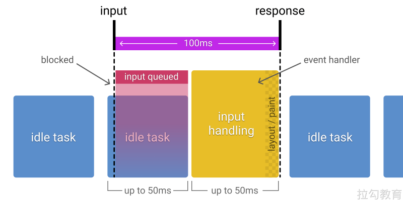

# **RAIL 性能模型**

[RAIL](https://web.dev/rail/) 是 Response, Animation, Idle, 和 Load 的首字母缩写, 是一种由 Google Chrome 团队于 2015 年提出的性能模型,  用于提升浏览器内的用户体验和性能。

RAIL 模型的理念是”以用户为中心，最终目标不是让您的网站在任何特定设备上都能运行很快，而是使用户满意”。

这个名字的由来是四个英文单词的首字母：

- 响应（Response）：应该尽可能快速的响应用户, 应该在 100ms 以内响应用户输入。
- 动画（Animation）：在展示动画的时候，每一帧应该以 16ms 进行渲染，这样可以保持动画效果的一致性，并且避免卡顿。
- 空闲（Idle）：当使用 Javascript 主线程的时候，应该把任务划分到执行时间小于 50ms 的片段中去，这样可以释放线程以进行用户交互。
- 加载（Load）：应该在小于 1s 的时间内加载完成你的网站，并可以进行用户交互。

> 根据网络条件和硬件的不同，用户对性能延迟的理解也有所不同。例如，通过快速的Wi-Fi连接在功能强大的台式机上加载站点通常在1秒内完成，用户对此已经习以为常。在3G连接速度较慢的移动设备上加载网站需要花费更多时间，因此移动用户通常更耐心，在移动设备上加载5 s是一个更现实的目标。

这四个单词代表与网站或应用的生命周期相关的四个方面，这些方面会以不同的方式影响整个网站的性能。

我们将用户作为之后性能优化的中心，首先需要了解用户对于延迟的反应。用户感知延迟的时间窗口，如下表所示。

| 延迟         | 用户反映                                                     |
| ------------ | ------------------------------------------------------------ |
| 0 ~ 16ms     | 人眼可以感知每秒 60 帧的动画，即每帧 16 ms，除了浏览器将一帧画面绘制到屏幕上的时间，网站应用大约需要 10ms 来生成一帧 |
| 0 ~ 100ms    | 在该时间范围内响应用户操作，才会是流畅的体验                 |
| 100 ~ 1000ms | 能够感觉到明显的延迟                                         |
| >1s          | 用户的注意力将离开对执行任务的关注                           |
| >10s         | 用户感到失望，可能会放弃任务                                 |

## 响应

指标：应该尽可能快速的响应用户，应该在 100ms 以内响应用户输入。

网站性能对于响应方面的要求是，在用户感知延迟之前接收到操作的反馈。比如用户进行了文本输入、按钮单击、表单切换及启动动画等操作后，必须在 100ms 内收到反馈，如果超过 100ms 的时间窗口，用户就会感知延迟。

看似很基本的用户操作背后，可能会隐藏着复杂的业务逻辑处理及网络请求与数据计算。对此我们应当谨慎，将较大开销的工作放在后台异步执行，而即便后台处理要数百毫秒才能完成的操作，也应当给用户提供及时的阶段性反馈。

比如在单击按钮向后台发起某项业务处理请求时，首先反馈给用户开始处理的提示，然后在处理完成的回调后反馈完成的提示。

## 动画 

指标：在展示动画的时候，每一帧应该以 10ms 进行渲染，这样可以保持动画效果的一致性，并且避免卡顿。

前端所涉及的动画不仅有炫酷的UI特效，还包括滚动和触摸拖动等交互效果，而这一方面的性能要求就是流畅。众所周知，人眼具有视觉暂留特性，就是当光对视网膜所产生的视觉在光停止作用后，仍能保留一段时间。

研究表明这是由于视神经存在反应速度造成的，其值是 1/24s，即当我们所见的物体移除后，该物体在我们眼中并不会立即消失，而会延续存在 1/24s 的时间。对动画来说，无论动画帧率有多高，最后我们仅能分辨其中的 30 帧，但越高的帧率会带来更好的流畅体验，因此动画要尽力达到 60fps 的帧率。

目前大多数设备的屏幕刷新率为 60 次/秒，那么浏览器渲染动画或页面的每一帧的速率也需要跟设备屏幕的刷新率保持一致。所以根据 60fps 帧率的计算，每一帧画面的生成都需要经过若干步骤，一帧图像的生成预算为 16ms（1000ms / 60 ≈ 16.66ms），除去浏览器绘制新帧的时间，留给执行代码的时间仅 10ms 左右。如果无法符合此预算，帧率将下降，并且内容会在屏幕上抖动。 此现象通常称为卡顿，会对用户体验产生负面影响。关于这个维度的具体优化策略，会在后面优化渲染过程的相关章节中详细介绍。

- https://googlechrome.github.io/devtools-samples/jank/

## 空闲 

指标：当使用 Javascript 主线程的时候，应该把任务划分到执行时间小于 50ms 的片段中去，这样可以释放线程以进行用户交互。

要使网站响应迅速、动画流畅，通常都需要较长的处理时间，但以用户为中心来看待性能问题，就会发现并非所有工作都需要在响应和加载阶段完成，我们完全可以利用浏览器的空闲时间处理可延迟的任务，只要让用户感受不到延迟即可。利用空闲时间处理延迟，可减少预加载的数据大小，以保证网站或应用快速完成加载。

为了更加合理地利用浏览器的空闲时间，最好将处理任务按 50ms 为单位分组。这么做就是保证用户在发生操作后的 100ms 内给出响应。

## 加载 

指标：首次加载应该在小于 5s 的时间内加载完成，并可以进行用户交互。对于后续加载，则是建议在2秒内完成。

用户感知要求我们尽量在 5s 内完成页面加载，如果没有完成，用户的注意力就会分散到其他事情上，并对当前处理的任务产生中断感。需要注意的是，这里在 5s 内完成加载并渲染出页面的要求，并非要完成所有页面资源的加载，从用户感知体验的角度来说，只要关键渲染路径完成，用户就会认为全部加载已完成。

对于其他非关键资源的加载，延迟到浏览器空闲时段再进行，是比较常见的渐进式优化策略。比如图片懒加载、代码拆分等优化手段。

关于加载方面具体的优化方案，后续也会分出独立内容进行详细介绍。