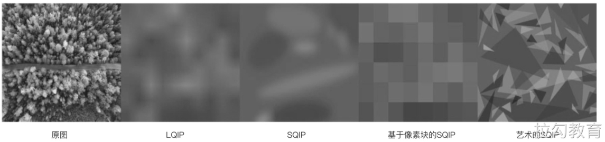

# 图片延迟加载

## 什么是延迟加载 

首先来想象一个场景，当浏览一个内容丰富的网站时，比如电商的商品列表页、主流视频网站的节目列表等，由于屏幕尺寸的限制，每次只能查看到视窗中的那部分内容，而要浏览完页面所包含的全部信息，就需要滚动页面，让屏幕视窗依次展示出整个页面的所有局部内容。

显而易见，对于首屏之外的内容，特别是图片和视频，一方面由于资源文件很大，若是全部加载完，既费时又费力，还容易阻塞渲染引起卡顿；另一方面，就算加载完成，用户也不一定会滚动屏幕浏览到全部页面内容，如果首屏内容没能吸引住用户，那么很可能整个页面就将遭到关闭。

既然如此，本着节约不浪费的原则，在首次打开网站时，应尽量只加载首屏内容所包含的资源，而首屏之外涉及的图片或视频，可以等到用户滚动视窗浏览时再去加载。

以上就是延迟加载优化策略的产生逻辑，通过延迟加载“非关键”的图片及视频资源，使得页面内容更快地呈现在用户面前。这里的“非关键”资源指的就是首屏之外的图片或视频资源，相较于文本、脚本等其他资源来说，图片的资源大小不容小觑。

## 实现图片延迟加载 

### 传统方式 

### Intersection Observer 方式 

此外，若将首屏视窗边界线作为延迟加载触发的阈值，其实并非最佳的性能考虑。更理想的做法是，在延迟加载的媒体资源到达首屏边界之前设置一个缓冲区，以便媒体资源在进入视窗之前就开始进行加载。

例如在使用Intersection Observer方式实现延迟加载判断时，可以通过配置options对象中的rootMargin属性来建立缓冲区：

```js
const lazyImageObserver = new IntersectionObserver((entries, observer) => {
  // 此处省略延迟加载的具体处理流程
}, {
  rootMargin: '0 0 256px 0'
})
```

观察可知 rootMargin 的值与 CSS 中 margin 属性值类似，上述代码中在屏幕视窗下设置了一个宽度为 256px 的缓冲区，这意味着当媒体元素距离视窗下边界小于 256px 时，回调函数就会执行开始资源的请求加载。而对于使用滚动事件处理来实现延迟加载的传统实现方式，也只需要更改 getBoundingClientRect 的设置，包括进入一个缓冲区即可实现类似的效果。

### CSS 类名方式 

### 原生的延迟加载支持 

## 加载注意事项 

对图像等资源的延迟加载，从理论上看必然会对性能产生重要的影响，但在实现过程中有许多细节需要注意，稍有差池都可能就会产生意想不到的结果。因此，总结以下几点注意事项。

### 资源占位 

当延迟加载的媒体资源未渲染出来之前，应当在页面中使用相同尺寸的占位图像。如果不使用占位符，图像延迟显示出来后，尺寸更改可能会使页面布局出现移位。

这种现象不仅会对用户体验带来困惑，更严重的还会触发浏览器成本高昂的回流机制，进而增加系统资源开销造成卡顿。而用来占位的图像解决方案也有多种，十分简单的方式是使用一个与目标媒体资源长宽相同的纯色占位符，或者像之前使用的Base64图片，当然也可以采用LQIP或SQIP等方法。

其中LQIP的全称是低质量图片占位符，即使用原图的较低分辨率版本来占位，SQIP则是一种基于SVG的LIQP技术，我们可以通过对比来感知它们和原图之间的差别，如图所示。



其实就是以最小的带宽消耗，告知用户此处将要展示一个媒体资源，可能由于资源尺寸较大还在加载。对于使用〈img〉标记的图像资源，应将用于占位的初始图像指给src属性，直到更新为所需的最终图像为止。而对于使用〈video〉标记的视频资源，则应将占位图像指给poster属性，除此之外，最好可以在〈img〉和〈video〉标签上添加表示宽width和高height的属性，如此便可确保不会在占位符转化为最终媒体资源时，发生元素渲染大小的改变。

### 内容加载失败 

在进行延迟加载过程中，可能会因为某种原因而造成媒体资源加载失败，进而导致错误的情况。比如用户访问某个网站后，保持浏览器该选项卡打开后长时间离开，等再返回继续浏览网页内容时，可能在此过程中网站已经进行了重新部署，原先访问的页面中包含的部分媒体资源由于哈希的版本控制发生更改，或者已被移除。那么用户滚动浏览页面，遇到延迟加载的媒体资源，可能就已经不可使用了。

虽然类似情况发生的概率不高，但考虑网站对用户的可用性，开发者也应当考虑好后备方案，以防止类似延迟加载可能遇到的失败。例如，图像资源可以采取如下方案进行规避：

```js
const newImage = new Image();
newImage.src = "photo.jpg" ;
//当发生故障时的处理措施
newImage.onerror = (err) => {};
//图像加载后的回调
newImage.onload = ()=> {};
```

当图片资源未能按预期成功加载时，所采取的具体处理措施应当依据应用场景而定。比如，当请求的媒体资源无法加载时，可将使用的图像占位符替换为按钮，让用户单击以尝试重新加载所需的媒体资源，或者在占位符区域显示错误的提示信息。总之，在发生任何资源加载故障时，给予用户必要的通知提示，总好过直接让用户无奈地面对故障。

### 图像解码延迟 

在前面章节介绍 JPEG 图像的编解码时，我们知道渐进式的JPEG会先呈现出一个低像素的图像版本，随后会慢慢呈现出原图的样貌。这是因为图像从被浏览器请求获取，再到最终完整呈现在屏幕上，需要经历一个解码的过程，图像的尺寸越大，所需要的解码时间就越长。如果在 JavaScript 中请求加载较大的图像文件，并把它直接放入 DOM 结构中后，那么将有可能占用浏览器的主进程，进而导致解码期间用户界面出现短暂的无响应。

为减少此类卡顿现象，可以采用decode方法进行异步图像解码后，再将其插入 DOM 结构中。但目前这种方式在跨浏览器场景下并不通用，同时也会复杂化原本对于媒体资源延迟加载的处理逻辑，所以在使用中应进行必要的可用性检查。下面是一个使用 Image.decode() 函数来实现异步解码的示例：

```html
<button id="load-image">加载图像</button>
<div id="image-container"></div>
```

对应的JavaScript事件处理代码如下：

```js
document.addEventListener("DOMContentLoaded",() => {
    const loadButton = document.getElementById("load-image");
    const imageContainer = document.getElementById("image-container");
    const newImage = new Image();
    newImage.src = "https://xx.cdn/very-big-photo.jpg";
    loadButton.addEventListener ("click", function() {
        if ("decode" in newImage) {
            //异步解码方式
            new Image.decode().then(function() {
                imageContainer.appendchild(newImage);
            });
        } else {
            //正常图像加载方式
            imageContainer.appendChild(newImage);
        }
    }, {
        once: true
    });
});
```

需要说明的是，如果网站所包含的大部分图像尺寸都很小，那么使用这种方式的帮助并不会很大，同时还会增加代码的复杂性。但可以肯定的是这么做会减少延迟加载大型图像文件所带来的卡顿。

### JavaScript 是否可用 

在通常情况下，我们都会假定JavaScript始终可用，但在一些异常不可用的情况下，开发者应当做好适配，不能始终在延迟加载的图像位置上展示占位符。可以考虑使用〈noscript〉标记，在JavaScript不可用时提供图像的真实展示：

```html
<!--使用延迟加载的图像文件标签-->

<!--当JavaScript不可用时，原生展示目标图像-->
<noscript>
    
</noscript>
```

如果上述代码同时存在，当JavaScript不可用时，页面中会同时展示图像占位符和〈noscript〉中包含的图像，为此我们可以给〈html〉标签添加一个no-js类：

```html
<html class="no-js">
```

在由〈link〉标签请求CSS文件之前，在〈head〉标签结构中放置一段内联脚本，当JavaScript可用时，用于移除no-js类：

```html
<script>document.documentElement.classList.remove("no-js");</script>
```

以及添加必要的CSS样式，使得在JavaScript不可用时屏蔽包含.lazy类元素的显示：

```css
.no-js .lazy {
    display: none;
}
```

当然这样并不会阻止占位符图像的加载，只是让占位符图像在JavaScript不可用时不可见，但其体验效果会比让用户只看到占位符图像和没有意义的图像内容要好许多。