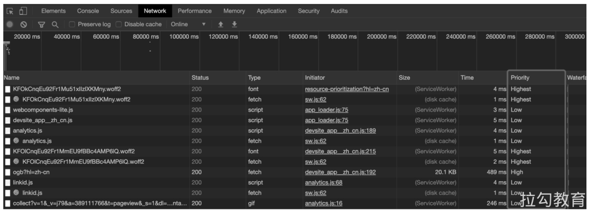
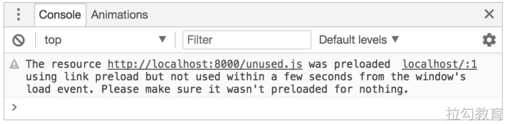
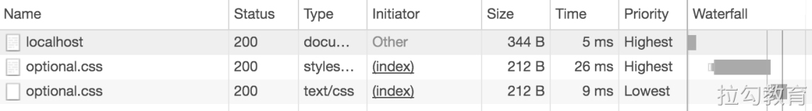

# 资源优先级

浏览器向网络请求到的所有数据，并非每个字节都具有相同的优先级或重要性。所以浏览器通常都会采取启发式算法，对所要加载的内容先进行推测，将相对重要的信息优先呈现给用户，比如浏览器一般会先加载CSS文件，然后再去加载JavaScript脚本和图像文件。

但即便如此，也无法保证启发式算法在任何情况下都是准确有效的，可能会因为获取的信息不完备，而做出错误的判断。本节就来探讨如何影响浏览器对资源加载的优先级。

## 优先级 

浏览器基于自身的启发式算法，会对资源的重要性进行判断来划分优先级，通常从低到高分为：Lowest、Low、High、Highest等。

比如，在 \<head> 标签中，CSS 文件通常具有最高的优先级 Highest，其次是 \<script> 标签所请求的脚本文件，但当 \<script> 标签带有 defer 或 async 的异步属性时，其优先级又会降为 Low。我们可以通过 Chrome 的开发者工具，在 Network 页签下找到浏览器对资源进行的优先级划分，如下图所示。



我们可以通过该工具，去了解浏览器为不同资源分配的优先级情况，细微的差别都可能导致类似的资源具有不同的优先级，比如首屏渲染中图像的优先级会高于屏幕视窗外的图像的优先级。本书不会详细探讨 Chrome 如何为当前资源分配优先级，读者如有兴趣可通过搜索“浏览器加载优先级”等关键字自行了解。本书对性能优化实战而言，会更加关注：当发现资源默认被分配的优先级不是我们想要的情况时，该如何更改优先级。

接下来介绍三种不同的解决方案：首先是前面章节提到过的预加载，当资源对用户来说至关重要却又被分配了过低的优先级时，就可以尝试让其进行预加载或预连接；如果仅需要浏览器处理完一些任务后，再去提取某些资源，可尝试使用预提取。

## 预加载 

使用 \<link rel="preload"> 标签告诉浏览器当前所指定的资源，应该拥有更高的优先级，例如：

```html
<link rel="preload" as="style" href="a.css">
<link rel="preload" as="script" href="b.js">
```

这里通过as属性告知浏览器所要加载的资源类型，该属性值所指定的资源类型应当与要加载的资源相匹配，否则浏览器是不会预加载该资源的。在这里需要注意的是，\<link rel="preload"> 会强制浏览器进行预加载，它与其他对资源的提示不同，浏览器对此是必须执行而非可选的。因此，在使用时应尽量仔细测试，以确保使用该指令时不会提取不需要的内容或重复提取内容。

如果预加载指定的资源在 3s 内未被当前页面使用，则浏览器会在开发者工具的控制台中进行警告提示，该警告务必要处理，如下图所示。



接下来看两个使用实例：字体的使用和关键路径渲染。通常字体文件都位于页面加载的若干 CSS 文件的末尾，但考虑为了减少用户等待文本内容的加载时间，以及避免系统字体与偏好字体发生冲突，就必须提前获取字体。因此我们可以使用 \<link rel="preload"> 来让浏览器立即获取所需的字体文件：

```html
<link rel="preload" as="font" crossorigin="crossorigin" type="font/woff2" href="myfont.woff2">
```

这里的crossorigin属性非常重要，如果缺失该属性，浏览器将不会对指定的字体进行预加载。

在第2章讲页面渲染生命周期时，提到过关键渲染路径，其中涉及首次渲染之前必须加载的资源（比如CSS和JavaScript等），这些资源对首屏页面渲染来说是非常重要的。以前通常建议的做法是把这些资源内联到HTML中，但对服务器端渲染或对页面而言，这样做很容易导致带宽浪费，而且若代码更改使内联页面无效，无疑会增加版本控制的难度。

所以使用 \<link rel="preload"> 对单个文件进行预加载，除了能很快地请求资源，还能尽量利用缓存。其唯一的缺点是可能会在浏览器和服务器之间发生额外的往返请求，因为浏览器需要加载解析 HTML 后，才会知道后续的资源请求情况。其解决方式可以利用 HTTP 2 的推送，即在发送 HTML 的相同连接请求上附加一些资源请求，如此便可取消浏览器解析HTML到开始下载资源之间的间歇时间。但对于 HTTP 2 推送的使用需要谨慎，因为控制了带宽使用量，留给浏览器自我决策的空间便会很小，可能不会检索已经缓存了的资源文件。关于 HTTP 2 的更多内容，将会在浏览器缓存章节详细展开介绍。

## 预连接

- https://web.dev/uses-rel-preconnect/

通常在速度较慢的网络环境中建立连接会非常耗时，如果建立安全连接将更加耗时。其原因是整个过程会涉及 DNS 查询、重定向和与目标服务器之间建立连接的多次握手，所以若能提前完成上述这些功能，则会给用户带来更加流畅的浏览体验，同时由于建立连接的大部分时间消耗是等待而非数据交换，这样也能有效地优化带宽的使用情况。解决方案就是所谓的预连接：

```html
<link rel="preconnect" href="https://example.com">
```

通过 \<link rel="preconnect"> 标签指令，告知浏览器当前页面将与站点建立连接，希望尽快启动该过程。虽然这么做的成本较低，但会消耗宝贵的 CPU 时间，特别是在建立 HTTPS 安全连接时。如果建立好连接后的 10s 内，未能及时使用连接，那么浏览器关闭该连接后，之前为建立连接所消耗的资源就相当于完全被浪费掉了。

另外，还有一种与预连接相关的类型 \<link rel="dns-prefetch">，也就是常说的 DNS 预解析，它仅用来处理 DNS 查询，但由于其受到浏览器的广泛支持，且缩短了 DNS 的查询时间的效果显著，所以使用场景十分普遍。

## 预解析 DNS 

- https://developer.mozilla.org/zh-CN/docs/Web/Performance/dns-prefetch

### 预提取 

前面介绍的预加载和预连接，都是试图使所需的关键资源或关键操作更快地获取或发生，这里介绍的预提取，则是利用机会让某些非关键操作能够更早发生。

这个过程的实现方式是根据用户已发生的行为来判断其接下来的预期行为，告知浏览器稍后可能需要的某些资源。也就是在当前页面加载完成后，且在带宽可用的情况下，这些资源将以 Lowest 的优先级进行提起。

显而易见，预提取最适合的场景是为用户下一步可能进行的操作做好必要的准备，如在电商平台的搜索框中查询某商品，可预提取查询结果列表中的首个商品详情页；或者使用搜索查询时，预提取查询结果的分页内容的下一页：

```html
<link rel="prefetch" href="page-2.html">
```

需要注意的是，预提取不能递归使用，比如在搜索查询的首页 `page-1.html` 时，可以预提取当前页面的下一页 `page-2.html` 的 HTML 内容，但对其中所包含的任何额外资源不会提前下载，除非有额外明确指定的预提取。

另外，预提取不会降低现有资源的优先级，比如在如下 HTML 中：

```html
<html>
    <head>
        <link rel="prefetch" href="style.css">
        <link rel="stylesheet" href="style.css">
    </head>
    <body>
        Hello World!
    </body>
</html>
```

可能你会觉得对 style.css 的预提取声明，会降低接下来 \<link rel="stylesheet" href="style.css"> 的优先级，但其真实的情况是，该文件会被提取两次，第二次可能会使用缓存，如下图所示。



显然两次提取对用户体验来说非常糟糕，因为这样不但需要等待阻塞渲染的 CSS，而且如果第二次提取没有命中缓存，必然会产生带宽的浪费，所以在使用时应充分考虑。