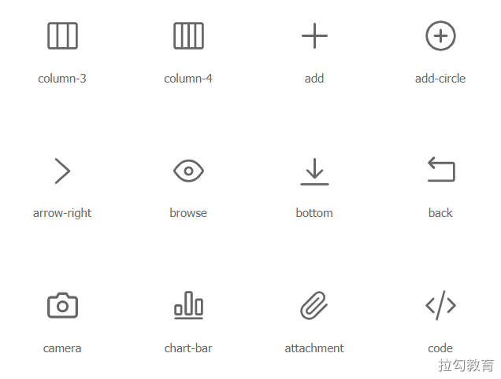
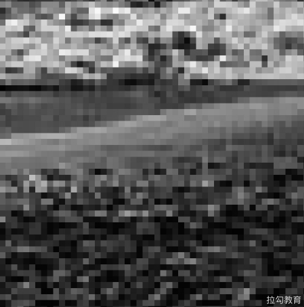
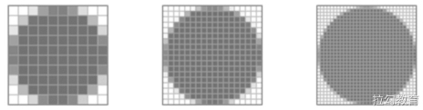

# 图片基础

HTTP Archive 上的数据显示，网站传输的数据中，60%的资源都是由各种图像文件组成的，当然这个数据是将各种类型网站平均之后的结果，要是单独看电商类面向消费者端页面的数据，这个比例可能会更大。如此之大的资源占比，也同样意味着存在很大的优化空间。

## 图像是否必须 

图像资源优化的根本思想，可以归结为两个字：**压缩**。无论是选取何种图像的文件格式，还是针对同一种格式压缩至更小的尺寸，其本质都是用更小的资源开销来完成图像的传输和展示。

在深入探讨之前，我们首先思考一下要达到期望的信息传递效果，是否真的需要图像？这不仅是因为图像资源与网页上的其他资源（HTML/CSS/JavaScript等）相比有更大的字节开销，出于对节省资源的考虑，对用户注意力的珍惜也很重要，如果一个页面打开后有很多图像，那么用户其实很难快速梳理出有效的信息，即便获取到了也会让用户觉得很累。

一个低感官体验的网站，它的价值转化率不会很高。当然这个问题的答案不是通过自己简单想想就能得到的，我们可能需要在日常的开发中与产品经理及体验设计师不断沟通，不断思考，来趋近更优的方案。

当确定了图像的展示效果必须存在时，在前端实现上也并非一定就要用图像文件，还存在一些场景可以使用更高效的方式来实现所需的效果。

- 网站中一个图像在不同的页面或不同的交互状态下，需要呈现出不同的效果（边角的裁切、阴影或渐变），其实没有必要为不同场景准备不同效果的多份图像文件，只需用 CSS 将一张图像处理为所需的不同效果即可。相对于一个图像文件的大小来讲，修改其所增加的 CSS 代码量可以忽略不计。
- 如果一个图像上面需要显示文字，建议使用网页字体的形式通过前端代码进行添加，而不是使用带文字的图像，其原因一方面是包含了更多信息的图像文件一般会更大，另一方面是图像中的文本信息带来的用户体验一般较差（不可选择、搜索及缩放），并且在高分辨率设备上的显示效果也会打折扣。

这里列举的两个例子，为了说明当我们在选择使用某种资源之前，如果期望达到更优的性能效果，则需要先去思考这种选择是否必需。

## 矢量图和位图 

当确定了图像是实现展示效果的最佳方式时，接下来就是选择合适的图像格式。图像文件可以分为两类：矢量图和位图。每种类型都有其各自的优缺点和适用场景。

### 矢量图 

矢量图中的图形元素被定义为一个对象，包括颜色、大小、形状及屏幕位置等属性。它适合如文本、品牌 logo、控件图标及二维码等构图形状较简单的几何图形。矢量图的优点是能够在任何缩放比例下呈现出细节同样清晰的展示效果。其缺点是对细节的展示效果不够丰富，对足够复杂的图像来说，比如要达到照片的效果，若通过 SVG 进行矢量图绘制，则所得文件会大得离谱，但即便如此也很难达到照片的真实效果。

SVG 也是一种基于 XML 的图像格式，其全称是 Scalable Vector Graphics（可缩放的矢量图形），目前几乎所有浏览器都支持 SVG。我们可以在 [Iconfont](https://www.iconfont.cn/) 上找到许多矢量图，或者上传自己绘制的矢量图，在上面构建自己的矢量图标库并引入项目进行使用，如下图所示。



标识照片的矢量图标的 SVG 标签格式，如下所示。

```html
<svg t="1620298657941" class="icon" viewBox="0 0 1024 1024" version="1.1" xmlns="http://www.w3.org/2000/svg" p-id="2974" width="200" height="200"><path d="M874.666667 117.333333H149.333333C108.8 117.333333 74.666667 151.466667 74.666667 192v640c0 40.533333 34.133333 74.666667 74.666666 74.666667h725.333334c40.533333 0 74.666667-34.133333 74.666666-74.666667V192c0-40.533333-34.133333-74.666667-74.666666-74.666667z m-245.333334 64v661.333334h-234.666666v-661.333334h234.666666zM138.666667 832V192c0-6.4 4.266667-10.666667 10.666666-10.666667h181.333334v661.333334H149.333333c-6.4 0-10.666667-4.266667-10.666666-10.666667z m746.666666 0c0 6.4-4.266667 10.666667-10.666666 10.666667h-181.333334v-661.333334H874.666667c6.4 0 10.666667 4.266667 10.666666 10.666667v640z" p-id="2975"></path></svg>
```

SVG 标签所包括的部分就是该矢量图的全部内容，除了必要的绘制信息，可能还包括一些元数据，比如 XML 命名空间、图层及注释信息。但这些信息对浏览器绘制一个 SVG 来说并不是必要的，所以在使用前可通过工具去除这些元数据来达到压缩的目的。

### 位图 

位图是通过对一个矩阵中的栅格进行编码来表示图像的，每个栅格只能编码表示一个特定的颜色，如果组成图像的栅格像素点越多且每个像素点所能表示的颜色范围越广，则位图图像整体的显示效果就会越逼真。虽然位图没有像矢量图那种不受分辨率影响的优秀特性，但对于复杂的照片却能提供较为真实的细节体验，如图中一幅海边的位图对于云朵及波浪的细节表现，如果用矢量图来实现是不可想象的。


当把图像不断放大后，就会看到许多栅格像素色块，如图所示。每个像素存储的是图像局部的 RGBA 信息，即红绿蓝三色通道及透明度。通常浏览器会为每个颜色通道分配一个字节的存储空间，即 28=256 个色阶值。



一个像素点4个通道就是4字节，一张图像整体的大小与其包含的像素数成正比，图像包含的像素越多，所能展示的细节就越丰富，同时图像就越大。

如表所示，当图像尺寸为100像素×100像素时，文件大小为39KB。随着图像尺寸在长和宽两个维度上同时增大，所产生像素数量的增加就不是简单的线性关系了，而是平方的抛物线增加，也就是说文件大小会迅速增加，在网络带宽一定的前提下，下载完一张图像会更慢。

| 图像尺寸          | 像素数量 | 文件大小 |
| ----------------- | -------- | -------- |
| 100像素 * 100像素 | 10000    | 39KB     |
| 200像素 * 200像素 | 40000    | 156KB    |
| 500像素 * 500像素 | 250000   | 977KB    |
| 800像素 * 800像素 | 640000   | 2.5MB    |

出于对性能的考虑，在使用图像时必须考虑对图像进行压缩，采用什么样的图像格式，使用什么样的压缩算法及压缩到何种程度，这将是本章接下来详细讨论的内容，但在此之前先说明关于分辨率的两个容易混淆的概念。

## 分辨率 

在前端开发过程中书写 CSS 时，经常会为图像设置显示所需的长宽像素值，但在不同的设备屏幕上，有时候相同的图像及相同的设置，其渲染出来的图像会让人明显察觉出清晰度有差别。产生这个现象的原因涉及两种不同的分辨率：屏幕分辨率和图像分辨率。

图像分辨率表示的就是该图像文件所包含的真实像素值信息，比如一个 200像素×200像素 的分辨率的图像文件，它就定义了长宽各200个像素点的信息。设备分辨率则是显示器屏幕所能显示的最大像素值，比如一台13英寸的 MacBook Pro 笔记本电脑的显示器分辨率为2560像素×1600像素。这两种分辨率都用到了像素，那么它们有什么区别呢？

例如，10像素×10像素的图像分辨率，既可以使用10像素×10像素的设备分辨率来显示，又可以使用20像素×20像素或40像素×40像素的设备分辨率来显示，效果如图所示。



从图中可以看到更高的设备分辨率有助于显示更绚丽多彩的图像，这其实很适合矢量图的发挥，因为它不会因放大而失真。而对位图来说，只有图像文件包含更多的像素信息时，才能更充分地利用屏幕分辨率。为了能在不同的分辨率下使项目中所包含的图像都能得到恰当的展示效果，可以利用 picture 标签和 srcset 属性提供图像的多个变体。

用于插入图像的 img 标签，有一个 `srcset `属性可以用来针对不同设备，提供不同分辨率的图像文件：

```html

```

除了 IE 和其他较低版本的浏览器不支持，目前主流的大部分浏览器都已支持 img 标签的 srcset 属性。在 srcset 属性中设置多种分辨率的图像文件及使用条件，浏览器在请求之前便会先对此进行解析，只选择最合适的图像文件进行下载，如果浏览器不支持，请务必在 src 属性中包含必要的默认图片。

使用picture标签则会在多图像文件选择时，获得更多的控制维度，比如屏幕方向、设备大小、屏幕分辨率等。

```html
<picture>
  <source media="(min-width: 800px)" srcset="photo.jpg, photo-2x.jpg 2x">
  <source media="(min-width: 450px)" srcset="photo-s.jpg, photo-s-2x.jpg 2x">
  
</picture>
```

由于 picture 标签也是加入标准不久的元素标签，所以在使用过程中，同样应当考虑兼容性问题。

## 有损压缩和无损压缩 

压缩是降低源文件大小的有效方式，对 JavaScript 代码或网页的一些脚本文件而言，压缩掉的内容是一些多余的空格及不影响执行的注释，其目的是在不损坏正常执行的情况下，尽量缩小源文件的大小。对图像文件而言，由于人眼对不同颜色的敏感度存在差异，所以便可通过减少对某种颜色的编码位数来减小文件大小，甚至还可以损失部分源文件信息，以达到近似的效果，使得压缩后的文件尺寸更小。

对于图像压缩，应该采用有损压缩还是无损压缩？如果都采用又该如何搭配设置呢？当结合了具体的业务需求再考虑后，关于压缩的技术选型就可以简单分成两步进行。

（1）首先确定业务所要展示图像的颜色阶数、图像显示的分辨率及清晰程度，当锚定了这几个参数的基准后，如果获取的图像源文件的相应参数指标过高，便可适当进行有损压缩，通过降低源文件图像质量的方法来降低图像文件大小。

如果业务所要求的图像质量较高，便可跳过有损压缩，直接进入第二步无损压缩。所以是否要进行有损压缩，其实是在理解了业务需求后的一个可选选项，而非必要的。

（2）当确定了展示图像的质量后，便可利用无损压缩技术尽可能降低图像大小。和第（1）步要通过业务决策来判断是否需要所不同的是，无损压缩是应当完成的工作环节。那么最好能通过一套完善的工程方案，自动化执行来避免烦琐的人工重复工作。