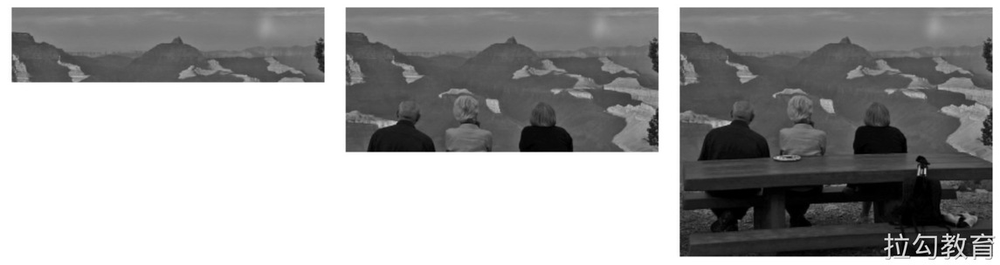
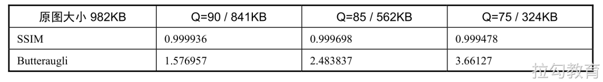
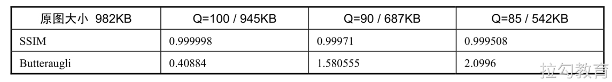
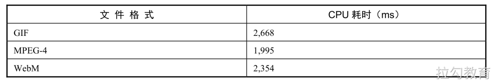
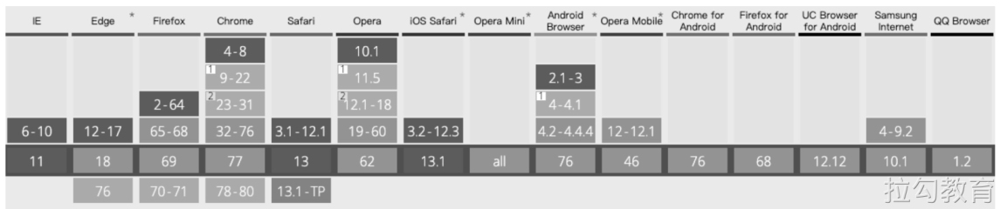
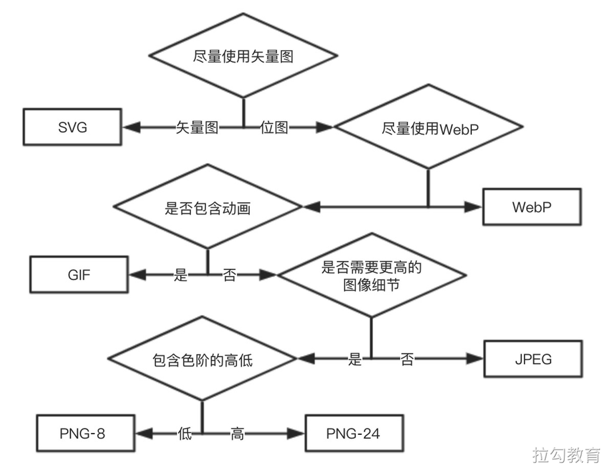

# 图像格式

实际上，不同的图像文件格式（JPG、PNG、GIF等）之间的区别，在于它们进行有损压缩和无损压缩过程中采用了不同的算法组合，接下来我们将从不同的图像文件格式入手，看看它们的特点和使用场景，以及在具体业务中应该如何选取。

## JPEG 

JPEG可能是目前所有图像格式中出现最早，同时也是使用范围最广的一种格式。它也是一种有损压缩算法，它通过去除相关冗余图像和色彩数据等方式来获得较高的压缩率，同时还能展现出相当丰富的图像内容。

JPEG在网站开发中经常被用作背景图、轮播图或者一些商品的banner图，以呈现色彩丰富的内容。但由于是有损压缩，当处理Logo或图标时，需要较强线条感和强烈颜色对比，JPEG图像可能会出现一些边界模糊的不佳体验，另外JPEG图像并不支持透明度。

接下来介绍有关JPEG常用的压缩编码方式，以及在工程实践中如何自动批量处理。

### 压缩模式 

JPEG包含了多种压缩模式，其中常见的有基于基线的、渐进式的。简单来说基线模式的JPEG加载顺序是自上而下的，当网络连接缓慢或不稳定时，其是从上往下逐渐加载完成的，如图所示。



渐进式模式是将图像文件分为多次扫描，首先展示一个低质量模糊的图像，随着扫描到的图像信息不断增多，每次扫描过后所展示的图像清晰度也会不断提升，如图3.7所示。

### 渐进式 JPEG 的优缺点 

渐进式JPEG的优点是显而易见的，在网络连接缓慢的情况下，首先能快速加载出一个图像质量比较模糊的预览版本。这样用户便可据此了解图像的大致内容，来决定是否继续花费时间等待完整图像的加载。这样做可以很好地提高对用户的感知性能，用户不仅知道所访问图像的大致内容，还会感知完整的图像就快加载好了。如果读者平时留心观察，应该能注意到渐进式JPEG已经在渐渐取代基线JPEG了。

通过了解两种压缩的原理不难发现，渐进式JPEG的解码速度会比基线的要慢一些，因为它增加了重复的检索开销。另外，通过渐进式JPEG压缩模式得到的图像文件也不一定是最小的，比如特别小的图像。所以是否要采用渐进式JPEG，需要综合考虑文件大小、大部分用户的设备类型与网络延迟。

### 创建渐进式 JPEG 

如果所得到的图像不是渐进式JPEG，那么我们可以通过许多第三方工具来进行处理，例如imagemin、libjpeg、imageMagick等。值得注意的是，这个步骤应当尽量交给构建工具来自动化完成，通过如下代码可以将该工作加入gulp处理管道：

```js
const gulp = require('gulp');
const imagemin = require('gulp-imagemin');
gulp.task('images', () => {
    gulp.src('images/*.jpg').pipe(imagemin({
        progressive: true
    }))
    .pipe(gulp.dest('dist'));
})
```

在执行构建流程后，gulp会调用imagemin的方法把images文件夹下的所有jpg后缀图像全部进行渐进式编码处理。

### 其它 JPEG 编码方式 

除了常见的基线与渐进式压缩编码方式，最近还出现了几种现代的JPEG编码器，它们尝试以更高的保真度及压缩后更小的文件大小为目标，同时还兼容当前主流的浏览器。其中比较出色的有Mozilla基金会推出的MozJPEG和Google提出的Guetzli。

MozJPEG和Guetzli也都已经有了可靠的imagemin插件支持，其使用方式与渐进式JPEG处理方式类似，这里仅列出示例代码，具体工程化构建请读者结合项目实践自行改写。

```js
const gulp = require('gulp');
const imagemin = require('gulp-imagemin');
const imageminMozJPEG = require('imagemin-mozjpeg'); //引入MozJPEG依赖包
const imageminGuetzli = require('imagemin-guetzli');//引入 Guetzli依赖包
// MozJPEG压缩编码
gulp.task('mozjpeg', () => {
    gulp.src('image/*.jpg').pipe(imagemin([
        imageminMozJPEG({ quality: 85 })
    ]))
    .pipe(gulp.dest('dist'))   
})
// Guetzli压缩编码
gulp.task('guetzli', () => {
    gulp.src('image/*.jpg').pipe(imagemin([
        imageminGuetzli({ quality: 85 })
    ]))
    .pipe(gulp.dest('dist')) 
})
```

MozJPEG引入了对逐行扫描的优化及一些栅格量化的功能，最多能将图像文件压缩10%，而Guetzli则是找到人眼感知上无法区分的最小体积的JPEG，那么两者的优化效果具体如何，又如何评价呢？
这里需要借助两个指标来进行衡量，首先是用来计算两个图像相似度的结构相似性分数（Structural Similarity index），简称SSIM，具体的计算过程可以借助第三方工具jpeg-compress来进行，这个指标分数以原图为标准来判断测试图片与原图的相似度，数值越接近1表示和原图越相似。
Butteraugli则是一种基于人类感知测量图像的差异模型，它能在人眼几乎看不出明显差异的地方，给出可靠的差别分数。如果SSIM是对图像差别的汇总，那么Butteraugli则可以帮助找出非常糟糕的部分。表3.2列出了MozJPEG编码压缩后的数据比较。





不仅要考虑图像压缩的质量和保真度，还要关注压缩后的大小，没有哪种压缩编码方式在各种条件下都是最优的，需要结合实际业务进行选择。这里可以给读者一些使用建议：

-  使用一些外部工具找到图像的最佳表现质量后，再用MozJPEG进行编码压缩。

-  Guetzli会获得更高质量的图像，压缩速度相对较慢。

虽然本节介绍了关于JPEG的若干编码器，也对它们之间的差别进行了比较，但需要明确的一点是，最终压缩后的图像文件大小差异更多地取决于设置的压缩质量，而非所选择的编码器。所以在对JPEG进行编码优化时，应主要关注业务可接受的最低图像质量。

## GIF 

GIF是Graphics Interchange Format的缩写，也是一种比较早的图像文件格式。由于对支持颜色数量的限制，256色远小于展示照片所需颜色的数量级，所以GIF并不适合用来呈现照片，可能用来呈现图标或Logo会更适合一些，但后来推出的PNG格式对于图形的展示效果更佳，所以当下只有在需要使用到动画时才会使用GIF。

接下来探讨一些关于GIF的优化点。

### 1.单帧的GIF转化为PNG 

首先可以使用npm引入ImageMagick工具来检查GIF图像文件，看其中是否包含多帧动画。如果GIF图像文件中不包含多帧动画，则会返回一个GIF字符串，如果GIF图像文件中包含动画内容，则会返回多帧信息。

对于单帧图像的情况，同样可使用ImageMagick工具将其转化为更适合展示图形的PNG文件格式。对于动画的处理稍后会进一步介绍，这里先列出代码示例：

```js
const im = require('imagemagick');
// 检查是否为动画
im.identify(['-format', '%m', 'my.gif'], (err,output) => {
    if (err) throw err;
    // 通过output处理判断流程
})
// 将gif转化为png
im.convert(['my.gif', 'my.png'], (err, stdout) => {
    if(err) throw err;
    console.log('转化完成', stdout) ;
})
```

### GIF 动画的优化

由于动画包含了许多静态帧，并且每个静态帧图像上的内容在相邻的不同帧上通常不会有太多的差异，所以可通过工具来移除动画里连续帧中重复的像素信息。这里可借助gifsicle来实现：

```js
const { execFile } = require('child_process');
const gifsicle = require('gifsicle');
execFile(gifsicle,[ '-o', 'output.gif', 'input.gif'], err => {
    console.log ( '动画压缩完成');
});
```

### 用视频替代动画

当了解过GIF的相关特性后，不难发现如果单纯以展示动画这个目的来看，那么GIF可能并不是最好的呈现方式，因为动画的内容将会受到诸如图像质量、播放帧率及播放长度等因素的限制。
GIF展示的动画没有声音，最高支持256色的图像质量，如果动画长度较长，即便压缩过后文件也会较大。综合考虑，建议将内容较长的GIF动画转化为视频后进行插入，因为动画也是视频的一种，成熟的视频编码格式可以让传输的动画内容节省网络带宽开销。
可以利用ffmpeg将原本的GIF文件转化为MPEG-4或WebM的视频文件格式，笔者将一个14MB的GIF动画通过转化后得到的视频文件格式大小分别是：MPEG-4格式下867KB，WebM格式下611KB。另外，要知道通过压缩后的动画或视频文件，在播放前都需要进行解码，可以通过Chrome的跟踪工具（chrome：//tracing）查看不同格式的文件，在解码阶段的CPU占用时，文件格式与CPU耗时如表所示。



从表中可以看出，相比视频文件，GIF在解码阶段也是十分耗时的，所以出于对性能的考虑，在使用GIF前应尽量谨慎选择。

## PNG 

PNG是一种无损压缩的高保真图片格式，它的出现弥补了GIF图像格式的一些缺点，同时规避了当时GIF中还处在专利保护期的压缩算法，所以也有人将PNG文件后缀的缩写表示成“PNG is Not GIF”。

相比于JPEG，PNG支持透明度，对线条的处理更加细腻，并增强了色彩的表现力，不过唯一的不足就是文件体积太大。如果说GIF是专门为图标图形设计的图像文件格式，JPEG是专门为照片设计的图像文件格式，那么PNG对这两种类型的图像都能支持。通常在使用中会碰到PNG的几种子类型，有PNG-8、PNG-24、PNG-32等。

### 对比 GIF 

其中PNG-8也称为调色板PNG，除了不支持动画，其他所有GIF拥有的功能它都拥有，同时还支持完全的alpha通道透明。只要不是颜色数特别少的图像，PNG-8的压缩比表现都会更高一筹。

对于颜色数少的单帧图形图像来说，更好的做法也并不是将其存为一个GIF文件，相比雪碧图都会更好一些，因为能够大大降低HTTP请求的开销，这一点后面章节会接着介绍，此处给出一个优化建议：在使用单帧图形图像时，应当尽量用PNG-8格式来替换GIF格式。

### 对比 JPEG 

当所处理图像中的颜色超过256种时，就需要用到JPEG或者真彩PNG，真彩PNG包括PNG-24和PNG-32，二者的区别是真彩PNG-24不包括alpha透明通道，而加上8位的alpha透明通道就是真彩PNG-32。

JPEG是有损的，它拥有更高的压缩比，也是照片存储的实际标准，如果还是要用PNG，那么很可能是在清晰的颜色过度周围出现了不可接受的“大色块”。

### 优化 PNG 

PNG图像格式还有一个优点，就是便于扩展，它将图像的信息保存在“块”中，开发者便可以通过添加一些自定义的“块”来实现额外的功能，但所添加的自定义功能并非所有软件都能读取识别，大部分可能只是特定的作图软件在读取时使用而已。

对Web显示而言，浏览器可能直接将这些多余的块自动忽略掉了，如果对显示没有作用，那么又何必要存储和传输这些信息呢？因此我们可以使用pngcrush对这些多余的块进行删除压缩，通过npm引入imagemin-pngcrush，代码如下：

```js
const imagemin = require ('imagemin') ;
const imageminPngcrush = require('imagemin-pngcrush');
imagemin (['images/*.png'], 'build/images', {
    plugins: [imageminPngcrush()]
}).then(() => console.log('完成图像优化'))
```

其中，imageminPngcrush（）中可以带入如下一些参数进行压缩控制。

-  -rem alla：删除所有块，保留控制alpha透明通道的块。

-  -brute：采用多种方法进行压缩会得到较好的压缩效果，由于执行的方法较多，所以执行压缩的速度会变慢，建议在离线操作下可以添加，但有时改进效果并不明显，如果对构建流程有要求可不加。

-  -reduce：会尝试减少调色板使用的颜色数量。

## WebP 

前面介绍的三种图像文件格式，在呈现位图方面各有优劣势：GIF虽然包含的颜色阶数少，但能呈现动画；JPEG虽然不支持透明度，但图像文件的压缩比高；PNG虽然文件尺寸较大，但支持透明且色彩表现力强。

开发者在使用位图时对于这样的现状就需要先考虑选型。假如有一个统一的图像文件格式，具有之前格式的所有优点，WebP就在这样的期待中诞生了。

### WebP 的优缺点 

WebP是Google在2010年推出的一种图像文件格式，它的目标是以较高的视觉体验为前提的，尽可能地降低有损压缩和无损压缩后的文件尺寸，同时还要支持透明度与动画。根据WebP官方给出的实验数据，当使用WebP有损文件时，文件尺寸会比JPEG小25%～34%，而使用WebP无损文件时，文件尺寸会比PNG小26%。

就像所有新技术一样，具有如此多优异特性的WebP，同样也不可避免兼容性的问题，CanIUse.com网站于2019年10月的数据统计情况，如图所示。



从图中可以发现，除了IE和苹果的Safari浏览器不支持，其他主流浏览器的最新版本都已支持WebP，考虑到浏览器的市场占有率，这样的兼容性程度可以说是非常乐观的了。虽然还需要做一些兼容性处理，但我们也有足够的理由在项目中积极地使用WebP。此外，由于有损压缩WebP使用了VP8视频关键帧编码，可能对较高质量（80～99）的图像编码来说，会比JPEG占用更多的计算资源，但在较低质量（0～50）时，依然有很大的优势。

### 如何使用 WebP 

可以使用图像编辑软件直接导出WebP格式的图像文件，或者将原有的JPEG或PNG图像转化为WebP格式。这样的转化最好使用构建工具辅助完成，比如通过npm安装webp-loader后，在webpack中进行如下配置：

```js
loader: [{
    test: /\.(jpe?g|png)$/I,
    loaders: [
    	'file-loader',
    	'webp-loader?{quality: 13}'
    ]
}]
```

这里值得注意的是，尽量不要使用低质量的JPEG格式进行WebP转化，因为低质量的JPEG中可能包含压缩的伪像，这样WebP不仅要保存图像信息，还要保存JPEG添加的失真，从而影响最终的转化效果。所以在选择转化的源图像文件时，建议使用质量最佳的。

### 兼容性处理 

目前WebP格式的图像并不适用于所有浏览器，所以在使用时，应当注意兼容处理好不支持的浏览器场景。

通常的处理思路分为两种：一种是在前端处理浏览器兼容性的判断，可以通过浏览器的全局属性window.navigator.userAgent获取版本信息，再根据兼容支持情况，选择是否请求WebP图像格式的资源；也可以使用〈picture〉标签来选择显示的图像格式，在〈picture〉标签中添加多个〈source〉标签元素，以及一个包含旧图像格式的〈img〉标签，当浏览器在解析DOM时便会对〈picture〉标签中包含的多个图片源依次进行检测。

倘若浏览器不支持WebP格式而未能检测获取到，最后也能够通过〈img〉标记兼容显示出旧图像格式，例如：

```html
<picture>
	<source srcset="/path/image.webp" type="image/webp">
    
</picture>
```

这里需要注意的是〈source〉标签的顺序位置，应当将包含image/webp的图像源写在旧图像格式的前面。

另一种是将判断浏览器是否支持的工作放在后端处理，让服务器根据HTTP请求头的Accept字段来决定返回图像的文件格式。如果Accept字段中包含image/webp，就返回WebP图像格式，否则就使用旧图像格式（JPEG、PNG等）返回。这样做的好处是让系统的维护性更强，无论浏览器对WebP图像格式的兼容支持发生怎样的改变，只需要服务器检查Accept字段即可，无须前端跟进相应的修改。

## SVG 

前面介绍的几种图像文件格式呈现的都是位图，而SVG呈现的是矢量图。正如我们在介绍位图和矢量图时讲到的，SVG对图像的处理不是基于像素栅格的，而是通过图像的形状轮廓、屏幕位置等信息进行描述的。

### 优缺点 

SVG这种基于XML语法描述图像形状的文件格式，就适合用来表示Logo等图标图像，它可以无限放大并且不会失真，无论分辨率多高的屏幕，一个文件就可以统一适配；另外，作为文本文件，除了可以将SVG标签像写代码一样写在HTML中，还可以把对图标图像的描述信息写在以.svg为后缀的文件中进行存储和引用。

由于文本文件的高压缩比，最后得到的图像文件体积也会更小。要说缺点与不足，除了仅能表示矢量图，还有就是使用的学习成本和渲染成本比较高。

### 优化建议 

即便SVG图像文件拥有诸多优点，但依然有可优化的空间。下面介绍一些优化建议。

（1）应保持SVG尽量精简，去除编辑器创建SVG时可能携带的一些冗余信息，比如注释、隐藏图层及元数据等。

（2）由于显示器的本质依然是元素点构成位图，所以在渲染绘制矢量图时，就会比位图的显示多一步光栅化的过程。为了使浏览器解析渲染的过程更快，建议使用预定义的SVG形状来代替自定义路径，这样会减少最终生成图像所包含标记的数量，预定义形状有〈circle〉、〈rect〉、〈line〉、〈polygon〉等。

（3）如果必须使用自定义路径，那么也尽量少用曲线。

（4）不要在SVG中嵌入位图。

（5）使用工具优化SVG，这里介绍一款基于node.js的优化工具svgo，它可以通过降低定义中的数字精度来缩小文件的尺寸。通过npm install -g svgo可直接安装命令号方式使用，若想用webpack进行工程化集成，可加入svgo-loader的相关配置：

```js
module.exports = {
    rules: [
        test: /\.svg$/,
        use: [
        	{loader: 'file-loader'},
    		{loader: 'svgo-loader', options: {externalConfig: 'svgo-config.yml'}}
    	]
    ]
}
```

其中，可在svgo-config.yml的配置文件中定义相关优化选项：

```js
plugins:
	- removeTitle: true
	- convertPathData: false
	- convertColors:
    	shorthex: false
```

（6）在优化过后，使用gzip压缩和（或）brotli压缩。

## Base64 

准确地说，Base64并不是一种图像文件格式，而是一种用于传输8位字节码的编码方式，它通过将代表图像的编码直接写入HTML或CSS中来实现图像的展示。一般展示图像的方法都是通过将图像文件的URL值传给img标签的src属性，当HTML解析到img标签时，便会发起对该图像URL的网络请求：

```html

```

当采用Base64编码图像时，写入src的属性值不是URL值，而是类似下面的编码：

```html
data:image/png;base64,xxxxxxxxxxxxxxxxxxxxxxxxxxxxxxxxxx
```

浏览器会自动解析该编码并展示出图像，而无须发起任何关于该图像的URL，这是Base64的优点，同时也隐含了对于使用的限制。由于Base64编码原理的特点，一般经过Base64编码后的图像大小，会膨胀四分之三。
这对想尝试通过Base64方式尽可能减少HTTP请求次数来说是得不偿失的，较复杂的大图经过编码后，所节省的几次HTTP请求，与图像文件大小增加所带来的带宽消耗相比简直是杯水车薪。所以也只有对小图而言，Base64才能体现出真正的性能优势。
作为使用指导建议，笔者希望在考虑是否使用Base64编码时，比对如下几个条件：
-  图像文件的实际尺寸是否很小。
-  图像文件是否真的无法以雪碧图的形式进行引入。
-  图像文件的更新频率是否很低，以避免在使用Base64时，增加不必要的维护成本。

## 格式选择建议
在了解了不同图像文件格式的特性后，显而易见的是不存在适用于任何场景且性能最优的图像使用方式。所以作为开发者，想要网站性能在图像方面达到最优，如何根据业务场景选择合适的文件格式也至关重要，图像文件使用策略如图所示。



这里根据使用场景的不同，以及图像文件的特性给出了一个可参考的选择策略：考虑到矢量图具有缩放不失真且表示图标时较小的文件尺寸，凡用到图标的场景应尽量使用矢量图；而对于位图的使用场景，由于在相同图像质量下其具有更高的压缩比且支持动画，所以WebP格式应该是我们的首选。

考虑到新技术的兼容性问题，也需要采用传统的方式进行适配；包含动画时使用GIF，对图像要求有更高分辨率来展示细节且需要透明度时，建议使用PNG；而在其他场景下追求更高的图像压缩比时，可使用JPEG。除此之外，位图对于不同缩放比的响应式场景，建议提供多张不同尺寸的图像，让浏览器根据具体场景进行请求调用。

## 使用建议 

本节额外给出一些使用建议来优化图像资源的体验性能，包括合并多张小图资源请求次数的雪碧图方案，使用Web字体的方式来替代图标文件及display：none使用的注意事项。

none使用的注意事项。

### CSS Sprite

### Web 字体

### 注意 display: none 的使用