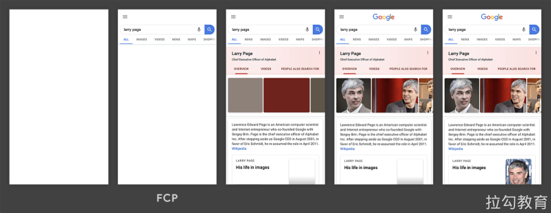
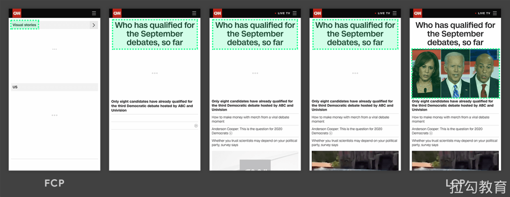
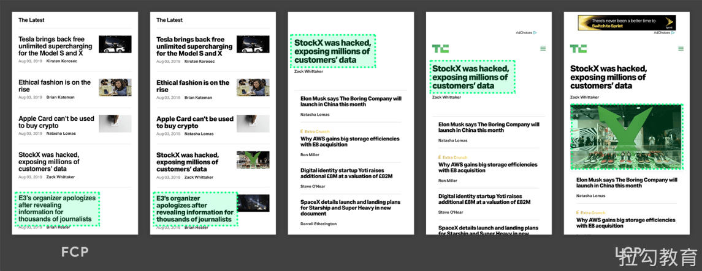
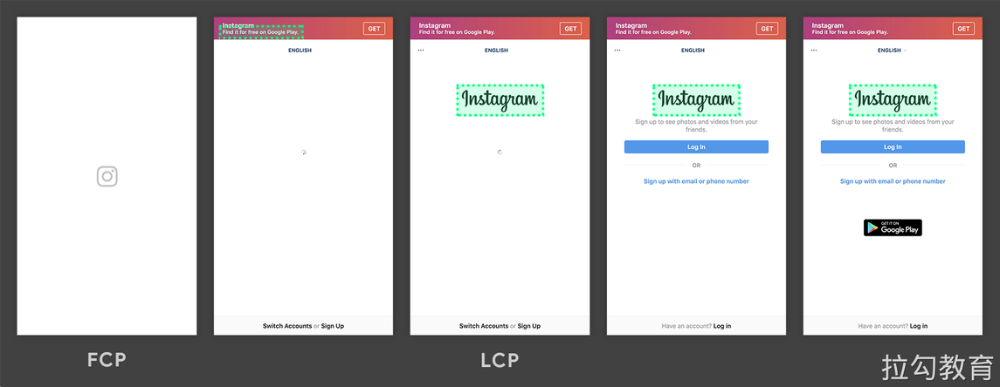
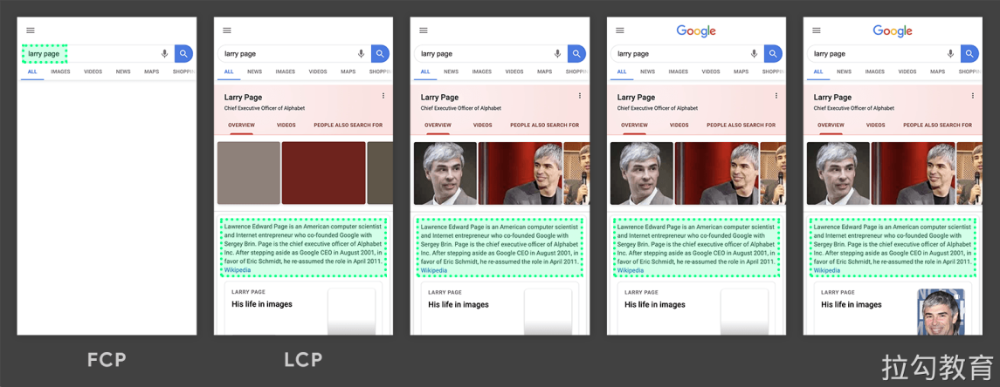
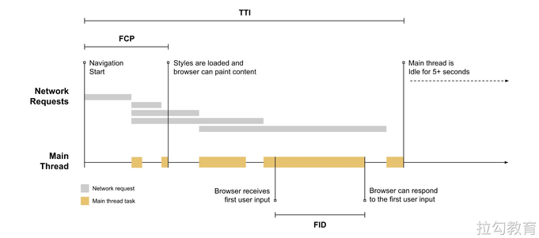
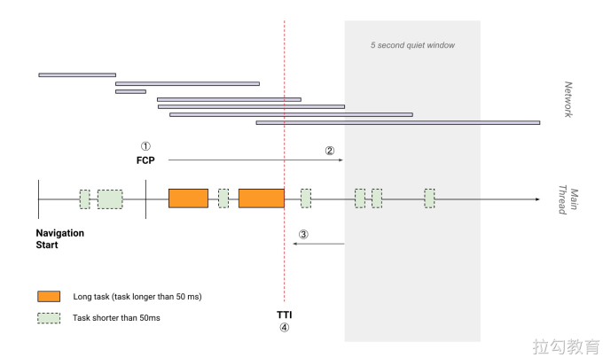
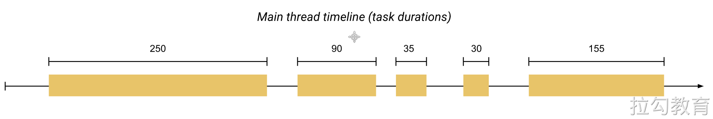
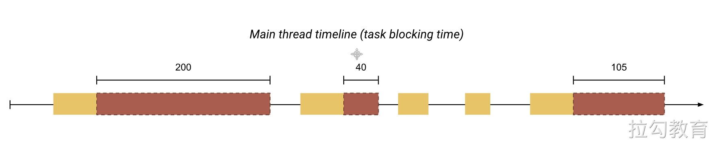
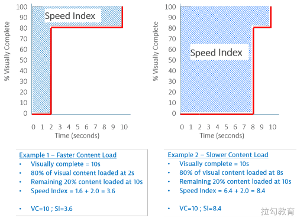

# **基于用户体验的性能指标**

[基于用户体验的性能指标](https://web.dev/metrics/)是 Google 在 web.dev 提出的。

## [First Contentful Paint（FCP）](https://web.dev/fcp/) 

FCP（First Contentful Paint）首次内容绘制，浏览器首次绘制来自 DOM 的内容的时间，内容必须是文本、图片（包含背景图）、非白色的 canvas 或 SVG，也包括带有正在加载中的 Web 字体的文本。

这是用户第一次开始看到页面内容，但仅仅有内容，并不意味着它是有用的内容（例如 Header、导航栏等），也不意味着有用户要消费的内容。

### 速度指标 

| FCP 时间（以秒为单位） | 颜色编码     | FCP分数（HTTP存档百分位数） |
| ---------------------- | ------------ | --------------------------- |
| 0–2                    | 绿色（快速） | 75–100                      |
| 2–4                    | 橙色（中等） | 50–74                       |
| 超过4                  | 红色（慢）   | 0–49                        |

### [优化方案](https://web.dev/fcp/#how-to-improve-fcp) 
- https://web.dev/fcp/#how-to-improve-fcp

## [Largest Contentful Paint（LCP） ](https://web.dev/lcp/)

LCP（Largest Contentful Paint）最大内容绘制，可视区域中最大的内容元素呈现到屏幕上的时间，用以估算页面的主要内容对用户可见时间。

LCP 考虑的元素：
- \ 元素
- \<image> 元素内的 \<svg> 元素
- \<video> 元素（封面图）
- 通过 [url()](https://developer.mozilla.org/en-US/docs/Web/CSS/url()) 函数加载背景图片的元素
- 包含文本节点或其他内联级文本元素子级的[块级](https://developer.mozilla.org/en-US/docs/Web/HTML/Block-level_elements)元素

为了提供良好的用户体验，网站应力争使用 2.5 秒或更短的“最大内容绘画” 。为确保您达到大多数用户的这一目标，衡量移动设备和台式机设备的页面加载量的第75个百分位数是一个很好的衡量标准。

以下是一些示例：

在以上两个时间轴中，最大的元素随内容加载而变化。在第一个示例中，新内容被添加到DOM中，并且更改了最大的元素。在第二个示例中，布局发生更改，以前最大的内容从视口中删除。

通常情况下，延迟加载的内容要比页面上已有的内容大，但不一定是这种情况。接下来的两个示例显示了在页面完全加载之前发生的最大内容绘画。

在第一个示例中，Instagram 徽标相对较早地加载，即使逐渐显示其他内容，它仍然是最大的元素。在 Google 搜索结果页面示例中，最大的元素是一段文本，该文本在任何图像或徽标加载完成之前显示。由于所有单个图像均小于此段，因此在整个加载过程中，它始终是最大的元素。

> 在 Instagram 时间轴的第一帧中，您可能会注意到相机徽标周围没有绿色框。那是因为它是一个 \<svg> 元素，并且 \<svg> 元素当前不被视为 LCP 候选对象。

### 速度指标 

| LCP 时间（以秒为单位） | 颜色编码     |
| ---------------------- | ------------ |
| 0-2.5                  | 绿色（快速） |
| 2.5-4                  | 橙色（中等） |
| 超过4                  | 红色（慢）   |

### 优化方案 

- https://web.dev/optimize-lcp/

## [First Input Delay（FID）](https://web.dev/fid/)

FID（First Input Delay）首次输入延迟，从用户第一次与页面交互（例如单击链接、点击按钮等）到浏览器实际能够响应该交互的时间。

输入延迟是因为浏览器的主线程正忙于做其他事情，所以不能响应用户。发生这种情况的一个常见原因是浏览器正忙于解析和执行应用程序加载的大量计算的 JavaScript。

第一次输入延迟通常发生在第一次内容绘制（FCP）和可持续交互时间（TTI）之间，因为页面已经呈现了一些内容，但还不能可靠地交互。

如上图所示，浏览器接收到用户输入操作时，主线程正在忙于执行一个耗时比较长的任务，只有当这个任务执行完成后，浏览器才能响应用户的输入操作。它必须等待的时间就此页面上该用户的 FID 值。

例如，以下所有 HTML 元素都需要在响应用户交互之前等待主线程上正在进行的任务完成：

- 文本输入框，复选框和单选按钮（\<input>，\<textarea>）
- 选择下拉菜单（\<select>）
- 链接（\<a>）

### **速度指标**

### 优化方案 

- https://web.dev/fid/#how-to-improve-fid
- https://web.dev/optimize-fid/

## [Time to Interactive（TTI）](https://web.dev/tti/)

表示网页第一次 **完全达到可交互状态** 的时间点，浏览器已经可以持续性的响应用户的输入。完全达到可交互状态的时间点是在最后一个长任务（Long Task）完成的时间, 并且在随后的 5 秒内网络和主线程是空闲的。
从定义上来看，中文名称叫可持续交互时间或可流畅交互时间更合适。

> 长任务是需要 50 毫秒以上才能完成的任务

### 速度指标 

| TTI指标（以秒为单位） | 颜色编码     |
| --------------------- | ------------ |
| 0–3.8                 | 绿色（快速） |
| 3.9–7.3               | 橙色（中等） |
| 7.3以上               | 红色（慢）   |

### 优化方案 

- https://web.dev/tti/#how-to-improve-tti

## [Total Block Time（TBT）](https://web.dev/tbt/)

Total Block Time（TBT）总阻塞时间，度量了 FCP 和 TTI 之间的总时间，在该时间范围内，主线程被阻塞足够长的时间以防止输入响应。

只要存在长任务，该主线程就会被视为“阻塞”，该任务在主线程上运行超过50毫秒（ms）。我们说主线程“被阻止”是因为浏览器无法中断正在进行的任务。因此，如果用户确实在较长的任务中间与页面进行交互，则浏览器必须等待任务完成才能响应。

如果任务足够长（例如，超过50毫秒的任何时间），则用户很可能会注意到延迟并感觉页面缓慢或过时。

给定的长任务的阻止时间是其持续时间超过50毫秒。页面的总阻塞时间是FCP和TTI之间发生的每个长任务的阻塞时间的总和。

例如，考虑页面加载期间浏览器主线程的下图：

上面的时间轴有五个任务，其中三个是长任务，因为它们的持续时间超过50毫秒。下图显示了每个长任务的阻塞时间：

因此，虽然在主线程上运行任务花费的总时间为560毫秒，但只有345毫秒的时间被视为阻塞时间。

### 速度指标 

| TBT时间 （以毫秒为单位） | 颜色编码     |
| ------------------------ | ------------ |
| 0–300                    | 绿色（快速） |
| 300-600                  | 橙色（中等） |
| 超过600                  | 红色（慢）   |

### 优化方案 

- https://web.dev/tbt/#how-to-improve-tbt

## [Cumulative Layout Shift（CLS）](https://web.dev/cls/)

Cumulative Layout Shift（CLS）累计布局偏移，CLS 会测量在页面整个生命周期中发生的每个意外的布局移位的所有单独布局移位分数的总和，它是一种保证页面的视觉稳定性从而提升用户体验的指标方案。

您是否曾经在页面上突然发生变化时在没有警告的情况下，文字移动了，并且您失去了位置。甚至更糟：您将要点击一个链接或一个按钮，但是在手指落下的瞬间，链接移动了，您最终单击了其他东西

页面内容的意外移动通常是由于异步加载资源或将 DOM 元素动态添加到现有内容上方的页面而发生的。罪魁祸首可能是尺寸未知的图像或视频，呈现比其后备更大或更小的字体，或者是动态调整自身大小的第三方广告或小部件。

### 速度指标 

| CLS 时间（以毫秒为单位） | 颜色编码     |
| ------------------------ | ------------ |
| 0–0.1                    | 绿色（快速） |
| 0.1-0.25                 | 橙色（中等） |
| 超过0.25                 | 红色（慢）   |

### 优化方案 

- https://web.dev/cls/#how-to-improve-cls
- https://web.dev/optimize-cls/

## Speed Index 

Speed Index（速度指数）是一个表示页面可视区域中内容的填充速度的指标，可以通过计算页面可见区域内容显示的平均时间来衡量。

### 测量方式 

捕获浏览器加载页面过程的视频，然后对每 100ms 间隔的页面截图计算页面内容填充的百分比，可以得到这样一个曲线。

图中的 Example 1 和 Example 2 都是在 10s 时页面填充完成，但 Example 1 在 2s 时就已经填充了 80% 的内容，而 Example 2 在 8s 时才填充 80%。

图中阴影部分的面积（即时间-内容填充百分比曲线以上部分）的大小即可表示可视区域内页面内容的填充速度，面积越小，填充速度越快。

### 速度指标 

| 速度指数 （以秒为单位） | 颜色编码     | 速度指数得分 |
| ----------------------- | ------------ | ------------ |
| 0–4.3                   | 绿色（快速） | 75–100       |
| 4.4–5.8                 | 橙色（中等） | 50–74        |
| 5.8以上                 | 红色（慢）   | 0–49         |

### 优化方案 

- https://web.dev/speed-index/#how-to-improve-your-speed-index-score