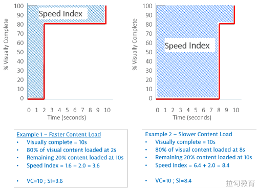

# **其它性能指标**

- https://blog.csdn.net/lyj0629/article/details/80207732
- 重定向次数：performance.navigation.redirectCount
- 重定向耗时: redirectEnd - redirectStart
- DNS 解析耗时: domainLookupEnd - domainLookupStart
- TCP 连接耗时: connectEnd - connectStart
- SSL 安全连接耗时: connectEnd - secureConnectionStart
- 网络请求耗时 (TTFB): responseStart - requestStart
- 数据传输耗时: responseEnd - responseStart
- DOM 解析耗时: domInteractive - responseEnd
- 资源加载耗时: loadEventStart - domContentLoadedEventEnd
- 首包时间: responseStart - domainLookupStart
- 白屏时间: responseEnd - fetchStart
- 首次可交互时间: domInteractive - fetchStart
- DOM Ready 时间: domContentLoadEventEnd - fetchStart
- 页面完全加载时间: loadEventStart - fetchStart
- http 头部大小： transferSize - encodedBodySize

## Time to First Byte（TTFB） 

浏览器从请求页面开始到接收第一字节的时间，这个时间段内包括 DNS 查找、TCP 连接和 SSL 连接。

## Speed Index（SI） 

这是一个表示页面可视区域中内容的填充速度的指标，可以通过计算页面可见区域内容显示的平均时间来衡量。

### 测量方式

首先在浏览器中捕获页面加载的视频，然后对每 100 毫秒间隔的页面截图计算页面填充的百分比，可以得到这样一个曲线（纵轴是页面可视区域内容填充完成度，横轴是时间）。



图中的 Example 1 和 Example 2 都是在 10s 时页面填充完成，但 Example 1 在 2s 是就已经填充了 80% 的内容，而 Example 2 在 8s 时才填充 80%。

图中阴影部分的面积（即时间-内容填充百分比曲线以上部分）的大小即可表示可视区域内页面内容的填充速度，面积越小，填充速度越快。

如果用时间来衡量，可以这样计算，以此来表示页面可见区域内容显示的平均时间。

```
Example 1：Speed Index = (80% * 2) + （20% * 10）= 3.6 
Example 2：Speed Index = (80% * 8) + （20% * 10）= 8.4
```

这个平均时间可以用来比较首屏内容完整呈现给用户的性能体验，但它计算的不是首屏内容完整呈现这一时刻，不能算是一个用时间来度量的指标。

## Frames Per Second（FPS） 

帧率是视频设备产生图像（或帧）的速率，用**每秒可以重新绘制的帧数**（Frames Per Second，FPS）表示。

重新绘制可能需要重新计算样式、布局和绘制，如果每帧绘制到屏幕的时间在 16.7 ms 以上，每秒绘制的帧数就会小于 60 帧，人眼就能感受到页面出现卡顿，所以 FPS 是衡量应用流畅度的一个非常重要的指标，60fps 是页面流畅的目标，可以为每次绘制提供 16.7ms 的时间预算。

既然帧率与页面重新绘制有关，那我们可以思考两个问题：

**（1）哪些情况下会触发重新绘制？**

FPS 在电影和游戏中最为常见，但现在被广泛用作衡量网站和网络应用程序性能的指标。

在 Web 性能中，FPS 最常用于衡量动画的性能：如果 FPS 太低，动画会卡顿。

FPS 也可以作为用户与页面交互时页面响应性的一般度量。例如，如果将鼠标移到某个页面元素上会触发执行 JavaScript 来更新页面，这可能会触发回流和重绘，这需要在帧中完成，如果浏览器处理帧的时间过长，将会出现卡顿现象。

再例如，如果在滚动页面时会触发很多复杂的页面更新，并且浏览器无法保持可接受的帧率，那么滚动页面时会显得迟缓或卡顿。

**（2）如何降低重新绘制的时间？**

重新绘制到屏幕可能需要从构建 DOM 树开始、重新计算样式、布局、绘制等，我们需要尽可能的避免触发这些流程，例如使用 CSS 修改 opacity 属性就不会触发重新布局，可以减少绘制时间。

所以在实现动画时，建议使用性能成本低的 CSS 属性，而不要使用 JavaScript 设置元素。