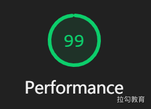
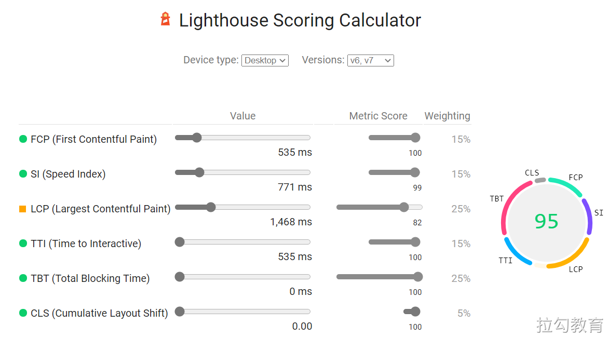
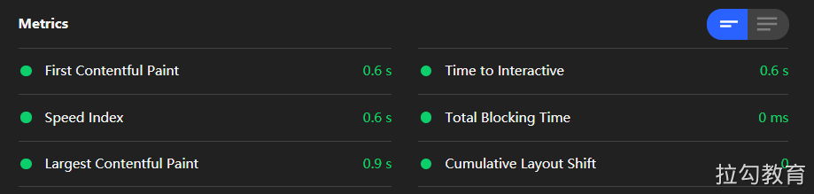
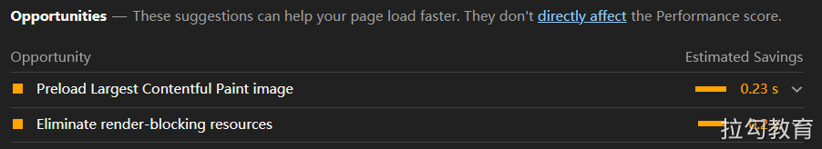
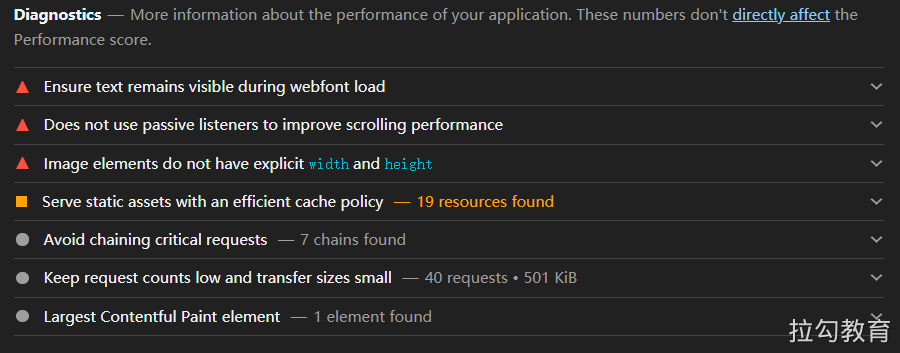
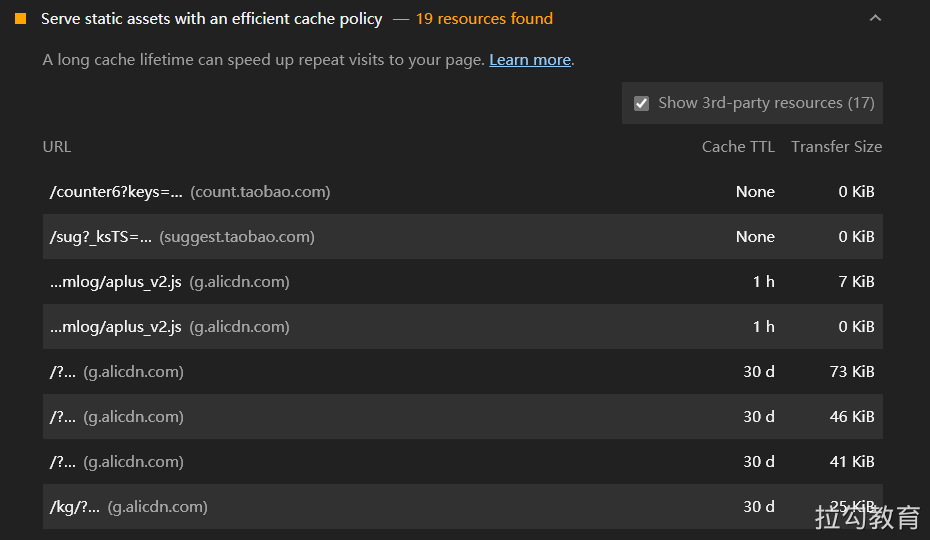
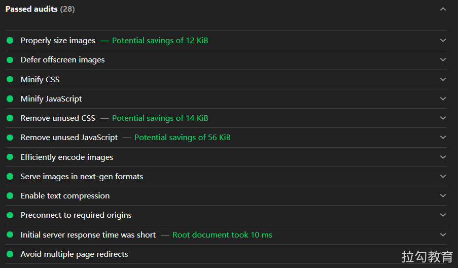

# 使用灯塔 Lighthouse 测试性能

Lighthouse 直译过来是“灯塔”的意思，它是由 Google 开发并开源的一个 Web 性能测试工具。该性能检测工具以此命名也蕴涵了相同的含义，即通过监控和检测网站应用的各方面性能表现，来为开发者提供优化用户体验和网站性能的指导建议。

## 准备 

参考：https://developer.chrome.com/docs/devtools/speed/get-started/。

```shell
git clone https://github.com/lipengzhou/salt-resolute-icecream.git
```

## 使用方式 

Lighthouse 提供了多种使用方式。

- [在 Chrome DevTools 中使用 Lighthouse](https://github.com/GoogleChrome/lighthouse#using-lighthouse-in-chrome-devtools)
- [使用 Chrome 扩展](https://github.com/GoogleChrome/lighthouse#using-the-chrome-extension)
- [使用 Node CLI 命令行工具](https://github.com/GoogleChrome/lighthouse#using-the-node-cli)
- [使用 Node 包](https://github.com/GoogleChrome/lighthouse#using-the-node-module)

## 性能报告 

关于性能报告部分的检测结果，Lighthouse 给出的信息包括：检测得分、性能指标、优化建议、诊断结果及已通过的性能，下面来分别进行介绍。

### 检测得分 

经过检测，Lighthouse 会对上述五个维度给出一个 0～100 的评估得分，如果没有分数或得分为 0，则很有可能是检测过程发生了错误，比如网络连接状况异常等；如果得分能达到 90 分以上，则说明网站应用在该方面的评估表现符合最佳实践，如下图所示。



关于如何得到这个评估得分，Lighthouse首先会获得关于评估指标的原始性能数据，然后根据指标权重进行加权计算，最后以其数据库中大量的评估结果进行对数正态分布的映射并计算最终得分。

- https://googlechrome.github.io/lighthouse/scorecalc
- https://web.dev/performance-scoring/



### 性能指标

关于性能指标有以下六个关键的数据。



这六个指标我们已经在[基于用户体验的性能指标](https://www.yuque.com/go/doc/44095887)中详细说过了，这里不再赘述。

这6种不同的指标数据需要通过加权计算，才能得到关于性能的最终评分，所加的权值越大表示对应指标对性能的影响就越大，如下图所示，列出了目前 Lighthouse 的权重情况。

| Audit                                                        | Weight |
| ------------------------------------------------------------ | ------ |
| [First Contentful Paint](https://web.dev/first-contentful-paint/) | 15%    |
| [Speed Index](https://web.dev/speed-index/)                  | 15%    |
| [Largest Contentful Paint](https://web.dev/lcp/)             | 25%    |
| [Time to Interactive](https://web.dev/interactive/)          | 15%    |
| [Total Blocking Time](https://web.dev/lighthouse-total-blocking-time/) | 25%    |
| [Cumulative Layout Shift](https://web.dev/cls/)              | 5%     |

该权重系统还在不断优化过程中，虽然 Lighthouse 对于其中个别指标给予了较大的权重，也就意味着对该指标的优化能够带来更显著的性能评分提升，但这里还要建议在优化的过程中切勿只关注单个指标的优化，而要从整体性能的提升上来考虑优化策略。

### 优化建议 

为了方便开发者更快地进行性能优化，Lighthouse 在给出关键性能指标评分的同时，还提供了一些切实可行的优化建议，如下图所示为检测报告中的优化建议。



这些建议按照优化后预计能带来的提升效果从高到低进行排列，每一项展开又会有更加详细的优化指导建议，从上到下依次包括以下内容。

**（1）移除阻塞渲染的资源**，部分JavaScript脚本文件和样式表文件可能会阻塞系统对网站页面的首次渲染，建议可将其以内嵌的方式进行引用，并考虑延迟加载。报告会将涉及需要优化的资源文件排列在下面，每个文件还包括尺寸大小信息和优化后预计提升首屏渲染时间的效果，据此可安排资源文件优化的优先级。

**（2）预连接所要请求的源**，提前建立与所要访问资源之间的网络连接，或者加快域名的解析速度都能有效地提高页面的访问性能。这里给出了两种方案：一种是设置〈link rel="preconnect"〉的预连接，另一种是设置〈link rel="dns-prefetch"〉的DNS预解析，前面章节对这两种方案都有过讨论，此处就不再赘述了。

**（3）降低服务器端响应时间**，通常引起服务器响应缓慢的原因有很多，因此也有许多改进方法：比如升级服务器硬件以拥有更多的内存或CPU，优化服务器应用程序逻辑以更快地构建出所需的页面或资源，以及优化服务器查询数据库等，不要以为这些可能并非属于前端工程师的工作范围就不去关注，通常node服务器转发层就需要前端工程师进行相应的优化。

**（4）适当调整图片大小**，使用大小合适的图片可节省网络带宽并缩短加载用时，此处的优化建议通常对于本应使用较小尺寸的图片就可满足需求，但却使用了高分辨率的大图，对此进行适当压缩即可。

**（5）移除未使用的CSS**，这部分列出了未使用但却被引入的 CSS 文件列表，可以将其删除来降低对网络带宽的消耗，若需要对资源文件的内部代码使用率进行进一步精简删除，则可以使用 Chrome 开发者工具的Coverage面板进行分析。

### 诊断结果 

这部分 Lighthouse 分别从影响网站页面性能的多个主要维度，进行详细检测和分析得到的一些数据，下面我们来对其进行介绍。



**（1）对静态资源文件使用高效的缓存策略**，这里列出了所有静态资源的文件大小及缓存过期时间，开发者可以根据具体情况进行缓存策略的调整，比如延迟一些静态资源的缓存期限来加快二次访问时的速度。



**（2）减少主线程的工作**，浏览器渲染进程的主线程通常要处理大量的工作：如解析 HTML 构建 DOM，解析 CSS 样式表文件并应用指定的样式，以及解析和执行 JavaScript 文件，同时还需要处理交互事件，因此渲染进程的主线程过忙很容易导致用户响应延迟的不良体验，Lighthouse 给我们提供了这一环节网站页面主线程对各个任务的执行耗时，让开发者可针对异常处理过程进行有目标的优化，如下图所示。

**（3）降低JavaScript脚本执行时间**，前端项目的逻辑基本都是依托于JavaScript执行的，所以JavaScript执行效率与耗时也会对页面性能产生不小的影响，通过对这个维度的检测可以发现执行耗时过长的JavaScript文件，进而针对性的优化JavaScript解析、编译和执行的耗时，如图11.20所示。

**（4）避免存在较大尺寸网络资源的请求**，因为如果一个资源文件尺寸较大，那么浏览器就需要等待其完全加载好后，才能进行后续的渲染操作，这就意味着单个文件的尺寸越大其阻塞渲染流程的时间就可能越长，并且网络传输过程中存在丢包的风险，一旦大文件传输失败，重新传输的成本也会很高，所以应当尽量将较大尺寸的资源进行优化，通常一个尺寸较大的代码文件可以通过构建工具打包成多个尺寸较小的代码包；对于图片文件如非必要还是建议在符合视觉要求的前提下尽量进行压缩。可以看出该检测维度列出的大尺寸资源文件，基本都是图片文件，如图11.21所示。

**（5）缩短请求深度**，浏览器通常会对同一域名下的并发请求进行限制，超过限制的请求会被暂时挂起，如果请求链的深度过长，则需要加载资源的总尺寸也会越大，这都会对页面渲染性能造成很大影响。因此建议在进行性能检测时，对该维度进行关注和及时优化，如图11.22所示。

### 已通过的性能 

这部分列出的优化项为该网站已通过的性能审核项，如图11.23所示，下面对其中重要的几项进行介绍和解读。



（1）延迟加载首屏视窗外的图片，该审核项的优化原理在有关图像优化章节有过详细的介绍，对首屏关键资源加载完毕后，延迟首屏外或处于隐藏状态的图片加载能够有效缩短用户可交互前的等待时间，提升用户访问体验。
（2）压缩 CSS 文件，可降低网络负载规模。
（3）压缩 JavaScript 文件，可降低网络负载规模。
（4）对图片文件采用高效的编码方式，经过编码优化的图片文件，不但其加载速度会更快，而且需要传输的数据规模也会越小，详情可参考图像优化章节的内容。
（5）采用新一代的图片文件格式，WebP、JPEG XR、JPEG 2000等较新的图片文件格式通常比传统的PNG或JPEG有更好的压缩效果，能够获得更快的下载速度和更少的流量消耗，但使用的同时还需要注意对新格式的兼容性处理。
（6）开启文本压缩，对于文本资源，先压缩再提供能够最大限度地减少网络传输的总字节数，常用的压缩方式有 gzip、 deflate 和 brotli，至少采用其中一种即可。
（7）避免多次页面重定向，过多的重定向会在网页加载前造成延迟。
（8）预加载关键请求，通过 \<link rel="preload"> 来预先获取在网页加载后期需要请求的资源，这主要是为了充分利用网站运行的间歇期。
（9）使用视频格式提供动画内容，建议通过 WebM 或 MPEG4 提供动画，来取代网站页面中大型 GIF 的动画。
（10）避免 DOM 的规模过大，如果 DOM 规模过大，则可能会导致消耗大量的内存空间、过长的样式计算耗时及较高的页面布局重排代价。Lighthouse 给出的参考建议是，页面包含的 DOM 元素最好少于1500个，树的深度尽量控制不要超过32层。
（11）确保在网页字体加载期间文本内容可见，使用 CSS 的 font-display 功能，来让网站页面中的文本在字体加载期间始终可见。