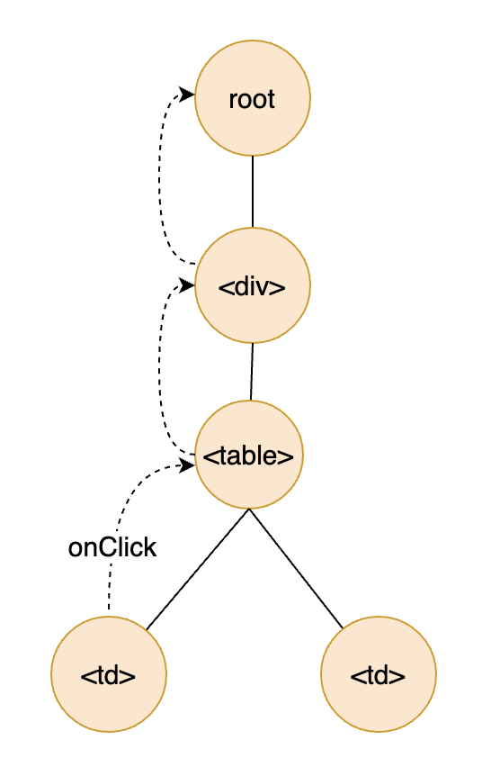

# 事件处理：如何创建自定义事件？

我们知道，在 React 中，父子组件的交互是通过 props。这个机制其实是双向的，父组件通过 props 把值传递给子组件，而子组件则通过暴露一些事件，给父组件反馈到一些状态或数据。这两个环节是**组件之间通信的基础**，所以都需要熟练掌握。

我们前面的课程已经有很多通过 props 从父组件传递参数的子组件的场景了，那么今天这节课，我们就来看看在 React 中事件的机制是怎样的，从原理出发，帮助你深入理解。同时呢，也来学习一下对于自定义事件，一般都有哪些典型的应用场景，帮助你学以致用。

## 在 React 中使用原生事件

在 React 中进行事件监听的语法，和原生 DOM 事件的写法是非常类似的，都是在一个节点上加一个回调函数的属性来实现。比如下面的方式：

```jsx
<button onClick={handler}>Hello</button> 
```

在前面的课程中我们已经看到了很多类似的例子。不过还要特别说明一点，对于原生 DOM 的事件，标准的的写法可能是都小写，比如 onclick。但是在 React 中，都是**约定使用骆驼体**（Camel Case）。

通过这个规律，我们基本上不用刻意去记事件的名称。我们要始终记得，**只要原生 DOM 有的事件，在 React 中基本都可以使用，只是写法上采用骆驼体就可以了**，比如 onMouseOver、onChange 等。

此外，关于事件处理函数，那就要回到很多同学之前在留言区提到的一个问题：是不是所有的回调函数都需要用 useCallback 进行封装呢？是不是简单的回调函数就可以不用封装了呢？

其实是否需要 useCallback ，和函数的复杂度没有必然关系，而是**和回调函数绑定到哪个组件有关**。这是为了避免因组件属性变化而导致不必要的重新渲染。

而对于原生的 DOM 节点，比如 button、input 等，我们是不用担心重新渲染的。所以呢，如果你的事件处理函数是传递给原生节点，那么不写 callback，也几乎不会有任何性能的影响。

但是**如果你使用的是自定义组件，或者一些 UI 框架的组件，那么回调函数还都应该用 useCallback 进行封装**。

\##React 原生事件的原理：合成事件（Synthetic Events）

因为原生事件的机制比较特别，所以我在这里要特别强调一下它的原理。

由于虚拟 DOM 的存在，在 React 中即使绑定一个事件到原生的 DOM 节点，事件也并不是绑定在对应的节点上，而是**所有的事件都是绑定在根节点上**。然后由 React 统一监听和管理，获取事件后再分发到具体的虚拟 DOM 节点上。

在 React 17 之前，所有的事件都是绑定在 document 上的，而从 React 17 开始，**所有的事件都绑定在整个 App 上的根节点上**，这主要是为了以后页面上可能存在多版本 React 的考虑。

具体来说，React 这么做的原因主要有两个。

第一，虚拟 DOM render 的时候， DOM 很可能还没有真实地 render 到页面上，所以无法绑定事件。

第二，React 可以屏蔽底层事件的细节，避免浏览器的兼容性问题。同时呢，对于 React Native 这种不是通过浏览器 render 的运行时，也能提供一致的 API。

这里有一点我要多解释下。那就是为什么事件绑定在某个根节点上，也能触发实际 DOM 节点的事件。

我们知道，在浏览器的原生机制中，事件会从被触发的节点往父节点冒泡，然后沿着整个路径一直到根节点，所以根节点其实是可以收到所有的事件的。这也称之为**浏览器事件的冒泡模型**。

因此，无论事件在哪个节点被触发， React 都可以通过事件的 srcElement 这个属性，知道它是从哪个节点开始发出的，这样 React 就可以收集管理所有的事件，然后再以一致的 API 暴露出来。

这样的话，我们在写原生事件的时候，就再也不用再担心浏览器兼容性的问题了。如下图所示，就展示了事件机制冒泡模型的原理：



对于原生事件的处理，可以说是 React 的一个创新，不仅能够让你像以前在原生 DOM 节点上定义事件的方式一样，而且还提供了一致的 API，让我们不用再担心浏览器的兼容问题，使用起来也更加容易。

## 创建自定义事件

对于一个自定义组件，除了可以从 props 接收参数并用于渲染之外，还很可能**需要和父组件进行交互**，从而反馈信息。这个时候，我们就需要**为组件创建自定义事件**，这也是 React 整个 UI 模型中非常重要的一个环节。

需要注意的是，虽然自定义事件和原生事件看上去类似，但是两者的机制是完全不一样的：

- 原生事件是浏览器的机制；

- 而自定义事件则是纯粹的组件自己的行为，本质是一种回调函数机制。

可能你一听自定义事件，下意识就觉得有些麻烦。但其实在 React 中，自定义事件不用通过任何特殊的 API，只需要通过 props 给组件传递一个回调函数，然后在组件中的某个时机，比如用户输入，或者某个请求完成时，去调用这个传过来的回调函数就可以了。

当然，习惯上我们都会**将这样的回调函数命名为 onSomething 这种以“ on ”开头的名字**，方便在使用的时候理解。

其实在第 6 讲中，我们在创建一个价格输入组件时已经实现了自定义事件，但是并没有具体地解释。那么在这里再给你举一个简单的例子，实现一个 on/off 的切换按钮，那么理解自定义事件，其实就非常简单了。

下面就是实现的代码，你也可以通过文末的链接在线查看代码和运行效果：

```jsx

import { useState } from "react";
// 创建一个无状态的受控组件
function ToggleButton({ value, onChange }) {
  const handleClick = () => {
    onChange(!value);
  };
  return (
    <button style={{ width: "60px" }} onClick={handleClick}>
      <span>{value ? "On" : "Off"}</span>
    </button>
  );
}
```

可以看到，所谓自定义事件，就是定义了一个 onChange 这样的属性，允许传递一个回调函数给这个组件，在某个时机去调用这个回调函数，从而实现事件的功能。

那么下面的代码就演示了如何使用这样一个组件：

```jsx
import { useState } from "react";
import ToggleButton from './ToggleButton';
function ToggleButtonExample() {
  const [on, setOn] = useState(true);
  return (
    <>
      <h1>Toggle Button</h1>
      <ToggleButton value={on} onChange={(value) => setOn(value)} />
    </>
  );
};
```

这里可以看到，ToggleButton 组件内部调用了 onChange 这个通过属性传递进来的回调函数，并传递了当前值给回调函数，从而实现了子组件到父组件的通信。

## 使用 Hooks 封装键盘事件

开篇词就提到，整个课程我们都是围绕 React Hooks 展开的，那么 Hooks 在事件处理方面又可以带来哪些新的思路呢？

在第 6 讲我们已经看到了一个 useScroll 的例子，通过 Hooks 绑定了滚动条位置这个数据源。那么这里再给大家看一个绑定键盘按键的例子，看看如何使用 Hooks，让代码语义更加清晰。

相比 useScroll，键盘事件可能看上去更加和 Hooks 没有关系。因为滚动条位置至少在直观上是一个很明显的数据，但是键盘呢，却完全是一个个独立的事件。

不过，如果你充分认识到 **Hooks 具备绑定任何数据源的能力**，那你就会知道，键盘输入正是一个非常常见的数据源。这样，我们就可以把键盘输入变成某个状态，方便在组件中使用。

在没有 Hooks 的时候，比如说我们要让某个显示表格的页面，支持通过左右键进行翻页的功能。那么我们就需要在 useEffect 里去做 window.addEventListner，然后在返回的回调函数里去 window.removeEventListner，实现起来就很麻烦。

但是，如果我们用一个 Hook 来实现这个功能，那么只要实现一次，就可以在多个组件中使用了。下面就是这个 Hook 的实现代码：

```jsx
import { useEffect, useState } from "react";
// 使用 document.body 作为默认的监听节点
const useKeyPress = (domNode = document.body) => {
  const [key, setKey] = useState(null);
  useEffect(() => {
    const handleKeyPress = (evt) => {
      setKey(evt.keyCode);
    };
    // 监听按键事件
    domNode.addEventListener("keypress", handleKeyPress);
    return () => {
      // 接触监听按键事件
      domNode.removeEventListener("keypress", handleKeyPress);
    };
  }, [domNode]);
  return key;
};
```

有了这个 Hook，我们在使用的时候就非常方便，无需做任何事件的绑定，而是**只要把键盘按键看做是一个不断变化的数据源**，这样，就可以去实时监听某个 DOM 节点上触发的键盘事件了。

比如下面就是去显示当前按键的一个简单使用例子：

```jsx
import useKeyPress from './useKeyPress';
function UseKeyPressExample() => {
  const key = useKeyPress();
  return (
    <div>
      <h1>UseKeyPress</h1>
      <label>Key pressed: {key || "N/A"}</label>
    </div>
  );
};
```

## 小结

在这节课，我们主要学习了 React 中的事件机制。事件其实分为两种。

一种是**原生的 DOM 事件**，在用法上和标准的 DOM API 是基本一一映射的，通过事件合成的机制，React 能够提供统一的 API 来抹平浏览器之间的差异，让开发更加简单。

另一种事件则是**自定义事件**，所谓的自定义事件，其实就是利用了属性传递回调函数给子组件，实现事件的触发。本质上，它和原生事件的机制是完全不一样的，原生事件是浏览器层面的事件，而自定义事件则是纯组件实现的一种机制。

最后呢，我们分析了一个例子：如何用 Hooks 去简化事件的处理。将键盘按键这个事件封装成了一个 Hook，就可以简化键盘事件的使用，也很好地展示了 Hooks 的思路带给我们的惊喜，可以让本来很技术的一些实现，比如事件的监听和解绑，变得更加具有语义，从而也让代码更容易理解和维护。

最后，附上这节课所有的代码和运行结果的链接：https://codesandbox.io/s/react-hooks-course-20vzg。

## 思考题

在键盘按键的例子中，我们只是实现了单个按键的监听，如果我们要实现同时两个按键的监听呢？比如同时按下 A 和 B，那么用 Hooks 怎么去比较好的实现？