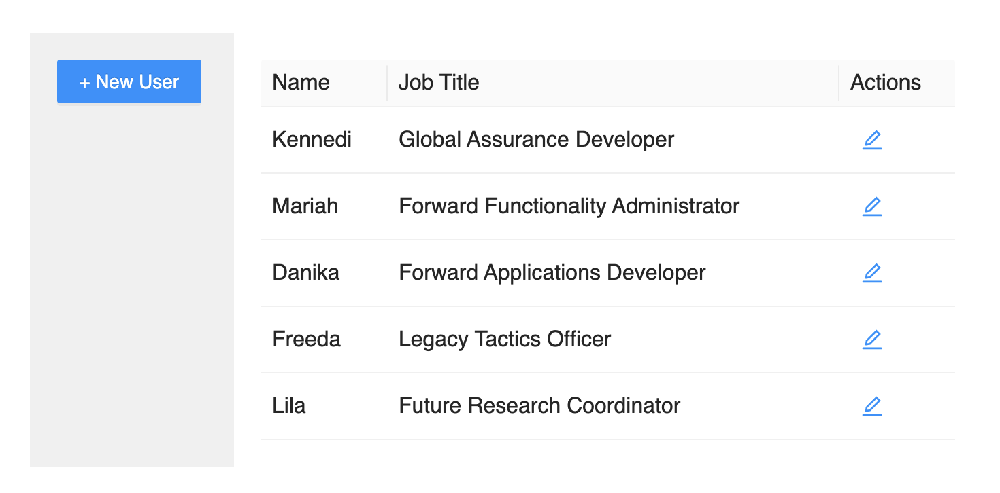

# 使用浮动层：如何展示对话框，并给对话框传递参数？

对话框是前端应用中非常常用的一种界面模式，它们通常是应用中的一个独立窗口，用于展示信息或者输入信息。

但是在 React 中，使用对话框其实并不容易，主要原因在于两点：

一方面，对话框需要先在父组件中声明，才能在子组件中控制其是否显示。

比如说我们需要同时在布局的 header 和 sider 上用菜单去控制某个对话框是否显示，那么这个对话框就必须定义在根组件上。

另一方面，给对话框传递参数只能由 props 传入，这意味着所有的状态管理都需要在更高级别的组件上。而实际上呢，这个对话框的参数可能只在子组件中才会维护，这时我们就需要利用自定义事件将参数回传，非常麻烦。

## 案例导入：处理对话框的误区

为了方便你理解这两点，我给你举一个实际场景的例子，你就能明白为什么说在 React 中，常用的对话框是比较难处理的。比如说我们需要实现下面这个截图演示的功能：



在这个例子中，我们有一个左右布局的页面。左边栏有一个新建用户的按钮，右边是一个用户列表。点击新建用户的按钮，或者点击表格中的编辑按钮，都会显示同一个对话框。这个对话框根据是否传入用户数据作为参数，来决定是新建还是编辑用户。

这个页面的代码一般会用下面的 JSX 去实现：

```jsx
<div className="main-layout">
  <Sider />
  <UserList />
</div>
```

可以看到，这里的主布局包含了 Sider 和 UserList 两个同层级的组件。但是它们要使用同一个对话框以显示编辑用户。而我们都知道，在 React 中，所有的 UI 都是状态驱动，这意味着我们必须将对话框相关的状态，以及状态管理逻辑提升到父组件中去实现，也就是这里的 Layout 组件。

那么，一般会用类似下面的代码逻辑去实现：

```jsx
function MainLayout() {
  const [modalVisible, setModalVisible] = useState(false);
  const [user, setUser] = useState(null);
  const showUserModal = (user) => {
    setModalVisible(true);
    setUser(user);
  }
  return (
    <div className="main-layout">
      <Sider onNewUser={showUserModal}/>
      <UserList onEditUser={user => showUserModal(user)}/>
      <UserInfoModal visible={modalVisible} user={user} />
    </div>
  );
}
```

在这段代码中，我们将 UserInfoModal 这个对话框组件定义在了父组件 Layout 中，通过 visible 控制其是否显示。然后再在 Sider 和 UserList 这两个组件中，用自定义事件来告知父组件，用户点击了某个按钮了，应该显示对话框。

这样的用法固然是可以正确工作的，也是我看到的大多数同学的常规写法。但这种写法其实隐含着如下两个问题。

第一，**语义隔离不明确**。MainLayout 这个组件应该只做布局的事情，而不应该有其他的业务逻辑。但是在这里，由于我们加入了用户信息处理的逻辑，就让本不相关的两块功能产生了依赖。

而且，如果要增加另外一个对话框，那意味着又要在 Layout 上增加新的业务逻辑了。这样的话，代码很快就会变得臃肿，且难以理解和维护。

第二，**难以扩展**。现在我们只是在 MainLayout 下面的两个组件共享了对话框，但是如果和 MainLayout 同级的组件也要访问这个对话框呢？又或者， MainLayout 下面的某个深层级的孙子组件也要能显示同一个对话框呢？

这样处理的话就会非常麻烦。前者意味着代码需要重构，继续提升状态到父组件；后者意味着业务逻辑处理更复杂，需要通过层层的自定义事件回调来完成。

所以，按照 React 方式的做法，或者大多数教程上演示的对话框的用法，其实在实际项目中是会遇到上面所述的各种问题。而这些问题的本质就是，**一个实现业务逻辑的 Modal 究竟应该在哪个组件中去声明？又该怎么和它进行交互呢？**

接下来，我会和你分享在一个比较大型的项目中，**如何用一个统一的方式去管理对话框，从而让对话框相关的业务逻辑能够更加模块化，以及和其他业务逻辑进行解耦**。

不过也特别说明一下，这种方式更多的是我个人经验的总结，并不一定是唯一的，或者说最佳的方式。所以如果你有任何疑问，欢迎在留言区和我交流讨论。

## 思路：使用全局状态管理所有对话框

要解决上面例子中演示的问题，我们可以先仔细思考下对话框这种 UI 模式的本质。

对话框在本质上，其实是**独立于其他界面的一个窗口，用于完成一个独立的功能**。

如果从视觉角度出发，你会发现在使用对话框的时候，你完全不会关心它是从哪个具体的组件中弹出来的，而只会关心对框本身的内容。

比如说，一个设置用户选项的对话框，它可能是从顶部菜单中点出来的，也可能是在某个具体页面的按钮点出来的，但都自动显示了上下文相关的设置选项。

对话框的这样一个本质，就决定了在组件层级上，它其实是应该独立于各个组件之外的。虽然很可能在一开始这个对话框的实现和某个组件非常高的相关度，但是在整个应用的不断开发和演进过程中，是很可能不断变化的。

所以，在定义一个对话框的时候，其定位基本会等价于**定义一个具有唯一 URL 路径的页面**。只是前者由弹出层实现，后者是页面的切换。

对于页面级别的 UI 切换，我们很容易理解，就是定义全局的路由嘛。那么同样的，如果我们以同样的方式去思考对话框，其实就是将对话框全局化，然后通过一个全局的机制来管理这些对话框。

这个过程和页面 URL 的切换非常类似，那么我们就可以给每一个对话框定义一个全局唯一的 ID，然后通过这个 ID 去显示或者隐藏一个对话框，并且给它传递参数。

基于这样一个设想，我们就来尝试去设计一个 API 去做对话框的全局管理。假设我们将这个对话框的实现命名为 NiceModal，那么我们的目标就是能够用以下的方式去操作对话框：

```jsx
// 通过 create API 创建一个对话框，主要为了能够全局的控制对话框的展现
const UserInfoModal = NiceModal.create(
  'user-info-modal',
  RealUserInfoModal
);
// 创建一个 useNiceModal 这样的 Hook，用于获取某个 id 的对话框的操作对象
const modal = useNiceModal('user-info-modal');
// 通过 modal.show 显示一个对话框，并能够给它传递参数
modal.show(args);
// 通过 modal.hide 关闭对话框
modal.hide();
```

可以看到，如果有这样的 API，那么无论在哪个层级的组件，只要知道某个 Modal 的 ID，那就都可以统一使用这些对话框，而不再需要考虑该在哪个层级的组件去定义了，使用起来会更加直观。

所以，通过上面的思考和验证，我们可以认为对话框这种模式的本质就是一个独立的窗口，它和一个拥有独立 URL 的页面在功能上和形式上都是极为类似的。这就意味着我们可以用和 URL 一样的方法去实现通用的对话框管理。

## 实现：创建 NiceModal 组件和相关 API

下面，我们就来看看如何去实现这样的一个 NiceModal 机制。为了让你比较好地理解实现的逻辑，我尽量通过代码注释的方式来解释实现思路和原理，所以你要仔细阅读代码，确保理解了实现的细节。

首先要考虑的便是如何管理全局状态，在这里我们以 Redux 为例，来创建一个可以处理所有对话框状态的 reducer：

```jsx
const modalReducer = (state = { hiding: {} }, action) => {
  switch (action.type) {
    case "nice-modal/show":
      const { modalId, args } = action.payload;
      return {
        ...state,
        // 如果存在 modalId 对应的状态，就显示这个对话框
        [modalId]: args || true,
        // 定义一个 hiding 状态用于处理对话框关闭动画
        hiding: {
          ...state.hiding,
          [modalId]: false,
        },
      };
    case "nice-modal/hide":
     const { modalId, force } = action.payload;
      // 只有 force 时才真正移除对话框
      return action.payload.force
        ? {
            ...state,
            [modalId]: false,
            hiding: { [modalId]: false },
          }
        : { ...state, hiding: { [.modalId]: true } };
    default:
      return state;
  }
};
```

这段代码的**主要思路**就是通过 Redux 的 store 去存储每个对话框状态和参数。在这里，我们设计了两个 action ，分别用来显示和隐藏对话框。

特别要注意的是，这里我们加入了 hiding 这样一个状态，用来处理对话框关闭过程的动画，确保用户体验。

为了让 Redux 的 action 使用起来更方便，我们可以定义一个 useNiceModal 这样的 Hook，在其内部封装对 Store 的操作，从而实现对话框状态管理的逻辑重用，并以更友好的方式暴露给用户：

```jsx
// 使用 action creator 来创建显示和隐藏对话框的 action
function showModal(modalId, args) {
  return {
    type: "nice-modal/show",
    payload: {
      modalId,
      args,
    },
  };
}
function hideModal(modalId, force) {
  return {
    type: "nice-modal/hide",
    payload: {
      modalId,
      force,
    },
  };
}
// 创建自定义 Hook 用于处理对话框逻辑
export const useNiceModal = (modalId) => {
  const dispatch = useDispatch();
  // 封装 Redux action 用于显示对话框
  const show = useCallback((args) => {
    dispatch(showModal(modalId, args));
  }, [
    dispatch,
    modalId,
  ]);
  // 封装 Redux action 用于隐藏对话框
  const hide = useCallback((force) => {
    dispatch(hideModal(modalId, force));
  }, [
    dispatch,
    modalId,
  ]);
  const args = useSelector((s) => s[modalId]);
  const hiding = useSelector((s) => s.hiding[modalId]);
  // 只要有参数就认为对话框应该显示，如果没有传递 args，在reducer 中会使用
  // 默认值 true
  return { args, hiding, visible: !!args, show, hide };
};
```

同时，我们可以实现 NiceModal 这样一个组件，去封装通用的对话框操作逻辑。比如关闭按钮，确定按钮的事件处理，等等。为了方便演示，我们以 Ant Design 中的 Modal 组件为例：

```jsx
function NiceModal({ id, children, ...rest }) {
  const modal = useNiceModal(id);
  return (
    <Modal
      onCancel={() => modal.hide()} // 默认点击 cancel 时关闭对话框
      onOk={() => modal.hide()} // 默认点击确定关闭对话框
      afterClose={() => modal.hide(true)} // 动画完成后真正关闭
      visible={!modal.hiding}
      {...rest} // 允许在使用 NiceModal 时透传参数给实际的 Modal
    >
      {children}
    </Modal>
  );
}
```

最后呢，我们用一个第 10 讲提到的容器模式，它会在对话框不可见时直接返回 null，从而不渲染任何内容；并且确保即使页面上定义了 100 个对话框，也不会影响性能：

```jsx
export const createNiceModal = (modalId, Comp) => {
  return (props) => {
    const { visible, args } = useNiceModal(modalId);
    if (!visible) return null;
    return <Comp {...args} {...props} />;
  };
};
```

这样，我们就实现了一个 NiceModal 这样的全局对话框管理框架。基于这样一个框架，使用对话框的时候就会非常方便。比如下面的代码：

```jsx
import { Button } from "antd";
import NiceModal, {
  createNiceModal,
  useNiceModal,
} from "./NiceModal";
const MyModal = createNiceModal("my-modal", () => {
  return (
    <NiceModal id="my-modal" title="Nice Modal">
      Hello NiceModal!
    </NiceModal>
  );
});
function MyModalExample() {
  const modal = useNiceModal("my-modal");
  return (
    <>
      <Button type="primary" onClick={() => modal.show()}>
        Show Modal
      </Button>
      <MyModal />
    </>
  );
}
```

在这个例子中，我们首先定义了一个简单的 MyModal 组件，这样我们就可以把多画框逻辑写在单独的组件中，而不是嵌入到父组件。在这个 MyModal 组件内部使用了 NiceModal 作为基础，从而可以绑定对话框 ID，并重用通用的对话框逻辑。

通过这个 Modal ID，我们就能够在应用的任何组件中去管理这个对话框了。

可以看到，在这部分我们基本完整实现了一个 NiceModal 的机制，它可以帮助你很好地去全局管理对话框。不过你再仔细点的话，会发现这里其实还缺少了一个直观的机制，那就是**如何处理对话框的返回值**。

## 处理对话框返回值

如果说对话框和页面这两种 UI 模式基本上是一致的，都是独立窗口完成独立逻辑。但是在用户交互上，却是有一定的差别，

- 对话框可能需要返回值给调用者；

- 而页面切换一般不会关心页面执行的结果是什么。

那么基于上面的 NiceModal 实现逻辑，现在的问题就是，**我们应该如何让调用者获得返回值呢？**

考虑到我们可以把用户在对话框中的操作看成一个异步操作逻辑，那么用户在完成了对话框中内容的操作之后，就认为异步逻辑完成了。因此我们可以**利用 Promise** 来完成这样的逻辑。

那么，我们要实现的 API 如下所示：

```jsx
const modal = useNiceModal('my-modal');
// 实现一个 promise API 来处理返回值
modal.show(args).then(result => {});
```

事实上，要实现这样一个机制并不困难，就是在 useNiceModal 这个 Hook 的实现中提供一个 modal.resolve 这样的方法，能够去 resolve modal.show 返回的 Promise。

实现的代码思路如下所示：

```jsx
const modal = useNiceModal('my-modal');
// 实现一个 promise API 来处理返回值
modal.show(args).then(result => {});
```

代码的核心思路就是**将 show 和 resolve 两个函数通过 Promise 联系起来**。因为两个函数的调用位置不一样，所以我们使用了一个局部的临时变量，来存放 resolve 回调函数。通过这样的机制，就可以在对话框中去调用 modal.resolve 来返回值了。

下面的代码演示了具体使用的一个例子：

```jsx
// 使用一个 object 缓存 promise 的 resolve 回调函数
const modalCallbacks = {};
export const useNiceModal = (modalId) => {
  const dispatch = useDispatch();
  const show = useCallback(
    (args) => {
      return new Promise((resolve) => {
        // 显示对话框时，返回 promise 并且将 resolve 方法临时存起来
        modalCallbacks[modalId] = resolve;
        dispatch(showModal(modalId, args));
      });
    },
    [dispatch, modalId],
  );
  const resolve = useCallback(
    (args) => {
      if (modalCallbacks[modalId]) {
        // 如果存在 resolve 回调函数，那么就调用
        modalCallbacks[modalId](args);
        // 确保只能 resolve 一次
        delete modalCallbacks[modalId];
      }
    },
    [modalId],
  );
  
  // 其它逻辑...
  // 将 resolve 也作为返回值的一部分
  return { show, hide, resolve, visible, hiding };
};
```

这段示意代码包括两个部分。

首先是在 UserList 的表格组件中，由编辑按钮触发对话框的显示，并在对话框返回后，将用户输入更新到表格。

第二部分则是在对话框中，用户点击了确定按钮后调用 modal.resolve 方法，将用户输入返回给 UserList 组件，从而完成整个编辑流程。

## 小结

在这节课我们主要学习了在 React 中使用对话框的一种实践方式：**利用全局状态来管理对话框。**

其核心思路在于**从 UI 模式的角度出发，认识到对话框和页面在很多时候是非常类似的，都是一个独立功能的 UI 展现**。

因此，用全局的方式去管理对话框就是一种非常合理的方式。这样，我们就能解决很多在 React 开发中经常遇到的各种对话框实现难题，从而让组件的语义更加清楚，代码更容易理解和维护。

这里要着重强调一点。在实现部分，我们用到了 Redux 作为全局状态管理框架来管理对话框的状态，并利用了自定义 Hook useNiceModal 去实现状态管理逻辑的重用。

虽然看上去是实现了一个框架级别的机制，但是实际上核心代码只有 100 行左右，你在实际项目中完全可以将其复制到你的项目中，并在理解的基础上，根据自己的需求和场景去定制使用。到时候你就能感受到这个机制带给你的惊喜了。

这里也要说明一点，使用了全局方式管理对话框，并不意味着你就不能使用本地状态的对话框了。对于一些非常简单的场景，比如你很确定某个对话框一定只在某个组件内才被使用，也是可以继续使用本地声明的对话框的。我们要明白，全局方式和本地方式是完全不冲突的，是可以共存的。

文中所有的示例代码和运行效果都可以通过 codesandbox 查看：https://codesandbox.io/s/react-hooks-course-20vzg 。

## 思考题

在本文中，我们使用的是 Redux 来管理所有对话框的所有状态。但有时候你的项目并不一定使用了 Redux，那么我们其实也可以使用 Context 来管理对话框的全局状态。那么请你思考一下，如果基于 Context ，应该如何实现 NiceModal 呢？