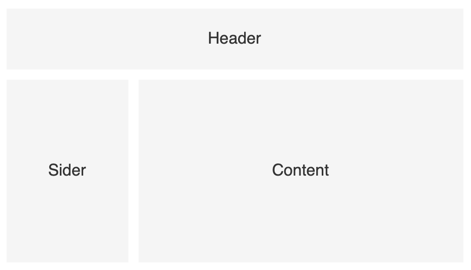
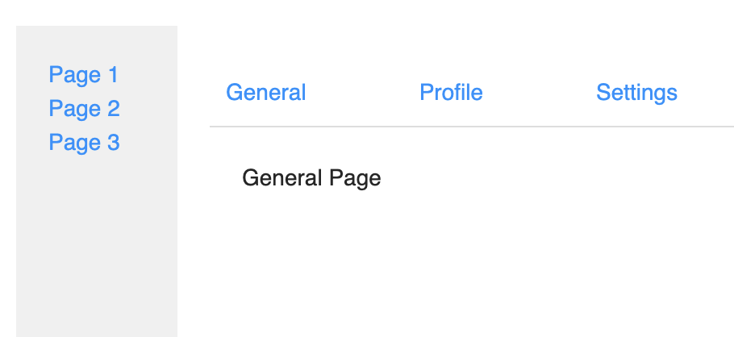
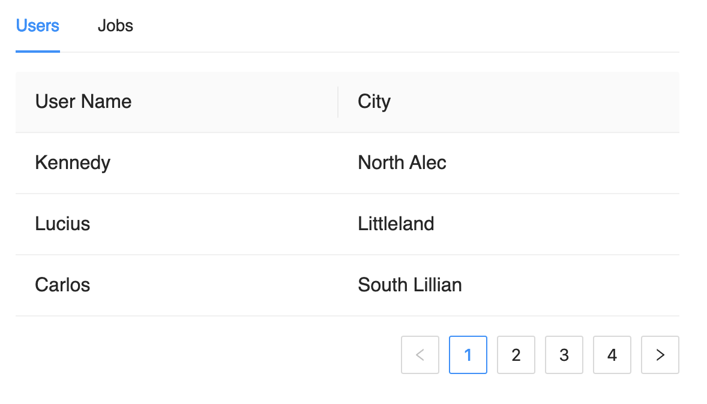

# 路由管理：为什么每一个前端应用都需要使用路由机制？

所谓**路由管理**，就是**让你的页面能够根据 URL 的变化进行页面的切换**，这是**前端应用中一个非常重要的机制**，同时也是 Web 应用区别于桌面应用的一个重要特征。

我们之所以说路由非常重要，主要体现在两个方面。

一方面，路由机制提供了按页面去组织整个应用程序的能力，页面之间的交互可以主要通过 URL 来进行，从而可以让各个业务功能互相独立，实现逻辑的解耦。

另一方面，URL 的全称是 _Uniform Resource Locator_，中文意思是“统一资源定位符”，表明 URL 是用于唯一的定位某个资源的。

所以对于能够通过前端应用展现的每一个资源，你都要考虑 URL 是否能唯一地定位到这个资源。这要求 URL 不仅能定位到某个页面，还要能定位到一些状态，比如当前的 Tab 页是什么，或者页面列表应该是第几页，等等。而路由机制，就可以让你做到这一点。

所以，对于每一个前端应用，无论大小，都应该要有自己的路由机制。而我们在开发每一个功能的时候，在设计之初就应该思考当前实现的功能和 URL 是否需要有什么联系。这样就可以让 URL 能够更准确地定位资源，进而提升用户体验。同时，由于我们将某些状态通过 URL 进行了管理，相关的业务逻辑语义也会更加明确。

那么在今天这节课，我就会跟你完整地介绍前端路由的工作原理，以及典型的使用场景，帮助你能够在自己的应用中熟练掌握路由的使用。

## 理解路由的工作原理：自己实现一个简单的路由机制

在 React 中的路由管理，一般都会通过路由框架 React Router 去实现。可能很多同学一听到“框架”，下意识地就觉得它的实现非常复杂。其实不然，在 React 中实现一个自己路由框架非常容易，只要**利用最基础的 React 机制**就能够实现。

所以我们首先就来看看，如果要自己实现这样一个机制应该如何去做，这样你就能够真正理解 React Router 这样的路由框架的工作原理了。理解了原理，你也就能在使用时更加得心应手，遇到问题也能自主解决。

在一个前端应用中，所谓的**页面切换**，或者导航，其实是一个页面的局部内容要使用不同的组件去展示。比如说下图，一个页面通常由 header、sider、content 等部分组成，但是在实际的页面切换的时候，改变的其实是 content 部分的内容。



所以这也是和传统的 Web 应用不一样的地方：

- 在服务器端渲染的页面中，每个 URL 的变化都是全部页面内容的切换。

- 而在前端路由管理中，则一般只在主内容区域 Content 部分变化， Header 和 Sider 是不会变化的。

那么，实现路由机制的**核心逻辑**就是**根据 URL 路径这个状态，来决定在主内容区域显示什么组件**。示意的代码如下：

```jsx
const MyRouter = ({ children }) => {
  const routes = _.keyBy(
    children.map((c) => c.props),
    "path",
  );
  const [hash] = useHash();
  const Page = routes[hash.replace("#", "")]?.component;
  // 如果路由不存在就返回 Not found.
  return Page ? <Page /> : "Not found.";
};
const Route = () => null;
```

这样，我们就简单实现了一个 MyRouter 这样的路由容器组件。我们通过 URL 中的 hash，也就是“#”后面的部分来决定具体渲染哪个组件到主区域。

同时我们定义了一个空组件 Route，来接收路由的具体参数 path 和 component，从而以声明式的方式去定义路由。

那么在使用的时候，就可以用下面的代码实现：

```jsx
function SamplePages {
  return (
    <div className="sample-pages">
      {/* 定义了侧边导航栏 */}
      <div className="sider">
        <a href="#page1">Page 1</a>
        <a href="#page2">Page 2</a>
        <a href="#page3">Page 3</a>
        <a href="#page4">Page 4</a>
      </div>
      <div className="exp-15-page-container">
        {/* 定义路由配置 */}
        <MyRouter>
          <Route path="page1" component={Page1} />
          <Route path="page2" component={Page2} />
          <Route path="page3" component={Page3} />
          <Route path="page4" component={Page4} />
        </MyRouter>
      </div>
    </>
  );
};
```

通过个例子，一方面，你就掌握了一个简单路由机制的实现，从而可以在一些简单的应用中直接使用，避免引入太多依赖。

另一方面，理解了路由实现的原理，也就能更从容地去使用更完善的第三方路由管理框架了。完整的代码和运行效果你也可以通过文末的链接查看。

## 使用 React Router

React Router 作为 React 全家桶三大成员之一，是几乎所有 React 应用的必备。虽然在刚才的例子中，我们自己实现的机制也能简单地进行路由管理。

但是在实际项目中，还有更多的情况需要考虑，比如路由嵌套、URL 的模式匹配、参数提取等。这些细节上的考虑，意味着我们要做一个完整的路由框架，还是需要很大的工作量的，所以你完全可以用 React Router 这样更成熟的开源方案去管理路由，而无须自己开发。

幸运的是，React Router 的使用非常简单，几乎不需要学习成本，你看一个使用的例子就明白了。

如果你细心的话会发现，我们课程的所有示例页面，就是用 React Router 去管理的。下面就是我们课程 App 的根组件。为了缩短这里代码的长度，就以定义了两讲的示例代码页面路由为例：

```jsx
// 从 react-router-dom 引入路由框架提供的一些组件
import { BrowserRouter, Switch, Route, Link } from "react-router-dom";
// 引入了两个课程示例页面
import Counter from "./01/Counter";
import UserList from "./01/UserList";
// 使用数组定义了页面组件和导航的标题，从而方便下面的渲染逻辑
const routes = [
  ["01 Counter", Counter],
  ["01 UserList", UserList],
];
function App() {
  return (
    <BrowserRouter>
      <div className="app">
        <ul className="sider">
          {routes.map(([label]) => (
            <li>
              <Link to={`/${label.replace(" ", "/")}`}>{label}</Link>
            </li>
          ))}
        </ul>
        <div id="pageContainer" className="page-container">
          <Switch>
            {routes.map(([label, Component]) => (
              <Route key={label} path={`/${label.replace(" ", "/")}`}>
                <Component />
              </Route>
            ))}
            {/* 定义一个默认的路由 */}
            <Route path="/" exact>
              <h1>Welcome!</h1>
            </Route>
            <Route path="*">Page not found.</Route>
          </Switch>
        </div>
      </div>
    </BrowserRouter>
  );
}
```

这里需要注意，React Router **不仅支持浏览器**，**还支持 React Native，以及一些用 Web 实现的移动 App**，所以它提供了多个 npm 模块。

代码里看到的 react-router-dom，其实正是支持浏览器的模块。我们在开发运行于浏览器的 Web App 时，只要引入这个包就可以了。

同时，我们也看到了 BrowserRouter、Link、Route、Switch 等组件的用法。接下来我就简单解释一下组件的作用。

**BrowserRouter**：标识用标准的 URL 路径去管理路由，比如 /my-page1 这样的标准 URL 路径。除此之外，还有 MemoryRouter，表示通过内存管理路由；HashRouter，标识通过 hash 管理路由。我们自己实现的例子其实就是用的 hash 来实现路由。

**Link**：定义一个导航链接，点击时可以无刷新地改变页面 URL，从而实现 React Router 控制的导航。

**Route**: 定义一条路由规则，可以指定匹配的路径、要渲染的内容等等。

**Switch**：在默认情况下，所有匹配的 Route 节点都会被展示，但是 Switch 标记可以保证只有第一个匹配到的路由才会被渲染。

这样，我们就使用了 React Router 提供的最基础的功能，实现了页面级别的路由管理。

但是我们要知道，React Router 的能力并不止于此，它的功能非常强大。我强烈建议你去完整阅读下它的官方文档，它的文档都是示例的形式，并不长，很容易看完，这样你就能够知道它的所有能力，从而在遇到具体需求的时候灵活运用。

那么接下来的内容，我们就以 React Router 为基础，来看看路由管理有哪些具体使用场景。相信通过这些例子，你能够进一步了解 React Router 提供的功能。

## 使用嵌套路由：实现二级导航页面

所谓**嵌套路由**，也称为**子路由**，就是**一个页面组件内部，还需要通过 URL 上的信息来决定组件内部某个区域****该****如何显示**。

嵌套路由对应到业务功能，一般就是一个两级导航页面。比如左边是侧边栏导航，用于控制右侧页面的展示。而右侧某个页面呢，又要通过顶部菜单来控制组件的展示。下面这张图就展示了这样一个布局：



这就需要路由框架具备两个能力：

1. **能够模糊匹配**。比如 /page1/general 、/page1/profile 这样两个路由，需要都能匹配到 Page1 这样一个组件。然后 Page1 内部呢，再根据 general 和 profile 这两个子路由决定展示哪个具体的页面。

2. **Route 能够嵌套使用**。在我们自定义 Route 的例子中，Route 组件仅用于收集路由定义的信息，不渲染任何内容。如果需要路由能嵌套使用，那就意味着需要在 Route 下还能嵌套使用 Route。而这在 React Router 是提供支持的。

下面的代码就展示了嵌套路由的用法：

```jsx
import { BrowserRouter, Route, Link } from "react-router-dom";
const Page1 = () => {
  return (
    <div className="exp-15-page1">
      <div className="exp-15-page1-header">
        <Link to="/page1/general">General</Link>
        <Link to="/page1/profile">Profile</Link>
        <Link to="/page1/settings">Settings</Link>
      </div>
      <div className="exp-15-page1-content">
        <Route path="/page1/general">General Page</Route>
        <Route path="/page1/profile">Profile Page</Route>
        <Route path="/page1/settings">Settings Page</Route>
      </div>
    </div>
  );
};
const Page2 = () => "Page 2";
const Page3 = () => "Page 3";
function NestedRouting() {
  return (
    <BrowserRouter>
      <h1>Nested Routing</h1>
      <div className="exp-15-nested-routing">
        <div className="exp-15-sider">
          <Link to="/page1">Page 1</Link>
          <Link to="/page2">Page 2</Link>
          <Link to="/page3">Page 3</Link>
        </div>
        <div className="exp-15-page-container">
          <Route path="/page1"><Page1 /></Route>
          <Route path="/page2"><Page2 /></Route>
          <Route path="/page3"><Page3 /></Route>
        </div>
      </div>
    </BrowserRouter>
  );
}
```

可以看到，我们首先在 NestedRouting 组件内部定义了一级导航，让以“/page1”开头的路径都使用 Page1 这个组件，而在 Page1 组件内部，就继续使用 Route 组件来定义二级导航。那么这时候的路径，就都是以 “/page1”开头的，比如 “/page1/general”。通过这样的机制，我们很容易就完成了二级导航这样一个常用的页面导航模式。

## 在 URL 中保存页面状态

这节课一开始我就提到了，拥有 URL 是 Web 应用和传统应用最大的一个区别。这意味这 Web 应用的内容是很容易分享的，只要发送一个 URL，别人就能和我们看到同样的内容。

所以在 Web 应用中我们一定要利用好这个特性，一方面可以**提升用户体验，****另一方面也可以****简化页面之间的交互**。

要做到这一点，就需要能**将页面的一些状态存放到 URL 中**。那么底下我们就通过一个例子，来看看应该如何利用 React Router 来管理 URL 中的参数。下面这张图就展示了这样一个场景：



页面上有一个 Tabs 组件，在两个 Tab 下分别有两个可以分页的表格。如果要将页面的内容分享给别人，一方面需要定位到当前展开的是哪个 Tab，同时还应该知道当前是表格的第几页，这样别人通过这个 URL 才能看到和你一样的内容。所以我们只要将当前 Tab 状态，和页码的状态放到 URL 中，就可以实现这样的功能。

那么如何去做呢？首先，我们需要**利用 React Router 的参数功能来定义一条路由**：

```jsx
<Route path="/tabs-page/:activeTab" component={TabsPage} />
```

这里可以看到，匹配路径中定义参数的方法，就是用冒号定义一个参数名字，这样如果访问 "/tabs-page/users" 这样的路径时，“users”这个名字就可以通过 React Router 提供的 API 拿到。而对于页码信息，我们可以通过查询字符串去实现。

下面的代码演示了完整的实现：

```jsx
import { useCallback } from "react";
import { Tabs, Table } from "antd";
import { useHistory, useParams } from "react-router-dom";
import data from "../10/data";
import { useSearchParam } from "react-use";
const { TabPane } = Tabs;
export default () => {
  // 通过 React Router 的 API 获取 activeTab 这个参数信息
  const { activeTab = "users" } = useParams();
  // 通过查询字符串获取当前的页码信息
  const page = parseInt(useSearchParam("page"), 10) || 1;
  
  // 通过 React Router 提供的 history 对象来操作 URL
  const history = useHistory();
  const handleTabChange = useCallback(
    (tab) => history.push(`/15/TabsPage/${tab}`),
    [history],
  );
  // 定义表格的翻页功能
  const pagination = {
    pageSize: 3,
    current: page,
    onChange: (p) => {
      history.push(`/15/TabsPage/${activeTab}?page=${p}`);
    },
  };
  return (
    <div>
      <h1>Tabs Page</h1>
      <Tabs activeKey={activeTab} onChange={handleTabChange}>
        <TabPane tab="Users" key="users">
          <Table
            dataSource={data}
            columns={[
              { dataIndex: "name", title: "User Name" },
              { dataIndex: "city", title: "City" },
            ]}
            pagination={pagination}
          />
        </TabPane>
        <TabPane tab="Jobs" key="jobs">
          <Table
            dataSource={data}
            columns={[{ dataIndex: "job", title: "Job Title" }]}
            pagination={pagination}
          />
        </TabPane>
      </Tabs>
    </div>
  );
}
```

借由这样的实现，我们就可以通过 "/tabs-page/users?page=2" 来唯一的确定某个页面和页面的状态了，这样的 URL 是更语义化，并且可被分享的。

还有特别需要注意的一点是，在这个实现中，我们遵循了唯一数据源的原则，避免定义中间状态去存储 tab 和页码的信息，而是直接去操作 URL，这样可以让代码逻辑更加清晰和直观。

## 路由层面实现权限控制

在一个前端应用中，路由机制不仅能够管理我们的导航，另外一个常用的场景就是进行**权限的控制**。比如说，只有登录了的用户才能访问某些页面，否则就会显示为“未授权”，并提示登录。那么应该如何利用 React Router 去实现权限控制呢？

我们完全可以利用**前端路由的动态特性**。你已经看到了，路由是**通过 JSX 以声明式的方式去定义**的，这就意味着路由的定义规则是可以根据条件进行变化的，也就是所谓的动态路由。

所以我们只需要根据用户是否登录这样一个状态，通过 Route 组件去声明不同的路由就可以了。比如说下面的代码，就展示了权限控制功能应该如何实现：

```jsx
import { useState } from "react";
import { Button } from "antd";
import { Route, Link } from "react-router-dom";
// 定义了两个示例页面组件
const Page1 = () => "Page 1";
const Page2 = () => "Page 2";
// 定义了一个组件用户展示未登录状态
const UnauthedPage = () => (
  <span style={{ color: "red" }}>Unauthorized, please log in first.</span>
);
export default () => {
  // 模拟用户是否登录的状态，通过一个按钮进行切换
  const [loggedIn, setLoggedIn] = useState(false);
  
  // 定义了两套路由，一套用于登录后，一套用于未登录状态
  const routes = loggedIn
    ? [
        {
          path: "/15/RouterAuth",
          component: Page1,
        },
        {
          path: "/15/RouterAuth/page1",
          component: Page1,
        },
        {
          path: "/15/RouterAuth/page2",
          component: Page2,
        },
      ]
      // 如果未登录，那么对于所有 /15/RouterAuth 开头的路径，显示未授权页面
    : [{ path: "/15/RouterAuth", component: UnauthedPage }];
  return (
    <div>
      <h1>Router Auth</h1>
      <Button
        type={loggedIn ? "primary" : ""}
        onClick={() => setLoggedIn((v) => !v)}
      >
        {loggedIn ? "Log Out" : "Log In"}
      </Button>
      <div className="exp-15-router-auth">
        <div className="exp-15-sider">
          <Link to="/15/RouterAuth/page1">Page 1</Link>
          <Link to="/15/RouterAuth/page2">Page 2</Link>
        </div>
        <div className="exp-15-page-container">
          {/* */}
          {routes.map((r) => (
            <Route path={r.path} component={r.component} />
          ))}
        </div>
      </div>
    </div>
  );
```

代码中核心的机制就在于我们根据登录状态，创建了不同的路由规则，这样就能在源头上对权限进行集中控制，避免用户未经授权就访问某些受保护的页面。

同时呢，因为在相同的 URL 下进行了信息提示，那么也就更容易实现用户登录后还能返回原页面的功能。

## 小结

在这节课我们主要介绍了在 React 应用中如何进行路由的管理。

首先我们了解了路由的重要性，它不仅能起到导航的作用，还能帮助我们更好地组织业务模块的代码。

随后我们自己动手，实现了一个简单的路由机制，认识到路由在本质上就是**根据状态渲染不同的组件**。注意，这里的状态就是 URL 的路径，而组件则是需要导航的页面。理解了这一点，也就能够理解一些开源框架的具体工作原理，那么你在使用时也就会更加从容。

接着，我们介绍了 React 生态中最为主流的 React Router 框架，它提供了很多灵活的 API，既可以让我们可以实现路由的定义和配置，比如灵活的模式匹配、参数、嵌套路由等等，也能让我们在实际项目中更加容易地去实现路由功能。

最后，通过两个例子，我们看到了路由机制在整个前端应用中的作用。要知道，它不仅仅可以起到导航的作用，还能语义化地标识页面状态，以及进行权限控制。前者提升了用户体验，让前端页面真正做到可分享。而后者则起到关注分离的作用，通过将权限控制逻辑在路由层面实现，就可以让这部分逻辑独立出来，而无须和业务逻辑写在一起，让代码更容易理解和维护。

## 思考题

文中提到在 URL 中存储更多状态可以简化页面之间的交互，那么为什么说可以简化交互呢？你能想到哪些场景呢？