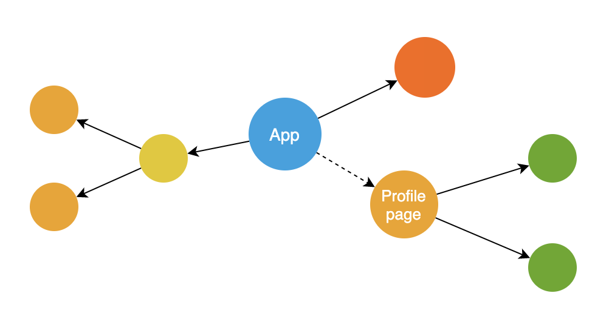
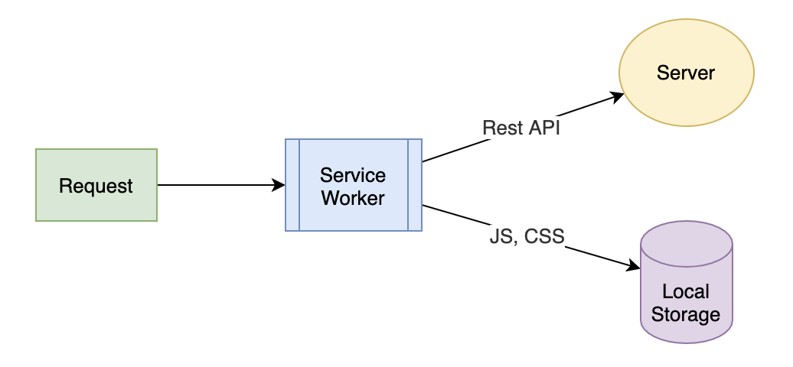

# 按需加载：如何提升应用打开速度？

随着前端技术的不断演进，以及浏览器性能的不断提高，前端应用的开发也变得越来越复杂，因为更多的功能被放到了前端去实现。

这也让我们面临这样一个挑战：**如何控制好整个应用的大小，以及如何提升加载性能，才能确保应用的打开速度够快。**

我们来分析一下，看怎么解决这个问题。在应用加载的性能指标中，其中一个很重要的指标就是**首屏打开速度**。也就是说，当用户打开你的应用之后，他要花多久才能看到首页面。根据统计显示，如果首页打开时间超过 3 秒，那么就会流失掉 40% 的用户。所以这项指标的重要性不言而喻，也让我们在完成需求开发的同时，要时刻有意识地去控制包的大小。要知道，包越小，首屏打开速度就越快。

照此来看，为了提高首屏加载速度，我们就需要**对应用进行分包**。

1. 首先，在打开某个页面时，只加载这个页面相关的内容，也就是**按需加载**。

2. 同时，为了提升后续应用的打开速度，就需要采用高效的缓存策略，避免前端资源的重复下载。

所以这节课，我们首先来看看在 React 应用中如何实现按需加载。然后呢，我会和你介绍下 Service Worker 技术，看看怎么利用 Service Worker 来缓存前端资源。虽然它和 React 没有必然的联系，但是作为目前最为有效的提升加载性能的手段，你也需要进行了解并能正确使用。

## 如何实现按需加载？

### 使用 import 语句，定义按需加载的起始模块

所谓**按需加载**，就是指在某个组件需要被渲染到页面时，才会去实际地下载这个页面，以及这个页面依赖的所有代码。

比如当用户打开 /users/profile 这个页面时，才会真正加载对应组件的代码。如下图所示，就展示了这样一个结构，其中 Profile Page 就是需要动态加载的组件。



这样的话，就不需要在一开始时就载入所有代码，影响首屏打开速度。而是通过按需加载，只下载与页面相关的部分。

要实现这个功能，本质上在于，**我们需要有动态加载模块的能力。**也就是在运行时去加载模块，而不是静态地去 import 一个模块。

对于这个需求，**ECMA Script 标准有一个提案**，专门用于动态加载模块，**语法是 import(someModule)**。

注意，这里的 import 和我们一般用于引入模块的静态声明方式不同，比如 import something from 'somemodule' 。但这里的 import 是作为一个函数动态运行的，这个 import() 函数会返回一个 Promise。这样，在模块加载成功后，我们就可以在 Promise 的 then 回调函数中去使用这个模块了。

虽然这只是一个提案，并没有成为标准，但是 Webpack 等打包工具利用了这样的语法去定义代码的分包。也就是说，Webpack 实现了这样的语法。

下面的代码演示了如何使用 import 语句来定义一个分包的拆分点：

```jsx
function ProfilePage() {
  // 定义一个 state 用于存放需要加载的组件
  const [RealPage, setRealPage] = useState(null);
  
  // 根据路径动态加载真正的组件实现
  import('./RealProfilePage').then((comp) => {
    setRealPage(Comp);
  });
  // 如果组件未加载则显示 Loading 状态
  if (!RealPage) return 'Loading....';
  
  // 组件加载成功后则将其渲染到界面
  return <RealPage />
}
```

在这段代码中，我们定义了 ProfilePage 这样一个实现按需加载功能的组件。这个组件只有被执行时，也就是渲染到界面上时，才会真正加载具体的实现代码。

这里要理解的关键点就在于，**import() 这个语句完全是由 Webpack 进行处理的。**Webpack 会将以“./RealProfilePage”模块为起点的所有依赖模块，单独打成一个包。并且，Webpack 还会生成代码，用于按需加载这个模块。

理解了这一点，我们也就知道了**按需加载的实现原理：**Webpack 利用了动态 import 语句，自动实现了整个应用的拆包。而我们在实际开发中，其实并不需要关心 Webpack 是如何做到的，而只需要考虑：**该在哪个位置使用 import 语句去定义动态加载的拆分点**。

很显然，我们不可能对任何模块都用动态 import 去加载，因为这会损害用户体验，导致每个功能都得等模块加载。总体需要采用的策略是：**按业务模块为目标去做隔离，尽量在每个模块的起始页面去定义这个拆分点。**

### 使用 react-lodable，实现组件的异步加载

上面的例子你已经看到了如何去实现一个 React 组件的动态加载，它的总体思路其实主要就是三个部分：

定义一个加载器组件，在使用的地方依赖于这个加载器组件而不是原组件；

在加载器组件的执行过程中，使用 import 去动态加载真实的实现代码；

处理加载过程，和加载出错的场景，确保用户体验。

显然，这样的逻辑是可以提取出来重用的。而 **react-loadable，正是这样一个开源的 npm 模块，专门用于 React 组件的按需加载**。

因此，在实际的项目开发中，我们一般都会直接使用 react-loadable 来完成按需加载，而不用自己去实现。

我们先看一下它的示例用法。

```jsx
import Loadable from "react-loadable";
// 创建一个显示加载状态的组件
function Loading({ error }) {
  return error ? 'Failed' : 'Loading';
}
// 创建加载器组件
const HelloLazyLoad = Loadable({
  loader: () => import("./RealHelloLazyLoad"),
  loading: Loading,
});
```

react-lodable 本身是**通过高阶组件来实现**的，这个高阶组件实现了模块加载、loading 状态以及错误处理的功能。你只要通过它提供的简单 API，就可以很容易实现组件的动态加载。

在代码中，我们可以看到 Loadable 这个高阶组件主要就是两个 API。

1. **loader：用于传入一个加载器回调，在组件渲染到页面时被执行**。在这个回调函数中，我们只需要直接使用 import 语句去加载需要的模块就可以了。

2. **loading：表示用于显示加载状态的组件**。在模块加载完成之前，加载器就会渲染这个组件。如果模块加载失败，那么 react-loadable 会将 errors 属性传递给 Loading 组件，方便你根据错误状态来显示不同的信息给用户。

可以说，有了 react-loadable，我们就不需要实现完整的模块加载器逻辑了，只需要告诉 Loadable 这个高阶组件应该加载哪个模块，加载过程如何显示，就可以将一个组件封装成能够自动按需加载的组件。

按需加载可以说是减少首屏加载时间最为有效的手段，它可以让用户在打开应用时，无需加载所有代码就能开始使用，从而提升用户体验。

但是对于加载性能的优化，除了按需加载之外，还有一块就是前端资源的缓存。合理的缓存策略，可以保证同样的前端资源永远只下载一次，从而让用户在使用过一次你的应用之后，就永远不用重新下载同样的资源，从而极大提高随后 App 的打开速度。

所以下面就跟大家介绍下如何用 Service Worker 来优化加载性能。

## 使用 service worker 缓存前端资源

Service Worker 其实是很容易被大家忽视的一种缓存机制，因为它通常是和 PWA （Progressive Web Application）联系在一起的，用于开发**离线的 Web 应用**。

这个时候，很多人会觉得如果我不开发离线应用，那是不是就不需要 Service Worker 了？

其实不然。Service Worker 还提供了**拦截前端请求**的能力，使得它能够**结合 Local Storage**，**成为一个独立的缓存方案。**所以它不仅可以用于实现前端静态资源的缓存，还能用来开发离线的 Web 应用。

这样的话，我们可以把 Service Worker 看作**一种前端的资源请求代理**。每一个前端页面发出的请求都会先由这个代理进行处理，然后你再决定请求是直接发送到服务器端，还是从本地的 Local Storage 读取内容返回。

如下图所示，展示了请求的流程：



可以看到，Service Worker 会拦截所有浏览器发送出来的请求，你可以通过代码去控制 Rest API 这些请求发送到服务器；而 JS、CSS 等静态资源，则通过 Cache Storage 存储在浏览器端。

和浏览器自动的资源缓存机制相比，Service Worker 加上 Cache Storage 这个缓存机制，具有更高的准确性和可靠性。因为它可以确保两点：

1. **缓存永远不过期。你**只要下载过一次，就永远不需要再重新下载，除非主动删除。

2. **永远不会访问过期的资源。**换句话说，如果发布了一个新版本，那么你可以通过版本化的一些机制，来确保用户访问到的一定是最新的资源。

这样，你的前端应用就像一个只需要安装一次的 App，安装过之后，就不需要再重新下载了，这样使用起来加载速度会更快。

下面就给你介绍下**如何使用 Service Worker 以及 Cache Storage**。

Service Worker 是一段独立于页面之外的 JavaScript 脚本，它并不在 Web 页面中运行，但是会在 Web 页面加载时，由一段代码去触发注册、下载和激活。一旦安装完成之后，Service Worker 就会拦截所有当前域名下的所有请求，由代码逻辑决定应该如何处理。

要使用 Service Worker，基本上分为注册、初始化、拦截请求等步骤，下面我们就看一下各个部分应该如何用代码实现。

### 注册 Service Worker

使用 Service Worker 的第一步，就是告诉浏览器当前域名下我需要使用 Service Worker。

我们可以使用下面的代码来实现：

```jsx
if ('serviceWorker' in navigator) {
  navigator.serviceWorker
    .register('/sw.js')
    .then(() => {
      // 注册成功
      console.log('Service worker registered.');
    }, (err) => {
      // 注册失败
      console.log('ServiceWorker registration failed: ', err);
    });
  });
}
```

从代码中可以看到，首先我们需要判断当前浏览器是否支持 Service Worker。如果支持，那么就用 register 方法注册一个 Service Worker，它的参数是 Service Worker 脚本的代码路径，例子中的代码路径就是根路径下的 sw.js 这个文件。如果浏览器不支持，则什么都不做。

### 在 Service Worker 安装之后初始化缓存机制

在 Service Worker 的实现代码被下载和执行后，会触发安装完成的事件，这个时候，你就可以在 sw.js 里监听这个事件，从而初始化自己的缓存机制。

比如下面的代码，就演示了如何在安装事件中配置 Cache Storage：

```jsx
const cacheName = 'my_app_cache';
// 在 sw.js 中监听安装完成事件
self.addEventListener('install', function(e) {
  console.log('Service worker installed.');
  // 初始化 Cache Storage
  const cacheOpenPromise = caches.open(cacheName);
  // 安装过程中，等待 Cache Storage 配置完成
  e.waitUntil(cacheOpenPromise);
});
```

如果你之前没有了解过 Cache Storage，也不要紧，我简单说明下你就能明白。

**Cache Storage** 也是**浏览器提供的一种缓存机制**，专门用于缓存一个请求的 request 和 response 的配对关系。此外，它还提供了 API，用来判断某个 request 是不是有对应的 response 已经缓存。所以 Cache Storage 也可以认为是专门为 Service Worker 提供的缓存机制。

有了这样一段代码，我们就完成了 Service Worker 的安装。需要特别注意的是，每次打开 Web 页面时，页面其实都会调用 Service Worker 的 register 方法去注册。但是浏览器会判断脚本内容是否有变化，只有发生了变化才会重新安装。

### 拦截请求

当 Service Worker 安装完成后，接下来就是处于运行状态，能够拦截前端的请求了。你可以通过监听 fetch 事件来处理所有的请求，然后根据请求内容等条件来决定如何处理请求。

比如使用本地缓存或者发送到服务器端，实现的方式就是在 sw.js 文件中加入下面的代码：

```jsx
// 监听所有的请求
self.addEventListener('fetch', function(e) {
  // 如果请求的路径不是 js 结尾，就通过 return false 来告诉 
  // service worker 这个请求应该发送到服务器端
  if (!request.url.endsWith('.js')) return false;
  
  // 否则检查 cache 中是否有对应的 response
  const promise = caches.open(cacheName).then(cache => {
    // 使用 cache.match 
    return cache.match(e.request).then(res => {
      if (res) {
        // 如果缓存存在则直接返回结果
        return Promise.resolve(res);
      } else {
        // 否则发出请求，并存到 cache
        const req = new Request(e.request.url);
        return fetch(corsRequest).then(res => {
          // 更新 cache
          cache.put(request, res.clone());
          return res;
        })
      }
    });
  });
  // 使用 e.respondWith 方法给请求返回内容
  e.respondWith(promise);
});
```

在这段代码中，采用的是一种缓存优先的策略。如果发现缓存存在，就使用缓存。否则发送请求到服务器端，然后把响应存放到缓存，并同时返回给调用者。

这是一种最为高效的静态资源缓存策略，因为只会下载一次，但同时也对静态资源的打包有一定要求，那就是任何一次代码更新，都需要有唯一的路径。在实际的项目中，一般会通过加入时间戳，或者版本化的命名静态资源文件来实现。

当然，在实际的项目中，使用 Service Worker 其实还有更多的考虑因素，比如何时删掉旧版本缓存，如何处理请求失败等等。但是核心机制基本就是示例代码中的内容，相信你在真正使用时，能够完善地加入对应的细节处理。

## 小结

在这一讲，我们主要学习了如何提升 React 应用的加载性能。主要分为两个部分来讲。

第一部分是资源的分包，用于实现按需加载的功能。在这里，我们主要利用了 import 语句和 Webpack 对分包的支持，这样就能够实现按需加载，从而提高首屏页面的打开速度。

第二个是 Service Worker 的概念和用法。不同于 PWA，这里的 Service Worker 仅仅用作前端静态资源的缓存。这是一个非常高效的缓存机制，可以保证静态资源仅被加载一次，从而极大地提高第二次以及后续打开 App 的速度。

因为 Service Worker 通常和 PWA 联系在一起，所以这也是一个很容易被忽视的技术。但通过今天这一课的学习，你应该能够体会到它作为缓存机制的应用场景，只要用很少的成本就带来很不错的用户体验，所以你一定要在实际项目中加以利用。

## 思考题

除了按需加载和 Service Worker，你还能想到哪些可以提升应用加载性能的方法？