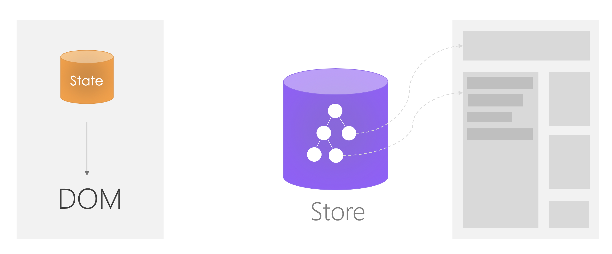
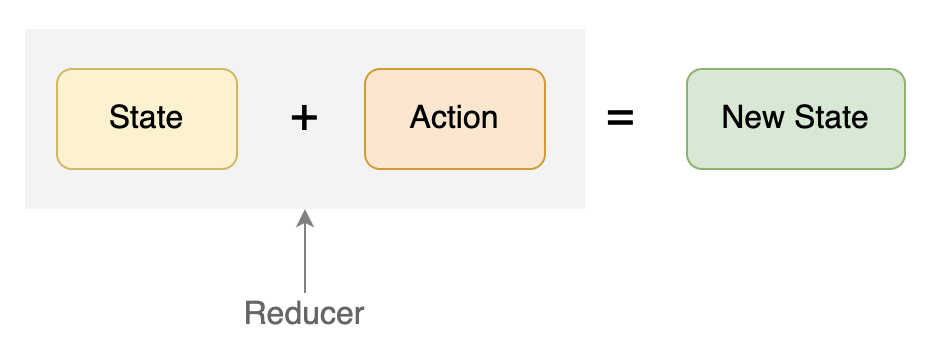
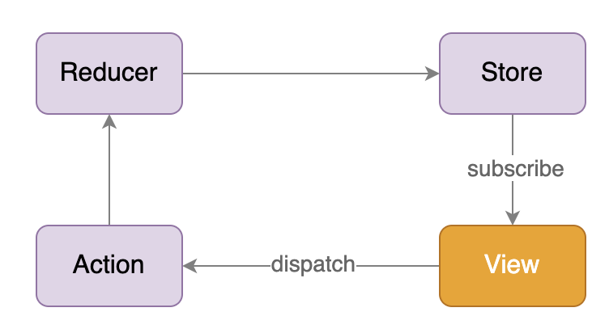
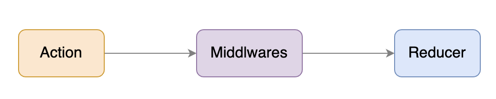

# 全局状态管理：如何在函数组件中使用 Redux？

Redux 作为一款状态管理框架啊，是公认的 React 开发中最大的一个门槛，但同时呢，它也是 React 开发人员必须掌握的一项技能。因为只有熟练应用 Redux，你才能更加灵活地使用 React，来从容应对大型项目的开发难题。

这里我要说句题外话。Redux 诞生于 2015 年，也就是 React 出现之后一年多。虽然一开始是由第三方开发者开源，不是 Facebook 官方，但是也迅速成为了最为主流的 React 状态管理库。而且，之后 Redux 跟它的开发者 Dan Abbramov 和 Andrew Clark 一起，都被 Facebook 收编，成为 React 官方生态的一部分。侧面可以看到 Redux 在 React 中的重要作用。

需要说明的是，Redux 作为一套独立的框架，虽然可以和任何 UI 框架结合起来使用。但是因为它基于不可变数据的机制，可以说，基本上就是为 React 量身定制的。

不过你可能会说，Redux 上手比较难，该怎么办呢？的确是这样，因 Redux 引入了一些新的编程思想，还有比较繁琐的样板代码，确实带来了一定的上手难度。

但是你不要担心，今天这节课，我会通过具体的例子带你上手 Redux。而且我会讲解 Redux 要解决什么问题，引入了什么样的新概念，争取能从本质上去理解 Redux 的理念和使用方法，提高你举一反三的能力。

## Redux 出现的背景

很多同学一开始可能不太明白状态管理框架的作用。但是如果随着对 React 使用的深入，你会发现组件级别的 state，和从上而下传递的 props 这两个状态机制，无法满足复杂功能的需要。例如跨层级之间的组件的数据共享和传递。我们可以从下图的对比去理解：



其中左图是单个 React 组件，它的状态可以用内部的 state 来维护，而且这个 state 在组件外部是无法访问的。而右图则是使用 Redux 的场景，用全局唯一的 Store 维护了整个应用程序的状态。可以说，对于页面的多个组件，都是从这个 Store 来获取状态的，保证组件之间能够共享状态。

所以从这张对比图，我们可以看到 Redux Store 的两个特点：

1. **Redux Store 是全局唯一的**。即整个应用程序一般只有一个 Store。

2. **Redux Store 是树状结构**，可以更天然地映射到组件树的结构，虽然不是必须的。

我们通过把状态放在组件之外，就可以让 React 组件成为更加纯粹的表现层，那么很多对于业务数据和状态数据的管理，就都可以在组件之外去完成（后面课程会介绍的 Reducer 和 Action）。同时这也天然提供了状态共享的能力，有两个场景可以典型地体现出这一点。

1. 跨组件的状态共享：当某个组件发起一个请求时，将某个 Loading 的数据状态设为 True，另一个全局状态组件则显示 Loading 的状态。

2. 同组件多个实例的状态共享：某个页面组件初次加载时，会发送请求拿回了一个数据，切换到另外一个页面后又返回。这时数据已经存在，无需重新加载。设想如果是本地的组件 state，那么组件销毁后重新创建，state 也会被重置，就还需要重新获取数据。

因此，学会 Redux ，才能真正用 React 去灵活解决问题。下面我们就来了解下 Redux 中的一些基本概念。

## 理解 Redux 的三个基本概念

Redux 引入的概念其实并不多，主要就是三个：State、Action 和 Reducer。

- 其中 State 即 Store，一般就是一个纯 JavaScript Object。

- Action 也是一个 Object，用于描述发生的动作。

- 而 Reducer 则是一个函数，接收 Action 和 State 并作为参数，通过计算得到新的 Store。

它们三者之间的关系可以用下图来表示：



在 Redux 中，所有对于 Store 的修改都必须通过这样一个公式去完成，即通过 Reducer 完成，而不是直接修改 Store。这样的话，一方面可以保证数据的不可变性（Immutable），同时也能带来两个非常大的好处。

1. 可预测性（Predictable）：即给定一个初始状态和一系列的 Action，一定能得到一致的结果，同时这也让代码更容易测试。

2. 易于调试：可以跟踪 Store 中数据的变化，甚至暂停和回放。因为每次 Action 产生的变化都会产生新的对象，而我们可以缓存这些对象用于调试。Redux 的基于浏览器插件的开发工具就是基于这个机制，非常有利于调试。

这么抽象的解释，你可能不好理解，别着急，我给你举个例子，来帮助你理解这几个概念。这个例子是开发一个计数器的逻辑。比如说要实现“加一”和“减一”这两个功能，对于 Redux 来说，我们需要如下代码：

```jsx
import { createStore } from 'redux'
// 定义 Store 的初始值
const initialState = { value: 0 }
// Reducer，处理 Action 返回新的 State
function counterReducer(state = initialState, action) {
  switch (action.type) {
    case 'counter/incremented':
      return { value: state.value + 1 }
    case 'counter/decremented':
      return { value: state.value - 1 }
    default:
      return state
  }
}
// 利用 Redux API 创建一个 Store，参数就是 Reducer
const store = createStore(counterReducer)
// Store 提供了 subscribe 用于监听数据变化
store.subscribe(() => console.log(store.getState()))
// 计数器加 1，用 Store 的 dispatch 方法分发一个 Action，由 Reducer 处理
const incrementAction = { type: 'counter/incremented' };
store.dispatch(incrementAction);
// 监听函数输出：{value: 1}
// 计数器减 1
const decrementAction = { type: 'counter/decremented' };
store.dispatch(decrementAction)
// 监听函数输出：{value: 0}
```

通过这段代码，我们就用三个步骤完成了一个完整的 Redux 的逻辑：

1. 先创建 Store；

2. 再利用 Action 和 Reducer 修改 Store；

3. 最后利用 subscribe 监听 Store 的变化。

需要注意的是，在 Reducer 中，我们每次都必须返回一个新的对象，确保不可变数据（Immutable）的原则。一般来说，我们可以用延展操作符（Spread Operator）来简单地实现不可变数据的操作，例如：

```jsx
return {
  ...state, // 复制原有的数据结构
  value: state.value + 1, // 变化 value 值使其 + 1
}
```

这在大多数场景下已经足够使用。当然对于复杂的数据结构，也有一些第三方的库可以帮助操作不可变数据，比如 Immutable、Immer 等等。

通过这个例子，我们看到了纯 Redux 使用的场景，从而更加清楚地看到了 Store、Action 和 Reducer 这三个基本概念，也就能理解 State + Action => New State 这样一个简单却核心的机制。

## 如何在 React 中使用 Redux

在刚才的讲解和具体例子中，我们并没有把 Redux 和 React 建立联系，这主要是为了帮助你先理解概念。要知道，在实际场景中，Redux Store 中的状态最终一定是会体现在 UI 上的，即通过 React 组件展示给用户。那么如何建立 Redux 和 React 的联系呢？

主要是两点：

1. React 组件能够在依赖的 Store 的数据发生变化时，重新 Render；

2. 在 React 组件中，能够在某些时机去 dispatch 一个 action，从而触发 Store 的更新。

要实现这两点，我们需要引入 Facebook 提供的 react-redux 这样一个工具库，工具库的作用就是建立一个桥梁，让 React 和 Redux 实现互通。

在 react-redux 的实现中，为了确保需要绑定的组件能够访问到全局唯一的 Redux Store，利用了 React 的 Conext 机制去存放 Store 的信息。通常我们会将这个 Context 作为整个 React 应用程序的根节点。因此，作为 Redux 的配置的一部分，我们通常需要如下的代码：

```jsx
import React from 'react'
import ReactDOM from 'react-dom'
import { Provider } from 'react-redux'
import store from './store'
import App from './App'
const rootElement = document.getElementById('root')
ReactDOM.render(
  <Provider store={store}>
    <App />
  </Provider>,
  rootElement
)
```

这里使用了 Provider 这样一个组件来作为整个应用程序的根节点，并将 Store 作为属性传给了这个组件，这样所有下层的组件就都能够使用 Redux 了。

完成了这样的配置之后，在函数组件中使用 Redux 就非常简单了：利用 react-redux 提供的 useSelector 和 useDispatch 这两个 Hooks。

在第二讲我们已经提到，Hooks 的本质就是提供了让 React 组件能够绑定到某个可变的数据源的能力。在这里，当 Hooks 用到 Redux 时可变的对象就是 Store，而 useSelector 则让一个组件能够在 Store 的某些数据发生变化时重新 render。

我在这里仍然以官方给的计数器例子为例，来给你讲解如何在 React 中使用 Redux：

```jsx
import React from 'react'
import { useSelector, useDispatch } from 'react-redux'
export function Counter() {
  // 从 state 中获取当前的计数值
  const count = useSelector(state => state.value)
  // 获得当前 store 的 dispatch 方法
  const dispatch = useDispatch()
  // 在按钮的 click 时间中去分发 action 来修改 store
  return (
    <div>
      <button
        onClick={() => dispatch({ type: 'counter/incremented' })}
      >+</button>
      <span>{count}</span>
      <button
        onClick={() => dispatch({ type: 'counter/decremented' })}
      >-</button>
    </div>
  )
}
```

此外，通过计数器这个例子，我们还可以看到 React 和 Redux 共同使用时的单向数据流：



需要强调的是，在实际的使用中，我们无需关心 View 是如何绑定到 Store 的某一部分数据的，因为 React-Redux 帮我们做了这件事情。总结来说，通过这样一种简单的机制，Redux 统一了更新数据状态的方式，让整个应用程序更加容易开发、维护、调试和测试。

## 使用 Redux 处理异步逻辑

学完了如何在 React 中使用 Redux，接下来我们就进入到 Redux 的进阶场景中。

在 Redux 中，处理异步逻辑也常常被称为**异步 Action**，它几乎是 React 面试中必问的一道题，可以认为这是 Redux 使用的进阶场景。

虽然 Redux 的官方文档中已经将异步逻辑的原理写得很清楚，但是大部分同学仍然只能说个大概，或者蹦出 Thunk、Saga 之类的几个单词。造成这种现象的很大一部分原因可能在于，仅满足于根据参考示例写出可运行的代码，而没有深究背后的原理。

但是要明白一点，只有能够解释清楚异步 Action，才算是真正理解了 Redux，才能在实际开发中灵活应用。

在 Redux 的 Store 中，我们不仅维护着业务数据，同时维护着应用程序的状态。比如对于发送请求获取数据这样一个异步的场景，我们来看看涉及到 Store 数据会有哪些变化：

1. 请求发送出去时：设置 state.pending = true，用于 UI 显示加载中的状态；

2. 请求发送成功时：设置 state.pending = false, state.data = result。即取消 UI 的加载状态，同时将获取的数据放到 store 中用于 UI 的显示。

3. 请求发送失败时：设置 state.pending = false, state.error = error。即取消 UI 的加载状态，同时设置错误的状态，用于 UI 显示错误的内容。

前面提到，任何对 Store 的修改都是由 action 完成的。那么对于一个异步请求，上面的三次数据修改显然必须要三个 action 才能完成。那么假设我们在 React 组件中去做这个发起请求的动作，代码逻辑应该类似如下：

```jsx
function DataList() {
  const dispatch = useDispatch();
  // 在组件初次加载时发起请求
  useEffect(() => {
    // 请求发送时
    dispatch({ type: 'FETCH_DATA_BEGIN' });
    fetch('/some-url').then(res => {
      // 请求成功时
      dispatch({ type: 'FETCH_DATA_SUCCESS', data: res });
    }).catch(err => {
      // 请求失败时
      dispatch({ type: 'FETCH_DATA_FAILURE', error: err });
    })
  }, []);
  
  // 绑定到 state 的变化
  const data = useSelectore(state => state.data);
  const pending = useSelector(state => state.pending);
  const error = useSelector(state => state.error);
  
  // 根据 state 显示不同的状态
  if (error) return 'Error.';
  if (pending) return 'Loading...';
  return <Table data={data} />;
}
```

从这段代码可以看到，我们使用了三个（同步）Action 完成了这个异步请求的场景。这里我们将 Store 完全作为一个存放数据的地方，至于数据哪里来， Redux 并不关心。尽管这样做是可行的。

但是很显然，发送请求获取数据并进行错误处理这个逻辑是不可重用的。假设我们希望在另外一个组件中也能发送同样的请求，就不得不将这段代码重新实现一遍。因此，Redux 中提供了 middleware 这样一个机制，让我们可以巧妙地实现所谓异步 Action 的概念。

简单来说，middleware 可以让你提供一个拦截器在 reducer 处理 action 之前被调用。在这个拦截器中，你可以自由处理获得的 action。无论是把这个 action 直接传递到 reducer，或者构建新的 action 发送到 reducer，都是可以的。

从下面这张图可以看到，Middleware 正是在 Action 真正到达 Reducer 之前提供的一个额外处理 Action 的机会：



我们刚才也提到了，Redux 中的 Action 不仅仅可以是一个 Object，它可以是任何东西，也可以是一个函数。利用这个机制，Redux 提供了 redux-thunk 这样一个中间件，它如果发现接受到的 action 是一个函数，那么就不会传递给 Reducer，而是执行这个函数，并把 dispatch 作为参数传给这个函数，从而在这个函数中你可以自由决定何时，如何发送 Action。

例如对于上面的场景，假设我们在创建 Redux Store 时指定了 redux-thunk 这个中间件：

```jsx
import { createStore, applyMiddleware } from 'redux'
import thunkMiddleware from 'redux-thunk'
import rootReducer from './reducer'
const composedEnhancer = applyMiddleware(thunkMiddleware)
const store = createStore(rootReducer, composedEnhancer)
```

那么在我们 dispatch action 时就可以 dispatch 一个函数用于来发送请求，通常，我们会写成如下的结构：

```jsx
function fetchData() {
  return dispatch => {
    dispatch({ type: 'FETCH_DATA_BEGIN' });
    fetch('/some-url').then(res => {
      dispatch({ type: 'FETCH_DATA_SUCCESS', data: res });
    }).catch(err => {
      dispatch({ type: 'FETCH_DATA_FAILURE', error: err });
    })
  }
}
```

那么在我们 dispatch action 时就可以 dispatch 一个函数用于来发送请求，通常，我们会写成如下的结构：

```jsx
import fetchData from './fetchData';
function DataList() {
  const dispatch = useDispatch();
  // dispatch 了一个函数由 redux-thunk 中间件去执行
  dispatch(fetchData());
}
```

可以看到，通过这种方式，我们就实现了异步请求逻辑的重用。那么这一套结合 redux-thunk 中间件的机制，我们就称之为异步 Action。

所以说异步 Action 并不是一个具体的概念，而可以把它看作是 Redux 的一个使用模式。它通过组合使用同步 Action ，在没有引入新概念的同时，用一致的方式提供了处理异步逻辑的方案。

## 小结

尽管 Redux 有令人诟病的地方，例如函数式的概念比较难以理解，样板代码过多等问题。但其带来的好处也是很明显的，比如可以让代码更容易理解，维护和测试。因此有超过 60% 的 React 应用都使用了 Redux。

所以即使对于一些小型的应用，不一定需要使用 Redux。但是对于开发人员来说，学会和理解 Redux 仍然是一项必须掌握的既能。

## 思考题

只考虑 Redux 部分，对于计数器应用，目前每次是固定加减 1，如果要能够在每次调用时增加或减少指定的变量值，应该如何实现？
